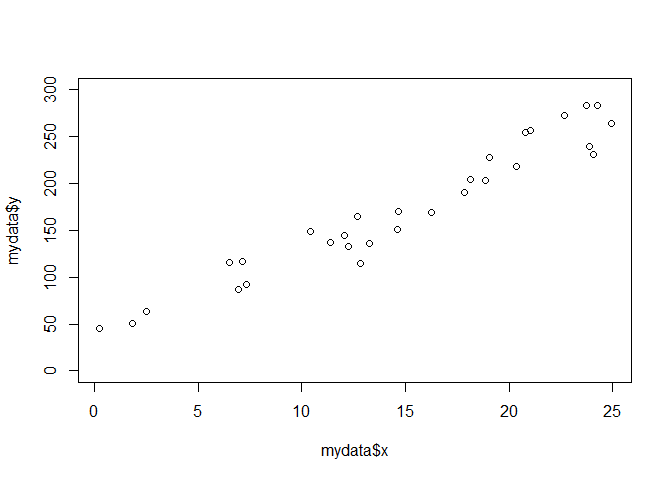
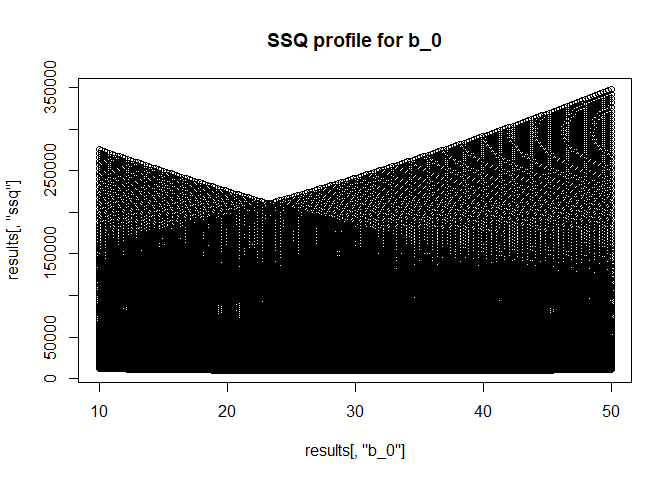

Solution to grid search of model parameters
================
Brett Melbourne
15 Sep 2020 (updated 7 Sep 2022)

I’ll first generate some fake data to work with but your algorithm will
use your own dataset.

``` r
set.seed(4.6) #make example reproducible
n <- 30  #size of dataset
b0 <- 20 #true y intercept
b1 <- 10 #true slope
s <- 20  #true standard deviation of the errors
x <- runif(n, min=0, max=25) #nb despite runif, x is not a random variable
y <- b0 + b1 * x + rnorm(n, sd=s) #random sample of y from the population
mydata <- data.frame(x, y)
rm(n, b0, b1, s, x, y) #clean up

plot(mydata$x, mydata$y, ylim=c(0,300))
```

<!-- -->

Here is an algorithm to fit the linear model to the data by grid search.
We need to choose a sensible range of parameter values to search over.
We can inspect the data to make some good guesses. The y-intercept

looks like it will be around 25, probably larger than 10 and less than
50. The slope
 is
rise over run, so it will be about 250/25 = 10, so we’ll try spanning
that value.

``` r
# Initialize parameters
b0_grid <- seq(10, 50, length.out=200)
b1_grid <- seq(5, 15, length.out=200)

# Initialize storage object (here I use a matrix)
n <- length(b0_grid) * length(b1_grid)
results <- matrix(NA, n, 3)
colnames(results) <- c("b_0", "b_1", "ssq")

# Grid search over the two parameters: b_0 and b_1
i <- 1 #row index for results matrix
for ( b_0 in b0_grid ) {
    for ( b_1 in b1_grid ) {

    #   Calculate model predictions
        y_pred <- b_0 + b_1 * mydata$x

    #   Calculate deviations and sum of squares
        e <- mydata$y - y_pred
        ssq <- sum(e^2)

    #   Keep the results
        results[i,] <- c(b_0, b_1, ssq)
        i <- i + 1

    }
#   Monitor progress
    print(paste(round(100 * i / n), "%", sep=""), quote=FALSE)
}
```

Find the minimum SSQ

``` r
ssq_min_row <- which.min(results[,3])
opt_pars <- results[ssq_min_row,]
ssq_min <- opt_pars["ssq"]
opt_pars
```

    ##         b_0         b_1         ssq 
    ##   31.909548    9.522613 9272.234644

We get
 =
31.9 and
 =
9.5.

Plot sum of squares profiles. This may take a while because there are a
lot of points.

``` r
# Profile for b_0
plot(results[,"b_0"], results[,"ssq"], main="SSQ profile for b_0")
```

<!-- -->

What is going on here? We’ve plotted all the points, including all of
the really bad fits (the parameter combinations with very high SSQ). So
this plot is dominated by the bad fits and is not very useful. We need
to look more closely at the smallest SSQ values (the underside of this
plot), so we need to set the y-axis limits to get a good view of the
minimum SSQ. Here is a nicer plot with a scaling control for zooming in
and out on the y-axis (try adjusting `scale`).

``` r
scale <- 1.2  #This is a zoom setting. Must be > 1. Smaller is zooming in.
par(mfrow=c(1,2))
plot(results[,1], results[,3], xlab="b_0", ylab="Sum of squares",
     ylim=c(ssq_min,scale*ssq_min))
plot(results[,2], results[,3], xlab="b_1", ylab="Sum of squares",
     ylim=c(ssq_min,scale*ssq_min))
mtext("Sum of squares profiles - grid search", outer=TRUE, line=-2.5)
```

<!-- -->

Now we can clearly see the basins of the SSQ for each parameter. The
basin is outlined by the points on the underside of this U-shaped
profile and the best-fit parameter value lies at the bottom of the basin
where the SSQ is at its minimum. The points filling in the interior of
the U-shaped profile are the SSQ values for combinations of the
parameter with the other parameter. For example, if we look vertically
above b_0 = 30 we see the SSQ for b_0 = 30 with different values of b_1
(although we can’t tell from this plot what the values of b_1 are).

These plots tell us that our grid search algorithm is working as
intended and that we’ve found the basin that includes the best-fit
parameter values. From here, we could adjust the search ranges and
search increments of b_0 and b_1 and redo the search to give whatever
number of significant digits we desire for the best-fit parameter
values. Finally, these profiles are beginning to tell us about the
uncertainty of the parameter values. The broader the profile, the less
certain the parameter value. We will soon see this idea of a parameter
profile as a representation of uncertainty formalized in terms of
probability from several different perspectives (frequentist,
likelihood, Bayesian).
