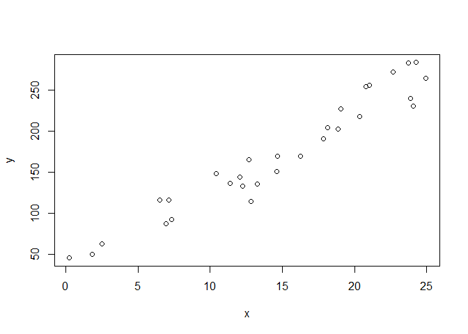
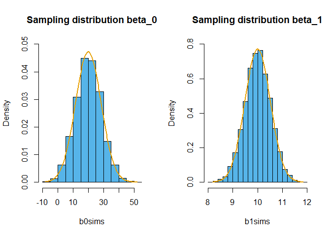
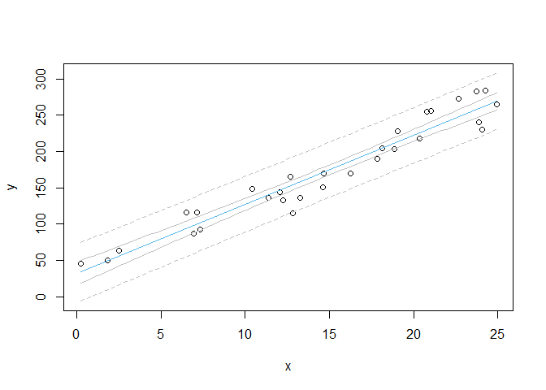

Inference algorithms for lm
================
Brett Melbourne
2021-09-01

Note: The `.md` version of this document is best for viewing on GitHub.
See the `.Rmd` version for the latex equation markup. The `.Rmd` version
does not display the plots in GitHub and is best for viewing within
RStudio.

Here I outline all the main inferences that we get from `lm()` from a
simple linear regression fit, and explain where they all come from.

First we’ll generate some fake data for illustration.

``` r
set.seed(4.6) #make example reproducible
n <- 30  #size of dataset
b0 <- 20 #true y intercept
b1 <- 10 #true slope
s <- 20  #true standard deviation of the errors
x <- runif(n, min=0, max=25) #nb while we have used runif, x is not a random variable
y <- b0 + b1 * x + rnorm(n, sd=s) #random sample of y from the population
```

<!-- quite possibly it would be clearer to redo this example with x evenly distributed and not randomly generated (but then we couldn't generate sample sizes). -->

## Plot the data

The first thing we do with any data is plot them. Never proceed to
fitting a model without first plotting the data. Of course, this all
looks good.

``` r
plot(x, y)
```

<!-- -->

## Train (fit) the model and ask for a summary

Satisfied that the data would be appropriately described by a linear
model, we’ll go ahead and fit the model and then ask for a summary of
the fit.

``` r
fit <- lm(y ~ x)
summary(fit)
```

    ## 
    ## Call:
    ## lm(formula = y ~ x)
    ## 
    ## Residuals:
    ##     Min      1Q  Median      3Q     Max 
    ## -39.579 -11.269  -2.065  15.997  25.268 
    ## 
    ## Coefficients:
    ##             Estimate Std. Error t value Pr(>|t|)    
    ## (Intercept)  32.0961     7.6909   4.173 0.000264 ***
    ## x             9.5111     0.4705  20.216  < 2e-16 ***
    ## ---
    ## Signif. codes:  0 '***' 0.001 '**' 0.01 '*' 0.05 '.' 0.1 ' ' 1
    ## 
    ## Residual standard error: 18.2 on 28 degrees of freedom
    ## Multiple R-squared:  0.9359, Adjusted R-squared:  0.9336 
    ## F-statistic: 408.7 on 1 and 28 DF,  p-value: < 2.2e-16

Let’s walk through all the output in this summary. First is the call
that we made to `lm()` - it tells us that we fitted the linear model
`y ~ x`. If you’re not yet familiar with this notation, we’ll cover it
in more detail shortly. The tilde here is not the same as in Bayesian
analysis (i.e. it is not a distributional statement). It is a linear
model shorthand for the following linear model:

$$ y_i = \beta_0 + \beta_1x_i + e_i$$

where the $i\mathrm{s}$ index the individual data points and the
$e_i\mathrm{s}$ are the errors, or residuals, of the model fit.

The next section of the summary is some distribution information about
the residuals. Remember that the residuals are the deviations $e_i$ of
the data from the fitted model. There are five numbers, the minimum and
maximum residual, the first and 3rd quartile (i.e. the 25th and 75th
percentiles) and the median (50th percentile). We expect the median to
be about 0 and the quartiles to be roughly symmetric because the SSQ
algorithm will result in balancing positive and negative deviations. I
don’t pay too much attention to this part of the summary since it is
better to view the residuals graphically.

The next section of the summary is the parameter (aka coefficient)
estimates, i.e. for $\beta_0$ (the intercept) and $\beta_1$ (the slope).
These are the best fit estimates, i.e. the values of $\beta_0$ and
$\beta_1$ at the minimum SSQ. Notice that the slope is labelled with the
name of the independent variable `x`. The standard errors, *t*-values
and *p*-values are inferences about these parameters. Where do these
inferences come from? They are frequentist inferences, so they all stem
from inference algorithms based on the sampling distribution. I’m going
to go ahead and print the coefficient table again so we have them in
view. But first, let’s take a look at the object that is created by the
call to the summary function.

``` r
sf <- summary(fit)
str(sf)
```

    ## List of 11
    ##  $ call         : language lm(formula = y ~ x)
    ##  $ terms        :Classes 'terms', 'formula'  language y ~ x
    ##   .. ..- attr(*, "variables")= language list(y, x)
    ##   .. ..- attr(*, "factors")= int [1:2, 1] 0 1
    ##   .. .. ..- attr(*, "dimnames")=List of 2
    ##   .. .. .. ..$ : chr [1:2] "y" "x"
    ##   .. .. .. ..$ : chr "x"
    ##   .. ..- attr(*, "term.labels")= chr "x"
    ##   .. ..- attr(*, "order")= int 1
    ##   .. ..- attr(*, "intercept")= int 1
    ##   .. ..- attr(*, "response")= int 1
    ##   .. ..- attr(*, ".Environment")=<environment: R_GlobalEnv> 
    ##   .. ..- attr(*, "predvars")= language list(y, x)
    ##   .. ..- attr(*, "dataClasses")= Named chr [1:2] "numeric" "numeric"
    ##   .. .. ..- attr(*, "names")= chr [1:2] "y" "x"
    ##  $ residuals    : Named num [1:30] -1.56 11.31 -9.39 -10.71 -7.82 ...
    ##   ..- attr(*, "names")= chr [1:30] "1" "2" "3" "4" ...
    ##  $ coefficients : num [1:2, 1:4] 32.1 9.51 7.69 0.47 4.17 ...
    ##   ..- attr(*, "dimnames")=List of 2
    ##   .. ..$ : chr [1:2] "(Intercept)" "x"
    ##   .. ..$ : chr [1:4] "Estimate" "Std. Error" "t value" "Pr(>|t|)"
    ##  $ aliased      : Named logi [1:2] FALSE FALSE
    ##   ..- attr(*, "names")= chr [1:2] "(Intercept)" "x"
    ##  $ sigma        : num 18.2
    ##  $ df           : int [1:3] 2 28 2
    ##  $ r.squared    : num 0.936
    ##  $ adj.r.squared: num 0.934
    ##  $ fstatistic   : Named num [1:3] 409 1 28
    ##   ..- attr(*, "names")= chr [1:3] "value" "numdf" "dendf"
    ##  $ cov.unscaled : num [1:2, 1:2] 0.178623 -0.009855 -0.009855 0.000668
    ##   ..- attr(*, "dimnames")=List of 2
    ##   .. ..$ : chr [1:2] "(Intercept)" "x"
    ##   .. ..$ : chr [1:2] "(Intercept)" "x"
    ##  - attr(*, "class")= chr "summary.lm"

Above, we see that the result of the summary function is an object that
contains a bunch of other objects, such as “residuals”, “coefficients”,
and “sigma”. Next we’ll look just at the coefficients, which are also
known as the **estimated parameters**, or simply the estimates. This is
often the most important part of the analysis since some or all of the
parameter estimates and their uncertainties are typically the target in
scientific questions. For example, we might be interested primarily in
the value of the slope. Is it steep or shallow? Does it represent a
rate? Is it positive or negative? Is it non-zero? etc

``` r
sf$coefficients
```

    ##              Estimate Std. Error   t value     Pr(>|t|)
    ## (Intercept) 32.096061   7.690906  4.173248 2.636342e-04
    ## x            9.511143   0.470481 20.215786 3.060848e-18

We see that the estimated intercept $\hat{\beta}_0$ is 32.1 and the
estimated slope $\hat{\beta}_1$ is 9.5 and they have standard errors
respectively of 7.7 and 0.47.

### Inference via sampling distributions

Where do those standard errors for the parameters in the coefficients
table come from? Those are $\hat{\sigma}_0$ and $\hat{\sigma}_1$, the
estimated standard deviations of the **sampling distribution** for each
parameter. Recall that the fundamental frequentist idea is that we
should imagine sampling repeatedly from a population. Here the imagined
population that we sample from is a **population of errors**, $e$. How
do we get standard errors for a quantity we only imagined? The inference
begins by assuming that the population of errors has a Normal
distribution $N(0,\sigma_e)$. The particular sample of $e_i\mathrm{s}$
we have for this dataset are assumed to be a sample from a larger
population of $e\mathrm{s}$. We might for example be sampling
individuals from a population and each individual, $i$, will have a
unique combination of $x$ and $y$, giving rise to an error, $e_i$. Or we
might have the same set of individuals but $y$ is measured with error on
each individual so that if new measurements were taken, the error for an
individual, $e_i$, would be different each time we take a measurement.
From this assumption of Normal errors in $y$, mathematical statistics
theory tells us that the sampling distributions for each of the
parameters are also Normal with their own standard deviations $\sigma_0$
and $\sigma_1$ that are scaled to $\sigma_e$ by constants $k$, such
that:

$$\sigma_0 =  k_0 \frac{\sigma_e}{\sqrt{n}}, \sigma_1 = k_1\frac{\sigma_e}{\sqrt{n}}$$

<!-- In these equations $\sigma_e$/$\sqrt{n}$ is the expected standard deviation for the mean of $e$ for a sample of size $n$ from the population of errors. -->

The $k\mathrm{s}$ depend on the variance of $x$ (the next section of R
code calculates these constants), while $n$ is the number of data points
in a sample (30 in our example) showing that larger samples lead to
smaller errors in the $\hat{\beta}\mathrm{s}$. Recall that $x$ is
fixed - it is not a random variable - so the variance in $x$ is
measuring the spread in the independent variable $x$ and is not a
measure of stochasticity or uncertainty. The only term on the RHS
quantifying stochasticity is $\sigma_e$.
<!-- The spread in x is important. If the spread is wider, the standard error is smaller because there is more information. -->

Simulation is a good way to explore and understand this concept of how
the sampling distributions of the parameters will be exactly Normal when
the errors in $y$ are Normal. We’ll set up an algorithm to simulate the
sampling distributions for the parameter estimates. Here is the
pseudocode for this sampling distribution algorithm:

    repeat very many times
        sample data from the population
        fit the linear model
        estimate the parameters
    plot sampling distribution (histogram) of the parameter estimates

<!-- Need to say here where true parameters b0, b1, s come from -->

We’ll compare the results of this sampling distribution algorithm
(implemented as a stochastic simulation) to the mathematical theory. In
R code now:

``` r
# Simulation of sampling distribution for estimated beta_0 and beta_1
# About 1 minute

# Imagine a large population of Normal errors, which will be
# the true population in our simulation.
pop_e <- rnorm(1e6,mean=0,sd=s)
# (pop_e has mean = 0.00 and sd = 20.0)

# Sample from this population and estimate parameters many times
reps <- 10000 #Large enough (set larger for even better precision)
b0sims <- rep(NA, reps) #to store sim results
b1sims <- rep(NA, reps)
for ( i in 1:reps ) {
    errs <- sample(pop_e,30)     #sample from population of errors
    ysim <- b0 + b1*x + errs     #simulate data for y
    fitsim <- lm(ysim ~ x)       #fit linear model
    b0sims[i] <- coef(fitsim)[1] #estimated beta_0
    b1sims[i] <- coef(fitsim)[2] #estimated beta_1
}

# Plot simulated sampling distributions and compare to theory
par(mfrow=c(1,2))

# Simulated sampling distribution for beta_0
hist(b0sims, freq=FALSE, ylim=c(0,0.05), col="#56B4E9", 
     main="Sampling distribution beta_0")

# Theoretical sampling distribution for beta_0
varpx <- mean((x-mean(x)) ^2 ) #population variance of x
k0 <- sqrt(1 + mean(x)^2 / varpx)
s0 <- k0 * s / sqrt(n)
yy <- seq(min(b0sims), max(b0sims), length.out=100)
lines(yy, dnorm(yy, mean=b0, sd=s0), lwd=2, col="#E69F00")

# Simulated sampling distribution for beta_1
hist(b1sims, freq=FALSE, ylim=c(0,0.8), col="#56B4E9", 
     main="Sampling distribution beta_1")

# Theoretical sampling distribution for beta_1
k1 <- 1 / sqrt( varpx )
s1 <- k1 * s / sqrt(n)
yy <- seq(min(b1sims), max(b1sims), length.out=100)
lines(yy, dnorm(yy, mean=b1, sd=s1), lwd=2, col="#E69F00")
```

<!-- -->

There is an extremely close match of the theory (curve) and the
simulation (histogram) of the sampling distribution. We used a large
number of replications (10,000) to inspect this concordance. You can
increase the replication even further to see that the theory exactly
matches simulation. This demonstrates that the mathematical theory for
the sampling distribution is sound. Most importantly, it demonstrates
from an algorithmic point of view that the sampling distribution concept
is actually quite simple (a few lines of pseudocode) and that we can
implement the algorithm readily.

### The plug in principle

However, unlike the simulation, for our actual dataset, we don’t know
the true population of errors or the true sampling distributions, so we
don’t know the true $\sigma\mathrm{s}$. Instead, we **assume** the
$e\mathrm{s}$ are Normal and, further, we’ll use estimates
$\hat{\sigma}_0$ and $\hat{\sigma}_1$, which come from plugging in
$\hat{\sigma}_e$ to the equations for the theoretical $\sigma\mathrm{s}$
above. As we first saw in the sex ratio example, this is the **plug in
principle**. For $\hat{\sigma}_e$ we use the residual standard error
(the standard error of the deviations after the best fit model is
found), which we find in our output summary is 18.2 (see summary table
above and further information below). You can see that the following
estimates calculated directly from plugging in $\hat{\sigma}_e$ to the
theoretical equations above match the information in the summary table.

``` r
sigma_e <- sf$sigma #\hat{\sigma}_e
print(sigma_e)
```

    ## [1] 18.19736

``` r
k0 * sigma_e / sqrt(n) #\hat{sigma}_0
```

    ## [1] 7.690906

``` r
k1 * sigma_e / sqrt(n) #\hat{sigma}_1
```

    ## [1] 0.470481

The assumption of normality of the $e\mathrm{s}$ is actually not all
that critical and the inference algorithm is quite **robust** to even
modestly large departures from normality. What really matters is
**whether the sampling distributions of the parameters are Normal** and
whether $\hat{\sigma}_e$ is a good description of the spread of the
sampling distribution. Remember that the sampling distribution will
often be approximately Normal regardless of whether or not the
$e\mathrm{s}$ are Normal due to the central limit theorem. The most
problematic situations occur when the distribution of $e$ is very
asymmetrical or varies with $x$ in some way (e.g. heteroscedasticity).
In both these cases, $\hat{\sigma}_e$ is not a good summary of the
distribution. The fact that normality of the errors is not crucial
explains a lot of the remarkable success of this inference algorithm -
i.e. it is the most widely used inference algorithm in applied work.

### *t* and *p*-values

After that interlude to explore sampling distributions, let’s get back
to our table of parameter estimates, which I’ll print again here:

``` r
sf$coefficients
```

    ##              Estimate Std. Error   t value     Pr(>|t|)
    ## (Intercept) 32.096061   7.690906  4.173248 2.636342e-04
    ## x            9.511143   0.470481 20.215786 3.060848e-18

What about the *t* values? The *t* value is the size of the estimate in
standard error units. For example, the *t* value for the intercept above
is:

``` r
32.096061 / 7.690906
```

    ## [1] 4.173248

Thus, 4.17 standard error units. Simple.

What about the *p*-values? Recall that a *p*-value is defined as:

> The probability of a sample statistic as large **or larger** than the
> one observed **given that some hypothesis is true**.

It is a measure of the **improbability** of the sample statistic under
some hypothesis. The hypothesis under consideration is typically a
**null hypothesis**. For example, here, for the intercept, it is the
null hypothesis that the true (unobserved) value of the intercept is
zero, along with other conditions, such as that the $e$ is Normal with a
particular value for $\sigma_e$. Under this null hypothesis, the *t*
statistic will have a particular sampling distribution. Once again, we
have a sampling distribution concept. Under the assumptions so far,
mathematical theory tells us that the sampling distribution for *t* has
a Student’s *t* distribution with 28 degrees of freedom (here, the
residual degrees of freedom). To get the *p*-value we use the built in
distribution function `pt` to calculate the cumulative probability that
*t* is 4.173, which is the probability that a sampled value of *t* is as
large or **smaller** than 4.173. The probability that *t* is **as large
or larger** than 4.173 is one minus the cumulative probability (close
enough; we haven’t bothered to add back in the probability that
*t*=4.173). But we are not done yet since *t* could be as “large or
larger” than 4.173 in the negative direction also (i.e. *t* could be \<
-4.173). We need to add that possibility. The *p* value is the sum of
these two probabilities. In other words, this is what is called a
two-tailed *p*-value because it allows for *t* to be larger than
expected in either tail of the *t* distribution. As a calculation
shortcut we could alternatively double one of the tail probabilities
since the *t* distribution is symmetric.

``` r
1 - pt(4.173248, 28) #as large or larger in positive direction
```

    ## [1] 0.0001318173

``` r
pt(-4.173248, 28)  #"as large or larger" in negative direction (as small or smaller than -t)
```

    ## [1] 0.0001318173

``` r
1 - pt(4.173248, 28) + pt(-4.173248, 28) #two-tailed p-value
```

    ## [1] 0.0002636345

``` r
2 * (1 - pt(4.173248, 28)) #Equivalent to twice one of the tails since symmetric
```

    ## [1] 0.0002636345

Thus, the *p*-values for the parameters $\beta_0$ and $\beta_1$ test the
null hypotheses that each parameter respectively is zero. Here the
*p*-values are small, which we interpret as providing evidence against
the null hypothesis since the observed *t* values are improbable **if
the data were generated by the null model**.

### Confidence intervals for parameters

We can get a precise 95% confidence interval for each of these
parameters with the `confint` function.

``` r
confint(fit)
```

    ##                 2.5 %   97.5 %
    ## (Intercept) 16.341954 47.85017
    ## x            8.547406 10.47488

These are exactly $t_{\textrm{df}}\sigma_\beta$, where $t_{\textrm{df}}$
is the critical value of *t* for the respective residual degrees of
freedom and probability. The degrees of freedom is 28 in this example
(reported in the summary table above) and is $n$ minus the number of
estimated parameters. The necessary probabilities for a 95% confidence
interval are 0.025 and 0.975 and delineate the lower and upper 2.5%
tails of the *t* distribution. These probabilities therefore define an
interval that contains 95% of the probability mass for the inferred
sampling distribution of *t*:

``` r
lo <- sf$coefficients[,"Estimate"] + qt(p=0.025, df=28) * sf$coefficients[,"Std. Error"]
up <- sf$coefficients[,"Estimate"] + qt(p=0.975, df=28) * sf$coefficients[,"Std. Error"]
cbind(lo, up)
```

    ##                    lo       up
    ## (Intercept) 16.341954 47.85017
    ## x            8.547406 10.47488

You can see that these are the same values given by `confint`. Notice
that these are close enough to $\pm2\sigma_\beta$:

``` r
lo <- sf$coefficients[,"Estimate"] - 2 * sf$coefficients[,"Std. Error"] 
up <- sf$coefficients[,"Estimate"] + 2 * sf$coefficients[,"Std. Error"]
cbind(lo, up)
```

    ##                    lo       up
    ## (Intercept) 16.714249 47.47787
    ## x            8.570181 10.45210

So, you should get used to scanning summary tables and doubling the
standard error to get approximate 95% CIs for the parameters.

### The rest of the summary

What else is in that summary? The final lines of the summary report:

    Residual standard error: 18.2 on 28 degrees of freedom
    Multiple R-squared:  0.9359,    Adjusted R-squared:  0.9336 
    F-statistic: 408.7 on 1 and 28 DF,  p-value: < 2.2e-16

To understand these, it is helpful to look at the analysis of variance
(ANOVA) table as well.

``` r
anova(fit)
```

    ## Analysis of Variance Table
    ## 
    ## Response: y
    ##           Df Sum Sq Mean Sq F value    Pr(>F)    
    ## x          1 135331  135331  408.68 < 2.2e-16 ***
    ## Residuals 28   9272     331                      
    ## ---
    ## Signif. codes:  0 '***' 0.001 '**' 0.01 '*' 0.05 '.' 0.1 ' ' 1

The ANOVA table partitions the sums of squares into contributions from
the deterministic part of the model ($\beta_0+\beta_1x$) and
contributions from the error $e$. The partitions are components of the
total sum of squares. The total SSQ is the sum of squares for the data
not accounting for the relationship of $y$ to $x$ (i.e. if our linear
model has only an intercept, or mean, while slope = 0).

``` r
totssq <- sum((y-mean(y)) ^ 2)
totssq
```

    ## [1] 144603.2

This number is the same as the sum of the “Sum Sq”” column in the table.
The residual SSQ in the table is the minimum SSQ that our training
algorithm found to determine the best-fit parameters for intercept and
slope. In this case, the best fit gives us a residual sum of squares of
9272. We can access the residuals from the fit also.

``` r
residuals(fit)
```

    ##            1            2            3            4            5            6 
    ##  -1.55620951  11.31380659  -9.39022334 -10.71351167  -7.82191419  21.90303800 
    ##            7            8            9           10           11           12 
    ##   0.06059346  25.13012559  25.26770263   0.65580802  -8.53172861  16.51695561 
    ##           13           14           15           16           17           18 
    ##   7.32351925 -18.99654092  17.78686819  -3.46477607  20.81027668 -20.04311845 
    ##           19           20           21           22           23           24 
    ## -29.98032952  14.43566709 -11.45414338  -4.46413778  12.77321555 -15.42617272 
    ##           25           26           27           28           29           30 
    ## -16.91325236  24.93175175  -2.57463733  24.04152606 -39.57886391 -22.04129472

and see that the sum of their squares is the residual sum of squares

``` r
rssq <- sum(residuals(fit) ^ 2)
rssq
```

    ## [1] 9272.029

The sum of squares associated with including $x$ in the model
(i.e. accounting for the deterministic part of the model), the first
line of the ANOVA table, is the total SSQ minus the residual SSQ.

``` r
xssq <- totssq - rssq
xssq
```

    ## [1] 135331.2

Thus, we can say that $x$ accounts for 135331 of the total SSQ and what
is left over is the residual SSQ 9272.

The next column of the ANOVA table is the mean square, which is the
total SSQ divided by the degrees of freedom. The degrees of freedom is
$n$ minus the number of parameters. You can also think of the mean
square as the estimated variance (hence “analysis of variance”). Recall
that the variance is

$$\frac{1}{n}\sum\limits_{i}^{n}(y_i-\bar{y})^2 = \frac{1}{n}SSQ$$

Mathematical theory tells us that if we use this formula as is, the
estimate of the variance would be biased downward. Dividing the SSQ by
the degrees of freedom instead of $n$ gives an unbiased estimate of the
variance. The residual mean square is an estimate of $\sigma^2_e$ and
this is a crucial estimate because it is used to draw inferences for
just about everything else. We used it above to calculate standard
errors for $\beta_0$ and $\beta_1$.

``` r
rms <- rssq / 28
rms
```

    ## [1] 331.1439

and its square root is the estimate for the standard deviation of $e$,
that is $\hat{\sigma}_e$.

``` r
sqrt(rms)
```

    ## [1] 18.19736

This number is the residual standard error in our summary output.

The *F*-statistic in the summary output can also be understood from the
ANOVA table. *F* is the mean square associated with $x$ divided by the
residual mean square. In other words, it is a variance ratio; the ratio
of the variance explained by $x$ to the residual variance:

``` r
xms <- xssq / 1 #mean square of x is xssq / df, where df for x = 1
F <- xms / rms  #read this as "x mean square divided by residual mean square""
F
```

    ## [1] 408.678

Finally, the *p*-value for *F* is the probability of sampling an *F* as
large or larger than the observed *F* given the null hypothesis that *F*
= 0. Again, mathematical theory tells us how to construct a sampling
distribution for *F* under the null hypothesis. We won’t cover that
detail here (which we could do with a simple simulation similar to the
one above) but the sampling distribution is the *F*-distribution, so we
can obtain the *p*-value thus:

``` r
1 - pf(F, df1=1, df2=28)
```

    ## [1] 0

For this example, it turns out that the *p*-value is close to zero but
there is a limit for how close the computer can get to zero and still be
accurate, so R reports this in the summary table as \<2.2e-16, a value
below which the probability is no longer accurate.

You’ll notice that both the *p*-value for the *F*-statistic associated
with x and the *p*-value for the *t* statistic associated with x in the
summary table are the same. They are both ultimately getting at the same
null hypothesis here, that $\beta_1$ = 0, via different sample
statistics. The frequentist approach is quite flexible in this respect
and it is often possible to devise different ways to test the core
hypothesis about a parameter.

The r-squared statistics are different standardized measures of the
proportion of variance explained by the linear model fit. For a variety
of reasons, these are rarely useful in practical work and we won’t go
into more detail here.

### Confidence intervals and prediction intervals for y

To get frequentist intervals for the mean of $y$ in relation to $x$ and
for predicting new values of $y$ for given $x$, we once again rely on
sampling distributions. We won’t go into the theory. The operations
involve linear algebra and are a bit more complex in that respect but
the principles and sampling distribution concepts are the same as we
have already encountered. These calculations are handled by the
`predict()` function. By default, `predict()` will provide predictions
(both point predictions and confidence intervals or prediction
intervals) for each data point in the current dataset based on their $x$
values. If we want to predict for other values of $x$ we need to
construct a new data frame that contains the values of $x$ we want to
predict for. So, for example, if we want to predict $y$ at $x$ = 10, we
need a new data frame with that value.

``` r
newd <- data.frame(x=10)
newd
```

    ##    x
    ## 1 10

We can then get predictions for $y$ and confidence intervals using
`predict()`.

``` r
predict(fit, newd, interval = "confidence")
```

    ##        fit      lwr      upr
    ## 1 127.2075 119.0094 135.4056

The predicted (or estimated) mean of $y$ is 127 with 95% confidence
interval 119 to 135. What we asked for here is to predict the **mean of
y** and the **confidence interval for this mean**. In this respect, we
can also consider it to be an estimate of the true mean at $x$ = 10. The
distinction between prediction and estimate is a bit fuzzy here. Whether
you lean one way or the other depends on the context.

We can similarly get a prediction interval for a new value of $y$ at $x$
= 10. This is a prediction in all senses of “predict” because the
interval is no longer about the mean of $y$ but rather about likely and
possible new values of $y$.

``` r
predict(fit, newd, interval = "prediction")
```

    ##        fit      lwr     upr
    ## 1 127.2075 89.04102 165.374

We see that the prediction interval is wider, as expected because it
also includes the uncertainty in sampling a value of $y$, which includes
the distribution of $e$.

To calculate confidence intervals and prediction intervals for a range
of $x$, just construct a new data frame with a grid of $x$ values. Here,
we’ll ask for a grid that spans the range of $x$ in 100 increments. It
is also helpful to `cbind` the output matrix to the new data.

``` r
newd <- data.frame(x = seq(min(x), max(x), length.out=100))
pred_w_ci <- cbind(newd, predict(fit, newd, interval = "confidence"))
pred_w_pi <- cbind(newd, predict(fit, newd, interval = "prediction"))
```

<!-- # nb predict returns a matrix if interval is asked for, whereas it otherwise returns a data frame. Inconsistent behavior. -->

We can then plot these with the data. Use your favorite graphing
facilities. Here, I use base plotting functions.

``` r
# y limits for plots
ylwr <- min(pred_w_pi[,c("fit","lwr","upr")])
yupr <- max(pred_w_pi[,c("fit","lwr","upr")])

# Plot
plot(y ~ x, ylim=c(ylwr,yupr))
lines(pred_w_ci[c(1,nrow(pred_w_ci)),c("x","fit")], col="#56B4E9")
lines(pred_w_ci[,c("x","lwr")], col="grey")
lines(pred_w_ci[,c("x","upr")], col="grey")
lines(pred_w_pi[,c("x","lwr")], col="grey", lty=2)
lines(pred_w_pi[,c("x","upr")], col="grey", lty=2)
```

<!-- -->

<!-- # Confidence intervals are approx 2 * se -->
<!-- pred_se <- predict(fit, newd, se.fit=TRUE) -->
<!-- up <- pred_se$fit + 2 * pred_se$se.fit -->
<!-- cbind(pred_w_ci[,"upr"],up) #not exactly -->
<!-- lines(newd$x,up,col="red") #but essentially the same -->

### Checking the model

An important task is to check the model fit. We want to assess
assumptions of the model, check for outliers, and consider data points
that could have an unusual influence on the inference. There are good
standard diagnostic tools for doing this for standard linear models. The
workhorse is a series of diagnostic plots, some of which are given by
the default call to plot.

``` r
plot(fit)
```

But there are more plots available and a range of options:

``` r
plot(fit, 1:6)
?plot.lm
```

We will discuss diagnostics in more detail later as this is a very
important topic and most issues are common to frequentist, likelihood,
and Bayesian analyses.

### Summary

-   We have looked at the inferences that are provided by R’s `lm()`
    function and explored the **frequentist** theory behind them.
-   The inferences are all the result of the frequentist way of
    **counting how data could happen** - the **sampling distribution**
    for a statistic - and using the **plug in principle**.
-   From an algorithmic point of view we saw that the sampling
    distribution concept is quite simple (a few lines of pseudocode) and
    that we can implement the algorithm readily. As we shall see, we can
    take further advantage of this to devise purely algorithmic
    approaches to frequentist inference, such as the bootstrap.
-   Realize also that the algorithm is what is important, rather than
    the intricacies of the mathematical theory. Much of the math was
    devised essentially to get around computational limitations that
    existed when linear regression was invented. These limitations are
    no longer so constraining.
-   The code for a basic analysis of a linear model using `lm()` with
    the most common inferences that you might desire is recapitulated
    here:

``` r
plot(x, y)
fit <- lm(y ~ x)
summary(fit)
confint(fit)
newd <- data.frame(x=seq(min(x), max(x), length.out=100))
pred_w_ci <- cbind(newd, predict(fit, newd, interval="confidence"))
pred_w_pi <- cbind(newd, predict(fit, newd, interval="prediction"))
lines(pred_w_ci[c(1,nrow(pred_w_ci)),c("x","fit")], col="#56B4E9")
lines(pred_w_ci[,c("x","lwr")], col="grey")
lines(pred_w_ci[,c("x","upr")], col="grey")
lines(pred_w_pi[,c("x","lwr")], col="grey", lty=2)
lines(pred_w_pi[,c("x","upr")], col="grey", lty=2)
plot(fit, 1:6)
```
