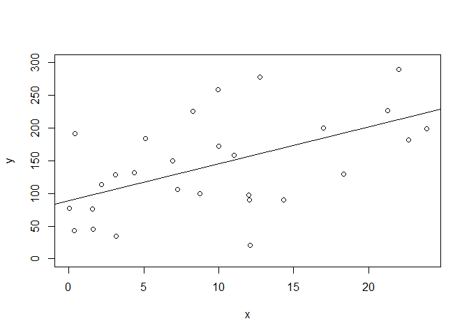
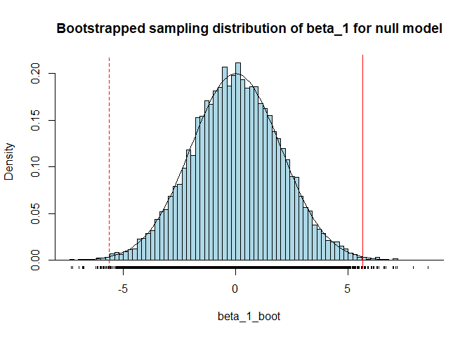

Solution to bootstrap *p*-value
================
Brett Melbourne
22 Sep 2022

The task is to bootstrap a *p*-value for the slope $\beta_1$. We derived
this algorithm in class in group work.

Algorithm:

    Fit full model (y = beta_0 + beta_1 * x + e)
    Record estimated beta_1 and sigma_e
    Fit null model (y = beta_0 + e)
    Record estimated beta_0
    Repeat very many times
        generate data from the null model
        fit the full model
        record the estimated beta_1 (call this beta_1_boot)
    Calculate the frequency beta_1_boot is as large or larger than beta_1_obs

Generate some fake data to work with. Your algorithm will use your own
dataset. This example has a loose relationship with large $\sigma_e$.

``` r
set.seed(11.5) #make example reproducible
n <- 30  #size of dataset
b0 <- 100 #true y intercept
b1 <- 7 #true slope
s <- 100  #true standard deviation of the errors
x <- runif(n, min=0, max=25) #nb while we have used runif, x is not a random variable
y <- b0 + b1 * x + rnorm(n, sd=s) #random sample of y from the population
```

Fit full model (y = beta_0 + beta_1 \* x + e)

``` r
fit_m1 <- lm(y ~ x)
```

Visualize data with fitted full model

``` r
plot(x, y, ylim=c(0, 300))
abline(fit_m1)
```

<!-- -->

Record estimated beta_1 and sigma_e

``` r
beta_1 <- coef(fit_m1)[2]
sigma_e <- sqrt(sum(fit_m1$residuals ^ 2) / fit_m1$df.residual)
```

Fit null model (y = beta_0 + e)

``` r
fit_m0 <- lm(y ~ 1)
```

Record estimated beta_0 for the null model

``` r
beta_0_null <- coef(fit_m0)[1]
```

Bootstrap algorithm

``` r
reps <- 10000
beta_1_boot <- rep(NA, reps)
for ( i in 1:reps ) {
    
#   generate data from the null model
    y_boot <- beta_0_null + rnorm(n, mean=0, sd=sigma_e)
    
#   fit the full model
    fit_m1_boot <- lm(y_boot ~ x)
    
#   record the estimated beta_1
    beta_1_boot[i] <- coef(fit_m1_boot)[2]
    
    if ( i %% 1000 == 0 ) print(paste(100*i/reps,"%",sep="")) #monitoring
    
}
```

Calculate two-tailed *p*-value, which is the notion that the magnitude
of the observed $\beta_1$ is at issue and not its specific sign, so we
need to consider magnitudes of $\beta_1$ of either sign in the sampling
distribution.

``` r
sum(abs(beta_1_boot) >= abs(beta_1)) / reps
```

    ## [1] 0.0046

``` r
#sum( beta_1_boot >= beta_1 | beta_1_boot <= -beta_1 ) / reps #equivalent
```

Compare our version of the bootstrap *p*-value to the classical
*p*-value. It’s very similar for these data. The appropriate *p*-value
is on line `x`.

``` r
summary(fit_m1)$coefficients
```

    ##              Estimate Std. Error  t value     Pr(>|t|)
    ## (Intercept) 89.390631  23.333192 3.831050 0.0006597707
    ## x            5.637969   1.974472 2.855432 0.0080064721

Visualize the bootstrap distribution.

``` r
hist(beta_1_boot, freq=FALSE, breaks=100, col="lightblue", main=
         "Bootstrapped sampling distribution of beta_1 for null model")
rug(beta_1_boot, ticksize=0.01)
abline(v=beta_1, col="red")
abline(v=-beta_1, col="red", lty=2)
lines(seq(-10,10,0.1), dnorm(seq(-10,10,0.1), mean=0, sd=sd(beta_1_boot)))
```

<!-- -->

As usual, the histogram shows the bootstrapped sampling distribution. I
have added a rug plot, which puts a tickmark for each bootstrap
replicate, useful here to visualize the tails. I have also added a solid
red line to show the observed (fitted) value for $\beta_1$ and a dashed
red line to show the value of $-\beta_1$ indicating a slope of the same
magnitude but in the negative direction. Bootstrap samples outside these
lines are the values “as large or larger than” the observed magnitude of
$\beta_1$. I have also overlaid a Normal distribution on the histogram.
We see that the sampling distribution for $\beta_1$ tends Normal, as
expected from theory based on the assumptions of the null model.

Here we’ve used $\beta_1$ straight up as the test statistic. If we
instead use the *t* statistic (i.e. divide $\beta_1$ by its standard
error), which matches the setup of the classical test, we find that the
*p*-value is almost identical to the classical test. These are both
valid *p*-values, just for different test statistics.
