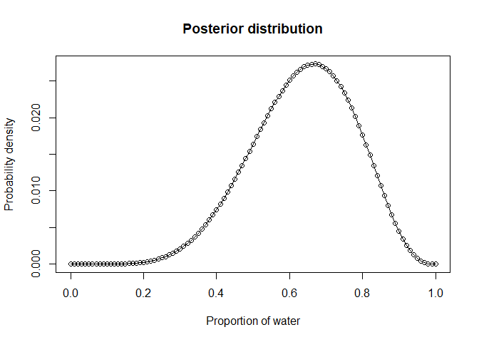
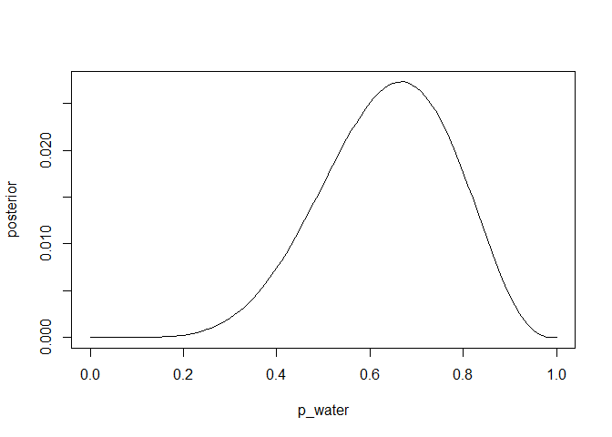

Grid approximation of posterior distribution
================
Brett Melbourne
03 Oct 2022

Example from McElreath 2016 p 40

Algorithm

    load data
    define grid of parameter values
    for each parameter value, compute numerator
       compute prior probability
       compute likelihood
       numerator = prior x likelihood
    denominator = sum of numerators
    for each parameter value, compute posterior
       posterior probability = numerator / denominator
    plot posterior probability vs parameter values

Translated to R as a structured program

``` r
# load data (6 water hits out of 9 tosses)
water <- data.frame(hits=6, ntosses=9)

# define grid of parameter values (proportion of water)
resolution <- 0.01
p_water <- seq(from=0, to=1, by=resolution)
n <- length(p_water)

# for each parameter value, compute numerator
numerator <- rep(NA, n)
for ( i in 1:n ) {
    prior <- dunif(p_water[i])
    likelihood <- dbinom(water$hits, size=water$ntosses, prob=p_water[i])
    numerator[i] <- prior * likelihood
}

denominator <- sum(numerator)

# for each parameter value, compute posterior
posterior <- rep(NA, n)
for ( i in 1:n ) {
    posterior[i] <- numerator[i] / denominator
}

# plot posterior probability vs parameter values
plot(p_water, posterior, xlab="Proportion of water", 
     ylab="Probability density", main="Posterior distribution")
lines(p_water, posterior)
```

<!-- -->

Translated to R as vectorized code

``` r
# load data (6 water hits out of 9 tosses)
water <- data.frame(hits=6, ntosses=9)

# define grid of parameter values (proportion water)
resolution <- 0.01
p_water <- seq(from=0, to=1, by=resolution)

# compute prior at each parameter value
prior <- dunif(p_water)

# compute likelihood at each parameter value
likelihood <- dbinom(water$hits, size=water$ntosses, prob=p_water)

# compute numerator at each parameter value
numerator <- likelihood * prior

# denominator = sum of numerators
denominator <- sum(numerator)

# compute posterior at each parameter value
posterior <- numerator / denominator

# plot posterior probability vs parameter values
plot(p_water, posterior, xlab="Proportion of water", 
     ylab="Probability density", main="Posterior distribution")
lines(p_water, posterior)
```

<!-- -->

Finally, a minimalist vectorized version

``` r
water <- data.frame(hits=6, ntosses=9)
p_water <- seq(0, 1, by=0.01)
prior <- dunif(p_water)
likelihood <- dbinom(water$hits, water$ntosses, p_water)
posterior <- prior * likelihood / sum(prior * likelihood)
plot(p_water, posterior, type="l") 
```

<!-- -->
