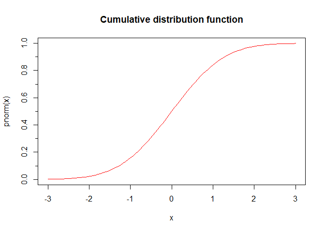
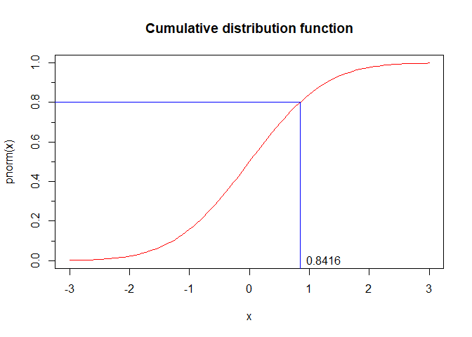
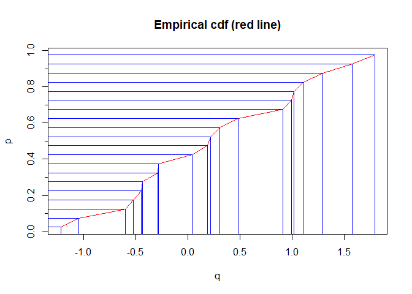
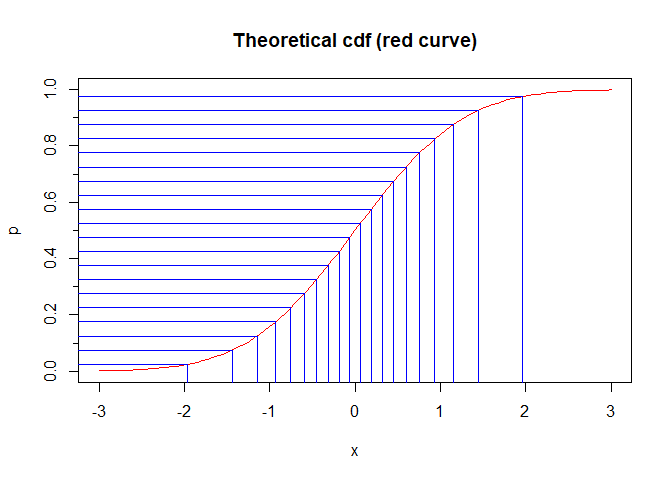
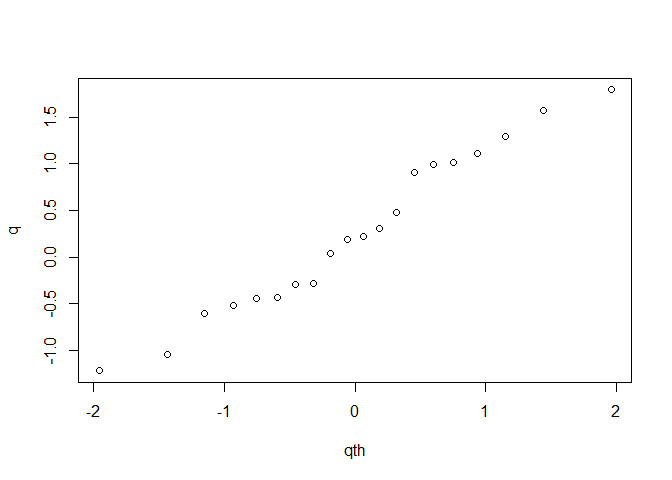

Quantiles and Q-Q plots
================
Brett Melbourne
6 Oct 2021

A short tutorial on quantiles and Q-Q plots

### Understanding quantiles

Here is the cumulative distribution function (cdf) for the standard
Normal distribution. This is a plot of the cumulative probability,
Prob(X \< x), versus x.

``` r
x <- seq(-3, 3, length.out=100)
plot(x, pnorm(x), type="l", col="red", main="Cumulative distribution function")
axis(2, at=seq(0, 1, by=0.1), labels=FALSE, tcl=-0.25)
```

<!-- -->

Quantiles are the inverse of this function. What is the value of x for
which the cumulative probability is p? For example, what value of x are
80% of the values expected to be less than?

``` r
p <- 0.80
qnorm(p) #This is that value of x; it equals 0.8416.
```

    ## [1] 0.8416212

We say that 0.8416 is the quantile for p = 0.8.

We could alternatively read the quantile off the graph of the cdf

``` r
plot(x, pnorm(x), type="l", col="red", main="Cumulative distribution function")
axis(2, at=seq(0, 1, by=0.1), labels=FALSE, tcl=-0.25)
segments(-4, p, qnorm(p), p, col="blue")
segments(qnorm(p), -0.1, qnorm(p), p, col="blue")
text(qnorm(p), 0, labels=signif(qnorm(p), 4), pos=4)
```

<!-- -->

Let’s check that. Let’s simulate a dataset from a standard normal
(i.e. mean = 0, sigma = 1).

``` r
z <- rnorm(100000)
```

Are 80% of the data less than the 0.8 quantile of 0.8416?

``` r
sum(z < 0.8416) / 100000
```

    ## [1] 0.79942

Yes, that’s about right.

### Procedure for constructing a QQ plot

The basic idea of a QQ plot is to plot the empirical quantiles
(i.e. from the data) against the theoretical quantiles of the
distribution in question (e.g. Normal, Poisson, etc).

Let’s say we have some data, y. We’ll imagine these are real data from
now on. It’s a small dataset, say 20 points.

``` r
y <- rnorm(20)
```

First of all, the data are their own quantiles, if we order them.

``` r
q <- sort(y)
q #The observed quantiles
```

    ##  [1] -2.7138498 -1.7393576 -1.6499127 -1.2132795 -0.8164366 -0.7741108
    ##  [7] -0.4962083 -0.4561042 -0.3884596 -0.3563116  0.4449208  0.4763855
    ## [13]  0.5317256  0.7110071  0.7526867  0.9637784  1.2197370  1.7223036
    ## [19]  1.7296007  1.7916341

So, for example, the fourth value of the ordered data is the quantile
with p = 4/20. That is 4/20 of the data are less than or equal to this
value (but we’ll take that as an estimate for strictly less than):

``` r
q[4]
```

    ## [1] -1.21328

Now, because this is a finite sample and the sample is quite small and
we won’t expect the quantile for p = 1.0 to be in the sample, we include
a small adjustment to better approximate the probabilities.

``` r
n <- length(y)          #Number of data points
p <- ( 1:n - 0.5 ) / n  #We'll take these as the probabilities
cbind(p, q)             #The probabilities with their quantiles
```

    ##           p          q
    ##  [1,] 0.025 -2.7138498
    ##  [2,] 0.075 -1.7393576
    ##  [3,] 0.125 -1.6499127
    ##  [4,] 0.175 -1.2132795
    ##  [5,] 0.225 -0.8164366
    ##  [6,] 0.275 -0.7741108
    ##  [7,] 0.325 -0.4962083
    ##  [8,] 0.375 -0.4561042
    ##  [9,] 0.425 -0.3884596
    ## [10,] 0.475 -0.3563116
    ## [11,] 0.525  0.4449208
    ## [12,] 0.575  0.4763855
    ## [13,] 0.625  0.5317256
    ## [14,] 0.675  0.7110071
    ## [15,] 0.725  0.7526867
    ## [16,] 0.775  0.9637784
    ## [17,] 0.825  1.2197370
    ## [18,] 0.875  1.7223036
    ## [19,] 0.925  1.7296007
    ## [20,] 0.975  1.7916341

The relationship between p and the ordered y (i.e. q) is the empirical
cdf

``` r
plot(q, p, type="l", col="red", main="Empirical cdf (red line)")
axis(2, at=seq(0, 1, by=0.1), labels=FALSE, tcl=-0.25)
for ( i in 1:n ) {
    segments(-4, p[i], q[i], p[i], col="blue")
    segments(q[i], -0.1, q[i], p[i], col="blue")    
}
```

<!-- -->

Now we calculate the quantiles of the standard normal for the same
probabilities (p) as the data

``` r
qth <- qnorm(p)
qth #The theoretical quantiles
```

    ##  [1] -1.95996398 -1.43953147 -1.15034938 -0.93458929 -0.75541503 -0.59776013
    ##  [7] -0.45376219 -0.31863936 -0.18911843 -0.06270678  0.06270678  0.18911843
    ## [13]  0.31863936  0.45376219  0.59776013  0.75541503  0.93458929  1.15034938
    ## [19]  1.43953147  1.95996398

And we can plot those on the theoretical cdf

``` r
plot(x, pnorm(x), type="l", col="red", ylab="p",
     main="Theoretical cdf (red curve)")
axis(2, at=seq(0, 1, by=0.1), labels=FALSE, tcl=-0.25)
for ( i in 1:n ) {
    segments(-4, p[i], qth[i], p[i], col="blue")
    segments(qth[i], -0.1, qth[i], p[i], col="blue")    
}
```

<!-- -->

The Q-Q plot is the observed quantiles versus the theoretical quantiles.
If the data are well approximated by the theoretical distribution (in
this case Normal), then this should be a straightish line. In this case,
since both the data and the theoretical distribution are standard normal
(i.e. mean=0, sd=1), the line is expected to be 1:1. But since the
dataset is small, the realization will be off the line.

``` r
plot(qth, q)
abline(0, 1, col="blue")
```

<!-- -->

You can try running the code several times (starting from generating the
data) and see how much it differs. Or try simulating a larger dataset.
Or try simulating a dataset that is Normal with different mean and sigma
(the line will still be straight), or generate data from a non-Normal
distribution, such as lognormal or Poisson (the line will not be
straight unless the distribution happens to be approximated well by the
Normal).
