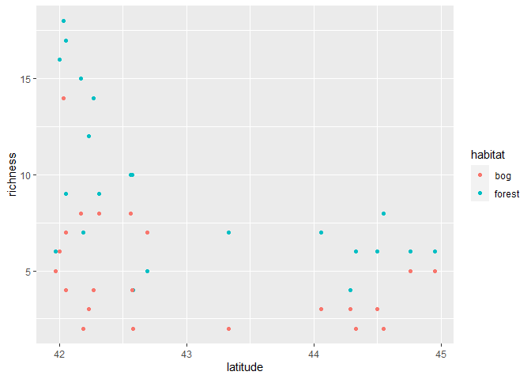
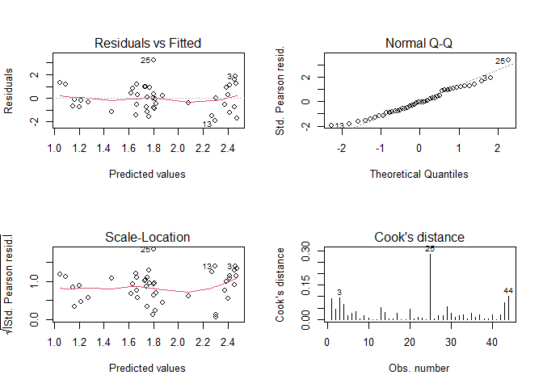
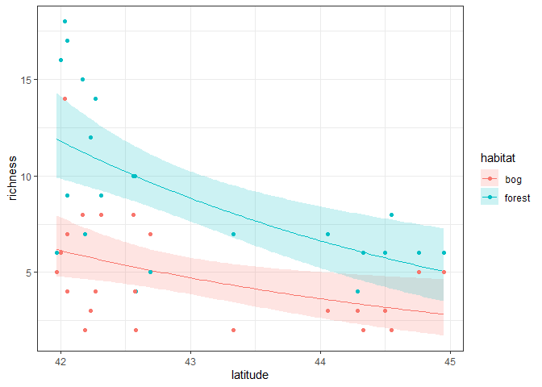
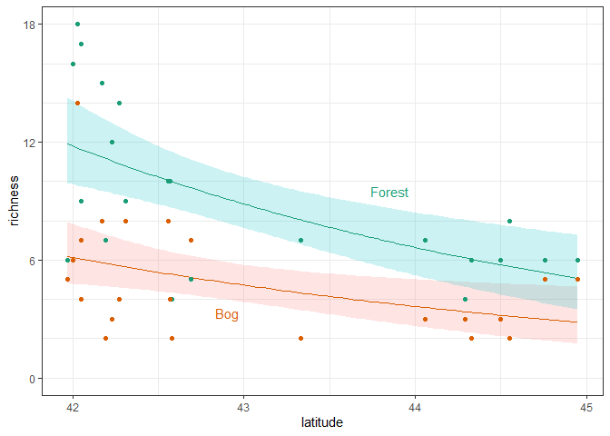

Ant data Generalized Linear Model - Frequentist
================
Brett Melbourne
11 Oct 2018 (updated 24 Oct 2022)

This is the first in a series of scripts to analyze the ant data
described in Ellison (2004). This script demonstrates frequentist
inference from the GLM. Future scripts will consider a Bayesian approach
to the ant analysis, as well as multilevel models to fully account for
the design structure and data variance.

This script can be rendered to a reproducible report.  
`rmarkdown::render("10_6_ants_frequentist.Rmd")`, or *Ctrl+Shift+K* in
RStudio.

``` r
library(ggplot2)
```

## EDA

Read in the ants data:

``` r
ant <- read.csv("data/ants.csv")
head(ant)
```

    ##   site habitat latitude elevation richness
    ## 1  TPB  forest    41.97       389        6
    ## 2  HBC  forest    42.00         8       16
    ## 3  CKB  forest    42.03       152       18
    ## 4  SKP  forest    42.05         1       17
    ## 5   CB  forest    42.05       210        9
    ## 6   RP  forest    42.17        78       15

For now we will focus on the relationship of species richness with
latitude and habitat. Later we will consider the other variables.

Convert habitat to a factor

``` r
ant$habitat <- factor(ant$habitat)
```

Plot the data with `ggplot`. The most common, abbreviated, style would
be

``` r
ggplot(ant, aes(latitude, richness, col=habitat)) + 
    geom_point()
```

<!-- -->

This is an attractive and effective default plot. There is a grid to aid
judging distance on a common scale, a color scale with good contrast
between categories, filled points and a grey background to help the
points pop, and an automatic legend placed outside of the plotting area.

Since we are focusing on the grammar of graphics logic and particularly
the mapping of variables to visual channels, from here we’ll use a
slightly more verbose style to emphasize our thoughtful choices. The
following code would produce a plot identical to the plot made by the
more terse code above.

``` r
ggplot(data=ant, mapping=aes(x=latitude, y=richness, col=habitat)) + 
    geom_point()
```

A nice feature of `ggplot` is the use of themes. Here is the same plot
with the black and white theme.

``` r
ggplot(data=ant, mapping=aes(x=latitude, y=richness, col=habitat)) + 
    geom_point() +
    theme_bw()
```

<!-- -->

## Training

Now, let’s move on to analysis. Fit the full model using `glm()`, which
uses a maximum likelihood algorithm:

``` r
fitHxL <- glm(richness ~ habitat + latitude + habitat:latitude, family=poisson, data=ant)
coef(fitHxL) #Maximum likelihood estimates of parameters
```

    ##            (Intercept)          habitatforest               latitude 
    ##            12.77869292             1.75682959            -0.26109963 
    ## habitatforest:latitude 
    ##            -0.02623362

Diagnostic plots

``` r
par(mfrow=c(2,2))
plot(fitHxL,1:4, ask=FALSE)
```

<!-- -->

Overall, the diagnostics seem not too bad. It is certainly an
improvement over the Normal linear model we tried before. There is
perhaps still a slight tendency for the standardized residuals to
increase with the mean (we’ll investigate that further later) and there
is an influential point (case 25). We should investigate the influential
point using our case deletion algorithm to examine parameter sensitivity
to this point. We’ll return to that later as we continue to improve the
model.

## Inference

Out of the box inferences about parameter uncertainty come from the
assumption of a Normal sampling distribution for the parameter z-values
(estimate divided by standard error), giving us a p-value for each
parameter.

``` r
summary(fitHxL)
```

    ## 
    ## Call:
    ## glm(formula = richness ~ habitat + latitude + habitat:latitude, 
    ##     family = poisson, data = ant)
    ## 
    ## Deviance Residuals: 
    ##     Min       1Q   Median       3Q      Max  
    ## -2.1562  -0.7929  -0.0332   0.8516   2.7420  
    ## 
    ## Coefficients:
    ##                        Estimate Std. Error z value Pr(>|z|)   
    ## (Intercept)            12.77869    4.40625   2.900  0.00373 **
    ## habitatforest           1.75683    5.47728   0.321  0.74840   
    ## latitude               -0.26110    0.10303  -2.534  0.01127 * 
    ## habitatforest:latitude -0.02623    0.12809  -0.205  0.83773   
    ## ---
    ## Signif. codes:  0 '***' 0.001 '**' 0.01 '*' 0.05 '.' 0.1 ' ' 1
    ## 
    ## (Dispersion parameter for poisson family taken to be 1)
    ## 
    ##     Null deviance: 102.763  on 43  degrees of freedom
    ## Residual deviance:  50.242  on 40  degrees of freedom
    ## AIC: 218.6
    ## 
    ## Number of Fisher Scoring iterations: 4

``` r
coef(summary(fitHxL))[,1:2]   #or use this for just the coefficients
```

However, most of the parameter hypotheses being considered here are not
meaningful, either because we don’t care about them biologically
(e.g. we don’t care about the `intercept` hypothesis that species
richness is different from zero at the equator), or because the
parameters are all interdependent (e.g. the fact that the
`habitatforest` parameter is not significantly different from zero means
nothing because it is balanced against the estimate for
`habitatforest:latitude`). The one slightly meaningful inference is for
the `habitatforest:latitude` parameter, which is telling us that there
is little evidence for an interaction on the scale of the linear
predictor. But even this doesn’t necessarily translate to the biological
hypothesis of no interaction between habitat and latitude since the
relationship with latitude is nonlinear, as we will see more clearly
when the fitted model is plotted below. Take away: most of the
hypothesis tests in these summary tables are usually irrelevant to
hypotheses that we are scientifically interested in, except in
infrequent special cases. As we’ll see later, if we want to test
specific scientific hypotheses, we’ll need to be deliberate about
expressing them as alternative models.

95% confidence intervals for parameters are obtained by profiling the
likelihood surface. This is just as we did earlier by varying one
parameter while optimizing over the others. Here, the intervals are
frequentist and are formed by assuming that the likelihood ratio has a

sampling distribution. Note this is not the same as the pure likelihood
intervals we constructed earlier since here the likelihood ratio is
merely a statistic and the inferential basis is the sampling
distribution of the statistic.

``` r
confint(fitHxL)
```

    ## Waiting for profiling to be done...

    ##                             2.5 %      97.5 %
    ## (Intercept)             4.4193660 21.75722597
    ## habitatforest          -9.1480324 12.38251387
    ## latitude               -0.4714597 -0.06606674
    ## habitatforest:latitude -0.2745658  0.22901128

The correlation matrix for the parameters shows how the `habitatforest`
and `habitatforest:latitude` parameters are highly interdependent.

``` r
cov2cor(vcov(fitHxL))
```

    ##                        (Intercept) habitatforest   latitude
    ## (Intercept)              1.0000000    -0.8044583 -0.9997593
    ## habitatforest           -0.8044583     1.0000000  0.8042646
    ## latitude                -0.9997593     0.8042646  1.0000000
    ## habitatforest:latitude   0.8041116    -0.9997617 -0.8043052
    ##                        habitatforest:latitude
    ## (Intercept)                         0.8041116
    ## habitatforest                      -0.9997617
    ## latitude                           -0.8043052
    ## habitatforest:latitude              1.0000000

Although meaningless for a single model, the log likelihood is useful
for comparison with alternative models. Here’s how we can extract the
log likelihood.

``` r
logLik(fitHxL)
```

    ## 'log Lik.' -105.2982 (df=4)

To construct regression intervals, we can use the `predict()` function.
For GLMs, there is no `interval="confidence"` option, so we have to
construct intervals from the standard errors. This is approximate. More
accurate intervals are obtained by parametric bootstrap.

``` r
newd <- data.frame(latitude = rep(seq(min(ant$latitude), max(ant$latitude), length.out=100),2),
                   habitat = factor(rep(c("bog","forest"),each=100)))
preds <- predict(fitHxL,newdata=newd,se.fit=TRUE)
mnlp <- preds$fit        #mean of the linear predictor
selp <- preds$se.fit     #se of the linear predictor
cillp <- mnlp - 2 * selp #lower of 95% CI for linear predictor
ciulp <- mnlp + 2 * selp #upper
cil <- exp(cillp)        #lower of 95% CI for response scale
ciu <- exp(ciulp)        #upper
mu <- exp(mnlp)          #mean of response scale
preds <- cbind(newd,preds,cil,ciu,mu)
```

In `ggplot` we can plot this in three layers:

-   a ribbon geom (a type of polygon) for intervals, using the `alpha`
    setting to obtain a nice see-through effect
-   a line geom for estimated means
-   a point geom for the data

We have two dataframes, one with the data and the other with the
predictions, so we need to specify the dataframe for each layer. I want
to plot the line layer underneath the points layer but then the default
label for the y axis is “mu”. We need to override that with an explicit
y-axis label.

``` r
ggplot() +
    geom_ribbon(data=preds, mapping=aes(x=latitude, ymin=cil, ymax=ciu, fill=habitat), alpha=0.2) +
    geom_line(data=preds, mapping=aes(x=latitude, y=mu, col=habitat)) +
    geom_point(data=ant, mapping=aes(x=latitude, y=richness, col=habitat)) +
    ylab("richness") +
    theme_bw()
```

<!-- -->

There are two modifications we could make to improve visual perception:

1.  colors with semantic meaning (green for forest, orange/brown for
    bog) that are also colorblind friendly
2.  labels added directly to the plot to reduce translational effort (no
    legend)
3.  set the y axis limits to include zero.

``` r
# Bog & Forest colors
bfc <- c("#d95f02", "#1b9e77")

ggplot() +
    geom_ribbon(data=preds, mapping=aes(x=latitude, ymin=cil, ymax=ciu, fill=habitat), alpha=0.2) +
    geom_line(data=preds, mapping=aes(x=latitude, y=mu, col=habitat)) +
    geom_point(data=ant, mapping=aes(x=latitude, y=richness, col=habitat)) +
    geom_text(aes(x=42.9, y=3.3, label="Bog"), col=bfc[1]) +
    geom_text(aes(x=43.85, y=9.5, label="Forest"), col=bfc[2]) +
    scale_color_manual(values=bfc) +
    ylab("richness") +
    ylim(0,18) +
    theme_bw() +
    theme(legend.position="none")
```

<!-- -->
