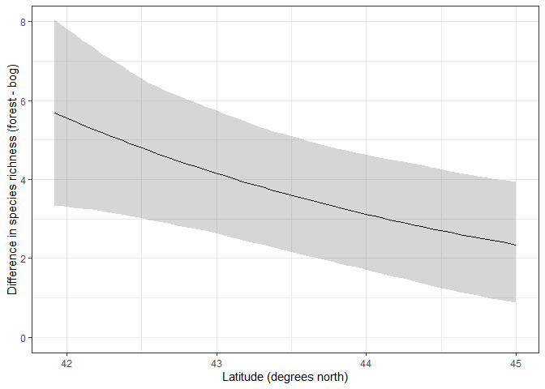

Ant data Generalized Linear Model - Bayesian
================
Brett Melbourne
16 Oct 2018 (updated 27 Oct 2022)

Second in a series of scripts to analyze the ant data described in
Ellison (2004). This script includes Bayesian inference from the GLM.
Future scripts will consider multilevel models to fully account for the
design structure.

This script can be rendered to a reproducible report.  
`rmarkdown::render("09_8_ants_bayesian_GLM.Rmd")`, or *Ctrl+Shift+K* in
RStudio.

Set up for Bayesian analysis (order is important):

``` r
library(ggplot2)
library(dplyr)
library(tidyr)
library(rstanarm) #nb overrides default ggplot theme
options(mc.cores=parallel::detectCores())
source("source/hpdi.R") #For calculating credible intervals
```

I prefer the black and white theme of ggplot, which we can set for all
the plots in this script

``` r
theme_set(theme_bw())
```

Read in the data

``` r
ant <- read.csv("data/ants.csv")
ant$habitat <- factor(ant$habitat)
```

Plot

``` r
ant %>% 
    ggplot(mapping=aes(x=latitude, y=richness, col=habitat)) +
    geom_point()
```

<!-- -->

## Training

Bayesian fit with `rstanarm`

``` r
bysfitHxL <- stan_glm(richness ~ habitat + latitude + habitat:latitude, 
                      family=poisson, data=ant)
```

We obtain a summary in the same way as many other analyses in R, which
will display estimates for the parameters along with their uncertainty.

``` r
summary(bysfitHxL, digits=4)
```

    ## 
    ## Model Info:
    ##  function:     stan_glm
    ##  family:       poisson [log]
    ##  formula:      richness ~ habitat + latitude + habitat:latitude
    ##  algorithm:    sampling
    ##  sample:       4000 (posterior sample size)
    ##  priors:       see help('prior_summary')
    ##  observations: 44
    ##  predictors:   4
    ## 
    ## Estimates:
    ##                          mean    sd      10%     50%     90%  
    ## (Intercept)            13.5463  3.2522  9.4725 13.4697 17.8226
    ## habitatforest           0.8329  3.0136 -3.0362  0.7749  4.7302
    ## latitude               -0.2793  0.0761 -0.3789 -0.2776 -0.1836
    ## habitatforest:latitude -0.0045  0.0704 -0.0955 -0.0030  0.0856
    ## 
    ## Fit Diagnostics:
    ##            mean   sd     10%    50%    90% 
    ## mean_PPD 6.9981 0.5713 6.2727 7.0000 7.7500
    ## 
    ## The mean_ppd is the sample average posterior predictive distribution of the outcome variable (for details see help('summary.stanreg')).
    ## 
    ## MCMC diagnostics
    ##                        mcse   Rhat   n_eff
    ## (Intercept)            0.0845 1.0010 1481 
    ## habitatforest          0.0922 1.0009 1069 
    ## latitude               0.0020 1.0010 1481 
    ## habitatforest:latitude 0.0022 1.0008 1071 
    ## mean_PPD               0.0113 1.0006 2552 
    ## log-posterior          0.0395 1.0028 1309 
    ## 
    ## For each parameter, mcse is Monte Carlo standard error, n_eff is a crude measure of effective sample size, and Rhat is the potential scale reduction factor on split chains (at convergence Rhat=1).

In this table, we can look at the posterior sample means
(`Estimates: mean`) for a point estimate of the parameter values. The
standard deviation (`Estimates: sd`) of the posterior samples is one
measure of uncertainty. Twice the standard deviation is roughly a 95%
credible interval assuming the posterior distribution is Normal. We can
compare the mean to the median (`Estimates: 50%`, the 50th percentile of
the posterior samples) and the 10th to the 90th percentiles of the
samples to have a sense of the symmetry of the posterior distribution.
The range between the 10th and 90th percentiles is another measure of
uncertainty (80% CPI by default).

Under `MCMC diagnostics` we see especially that the `Rhat` values are
all 1, indicating convergence, and `n_eff`, the effective number of
samples, is quite good (1000+) for all parameters. The Monte Carlo
standard error (`mcse`) is the amount of error contributed by the
sampling algorithm. We’d like to see that be relatively small compared
to the standard deviations (`sd`) of the parameters.

The `mean_ppd` (mean of the posterior predictive distribution) is a
quick check for gross problems with the fit. It’s just the predicted
mean of the response. Compare this to the observed mean of the data.
They should be in a similar ballpark. Here, `mean_ppd` is very close to
the observed mean.

``` r
mean(ant$richness)
```

    ## [1] 7.022727

### Working with posterior samples

We’ll first work with the samples directly (as we did in McElreath Ch
4). There are also convenience functions to do many standard things but
we will often want to calculate new quantities from the samples directly
to answer science questions that aren’t addressed by the standard
output. Doing it the slightly harder way first will prepare you for
building your own custom analyses by developing a deeper understanding
of the data structures as well as experience with visualization. At the
end we’ll look at some of the convenience functions in `rstanarm`. There
are also packages (e.g. `tidybayes`,`bayesplot`) that automate many
things here that I recommend you try after this class as more convenient
for routine Bayesian analyses.

No matter what package or algorithm we use to obtain samples, we want to
get those samples because they are the basis for all Bayesian
inferences. The object returned by `stan_glm()` includes within it a
`stanfit` object and we can use the `extract()` function from `rstan` to
get the samples:

``` r
samples <- rstan::extract(bysfitHxL$stanfit)
class(samples)
```

    ## [1] "list"

``` r
str(samples)
```

    ## List of 4
    ##  $ alpha   : num [1:4000, 1] 15.5 17.8 12.8 12.9 11.7 ...
    ##   ..- attr(*, "dimnames")=List of 2
    ##   .. ..$ iterations: NULL
    ##   .. ..$           : NULL
    ##  $ beta    : num [1:4000, 1:3] -2.62 -2.68 2.06 5.31 2.42 ...
    ##   ..- attr(*, "dimnames")=List of 2
    ##   .. ..$ iterations: NULL
    ##   .. ..$           : NULL
    ##  $ mean_PPD: num [1:4000(1d)] 7.43 7.02 7.36 7.48 7.05 ...
    ##   ..- attr(*, "dimnames")=List of 1
    ##   .. ..$ iterations: NULL
    ##  $ lp__    : num [1:4000(1d)] -111 -112 -110 -112 -111 ...
    ##   ..- attr(*, "dimnames")=List of 1
    ##   .. ..$ iterations: NULL

``` r
names(samples)
```

    ## [1] "alpha"    "beta"     "mean_PPD" "lp__"

### Diagnostics

We can plot histograms directly from the samples. To do this with
`ggplot`, we first need the samples in a dataframe. We can go one step
further, converting the dataframe to tidy format (using `pivot_longer`
from `tidyr`) and then using `facet_wrap` to plot histograms for all 4
parameters. First, combine the posterior samples into an appropriate
dataframe.

``` r
samplesdf <- data.frame(samples$alpha, samples$beta)
```

But that has given us poor column names:

``` r
head(samplesdf, 2)
```

    ##   samples.alpha        X1        X2         X3
    ## 1      15.51723 -2.617353 -0.325644 0.07832544
    ## 2      17.78277 -2.681215 -0.375653 0.07583807

Make new column names:

``` r
names(samplesdf) <- c("alpha", paste("beta", 1:3, sep="_"))
head(samplesdf, 2)
```

    ##      alpha    beta_1    beta_2     beta_3
    ## 1 15.51723 -2.617353 -0.325644 0.07832544
    ## 2 17.78277 -2.681215 -0.375653 0.07583807

Now plot the histograms

``` r
samplesdf %>% 
    pivot_longer(cols=everything(), names_to="parameter", values_to="sample_value") %>% 
    ggplot() +
    geom_histogram(mapping=aes(x=sample_value, y=stat(density)), bins=75) +
    facet_wrap(vars(parameter), scales="free")
```

<!-- -->

This of course is not merely diagnostic. The posterior distribution is
the full inference for a parameter. Diagnostically, we want to ask if
the samples are giving us a good picture of the posterior distribution.
We see that the distributions of the posterior samples are roughly
symmetric (statistical theory for these types of models suggests the
posterior would be approximately Normal) and not terribly noisy.

Sometimes you might only want one of the histograms, in which case you
can do it quickly without making a data frame by using `qplot` from
ggplot or `hist` from base plot.

``` r
qplot(samples$beta[,1], bins=75)
hist(samples$beta[,1], breaks=75)
```

Manual trace plot from the samples. This example is for `alpha` (aka
$\beta_0$):

``` r
intercept_trace <- rstan::extract(bysfitHxL$stanfit, pars="alpha", permuted=FALSE)
data.frame(intercept_trace) %>% 
    mutate(iteration=1:n()) %>%
    pivot_longer(cols=starts_with("chain"),
                 names_to="chain",
                 values_to="alpha") %>%
    ggplot() +
    geom_line(mapping=aes(x=iteration, y=alpha, col=chain))
```

<!-- -->

We see that the chains have converged. Sometimes the tidyverse code is
quite involved since we need to convert to a tidy dataframe first. The
following would make the same plot using base functions, using a for
loop to iterate over chains, which are indexed in dimension 2 of the
array:

``` r
plot(NA, NA, type="n", ylim=range(intercept_trace),
     xlim=c(0,length(intercept_trace[,1,1])), xlab="iteration", ylab="alpha")
for ( i in 1:4 ) {
    lines(intercept_trace[,i,1], col=i)  
}
```

## Inference

### Parameter credible intervals

We get 95% credible intervals (HPDI) directly from the samples

``` r
hpdi(samples$alpha[,1], prob=0.95)
```

    ##         lower    upper
    ## [1,] 7.245432 19.67567

``` r
hpdi(samples$beta[,1], prob=0.95)
```

    ##          lower    upper
    ## [1,] -5.156496 6.501717

``` r
hpdi(samples$beta[,2], prob=0.95)
```

    ##           lower      upper
    ## [1,] -0.4224518 -0.1291089

``` r
hpdi(samples$beta[,3], prob=0.95)
```

    ##           lower     upper
    ## [1,] -0.1372107 0.1332558

These are almost the same as the CPIs due to the symmetric posteriors.
Here is the convenience function for the parameter CPIs:

``` r
posterior_interval(bysfitHxL, prob=0.95)
```

    ##                              2.5%      97.5%
    ## (Intercept)             7.3291058 19.8587975
    ## habitatforest          -4.8427418  6.9447471
    ## latitude               -0.4276838 -0.1337174
    ## habitatforest:latitude -0.1445864  0.1286292

There is a good argument for using the CPI here in lieu of the HPDI. We
saw from the histograms that the posteriors are quite symmetric but also
that there was still some noise in the tails of the samples. Thus, the
CPI is probably a more numerically stable estimate of the credible
interval, even though the CPI is not a credible interval itself.

### Mean curves, regression intervals (HPDI), posterior predictive distribution

These quantities don’t come directly from the samples for individual
parameters but instead are quantities that we derive from combinations
of the samples. The following is quite literal. We could make this more
elegant but the steps needed are clear this way.

``` r
# Initialize variables and storage 
latitude <- seq(from=41.92, to=45, length.out=50) #range for latitude
n <- length(latitude)
hpdi_bog <- matrix(NA, nrow=n, ncol=5) #to store hpdi values and mean
colnames(hpdi_bog) <- c("mnmu","mulo95","muhi95","ppdlo95","ppdhi95")
hpdi_forest <- matrix(NA, nrow=n, ncol=5)
colnames(hpdi_forest) <- c("mnmu","mulo95","muhi95","ppdlo95","ppdhi95")

# For each latitude, form the posterior
for ( i in 1:n ) {
    
    # First form samples for the linear predictor \eta
    eta_bog <- samples$alpha[,1] + 
               samples$beta[,2] * latitude[i]
    eta_forest <- samples$alpha[,1] + 
                  samples$beta[,1] + 
                  samples$beta[,2] * latitude[i] + 
                  samples$beta[,3] * latitude[i]
    
    # Then use inverse link for samples of the posterior \mu
    mu_bog <- exp(eta_bog)
    mu_forest <- exp(eta_forest)
    
    # Sample from Poisson to get the posterior predictive distribution
    ppd_bog <- rpois(n=length(mu_bog), lambda=mu_bog)
    ppd_forest <- rpois(n=length(mu_forest), lambda=mu_forest)
    
    # Mean and intervals of these samples
    hpdi_bog[i,1] <- mean(mu_bog)
    hpdi_bog[i,2:3] <- hpdi(mu_bog, prob=0.95)
    #hpdi_bog[i,4:5] <- hpdi(ppd_bog, prob=0.95)
    hpdi_bog[i,4:5] <- quantile(ppd_bog, prob=c(0.025,0.975)) #CPI
    hpdi_forest[i,1] <- mean(mu_forest)
    hpdi_forest[i,2:3] <- hpdi(mu_forest, prob=0.95)
    #hpdi_forest[i,4:5] <- hpdi(ppd_forest, prob=0.95)
    hpdi_forest[i,4:5] <- quantile(ppd_forest, prob=c(0.025,0.975)) #CPI
    
}
rm(eta_bog, eta_forest, mu_bog, mu_forest) #clean up
```

Notice that we calculated expectations (means) and intervals directly on
the scale of the data (the “response” scale), not on the linear
predictor scale. If we calculated first on the linear predictor scale
and then backtransformed the intervals to the response scale they would
be biased due to nonlinear averaging. Also, the posterior predictive
distribution (PPD) can, of course, only be on the response scale. I used
the CPI (`quantile()`) for the posterior predictive distribution because
plots of the HPDI and CPI were substantially similar but the CPI was
more numerically stable.

Package in tidy format for plotting

``` r
predsbog <- data.frame(habitat=rep("bog", n), latitude, hpdi_bog)
predsforest <- data.frame(habitat=rep("forest", n), latitude, hpdi_forest)
preds <- rbind(predsbog, predsforest)
rm(latitude, n, hpdi_bog, hpdi_forest, predsbog, predsforest) #clean up
```

Now we can visualize these inferences. The credible intervals for the
means are the shaded regions while the dashed lines show the posterior
predictive interval.

``` r
bfc <- c("#d95f02", "#1b9e77") #bog & forest colors
preds %>%
    ggplot() +
    geom_ribbon(mapping=aes(x=latitude, ymin=mulo95, ymax=muhi95, fill=habitat),
                alpha=0.2) +
    geom_point(data=ant, mapping=aes(x=latitude, y=richness, col=habitat)) +
    geom_line(mapping=aes(x=latitude, y=mnmu, col=habitat)) +
    geom_line(mapping=aes(x=latitude, y=ppdlo95, col=habitat), lty=2) +
    geom_line(mapping=aes(x=latitude, y=ppdhi95, col=habitat), lty=2) +
    geom_text(aes(x=42.7, y=3.3, label="Bog"), col=bfc[1]) +
    geom_text(aes(x=43.85, y=9.5, label="Forest"), col=bfc[2]) +
    scale_fill_manual(values=bfc) +
    scale_color_manual(values=bfc) +
    scale_y_continuous(breaks=seq(0, 20, 4), minor_breaks=seq(0, 20, 2)) +
    xlab("Latitude (degrees north)") +
    ylab("Ant species richness") +
    theme(legend.position="none")
```

<!-- -->

Notice that the intervals for forest are wider than for bog. This is
because the uncertainty scales with the mean of the response. Also
notice that the intervals for the posterior predictive distribution have
discrete steps. This is because the data generating process is discrete
(e.g. we cannot have 1.3 species). Also, there are a few blips in the
intervals for the predictive distribution and some wiggles in the mean
intervals. This is due to Monte Carlo error. Increase the number of
iterations when training the model (e.g. iter=10000) and these will
largely go away.

Let’s consider now our original three scientific questions. We can
answer question 2: How does species richness vary with latitude? The
above plot shows this. Species richness declines with latitude and
appears to be well described by a gentle exponential decline over the
range of the data (because the inverse link function is exponential).
The uncertainty in this relationship for both habitats is shown by the
credible intervals for the mean. We can also answer question 3: Is this
relationship different between habitats? There are two answers,
depending on our view. On the one hand, we could conclude from the plot
that species richness starts higher and declines faster with latitude in
forest than in bog habitat. On the other hand, the exponential decline
is about the same and there is little evidence for a difference in the
exponent as judged by the value and uncertainty of $\beta_3$
(`habitatforest:latitude`, the difference in the exponent between
habitats). The mean and 95% CPI for this parameter is (repeating here
from earlier):

``` r
mean(samples$beta[,3])
```

    ## [1] -0.004518824

``` r
posterior_interval(bysfitHxL, pars="habitatforest:latitude", prob=0.95)
```

    ##                              2.5%     97.5%
    ## habitatforest:latitude -0.1445864 0.1286292

Finally, we can’t properly answer question 1: How different is species
richness between habitats? We can see from the plot above that mean
species richness is mostly higher in forest than bog, judging by the
non-overlap of the credible intervals for the mean. We can also roughly
read off the difference (about 5.5 at latitude 42, or 2.5 at latitude
45). But we haven’t yet precisely quantified this difference or its
uncertainty.

### Non-standard derived quantities

To answer question 1, we need to make our own relevant quantities: the
differences in mean species richness between habitats at different
latitudes. These differences are a function of the parameters, so we can
**derive** samples of them from samples of the parameters. The first
half of this code is substantially the same as above; the main action is
at the line that calculates the difference. The object `diff` contains
the posterior samples for the difference in mean richness at a given
altitude. I found the CPI to be a good and stable estimate of the
credible interval.

``` r
# Initialize variables and storage 
latitude <- seq(from=41.92, to=45, length.out=50) #range for latitude
n <- length(latitude)
forest_bog_diff <- matrix(NA, nrow=n, ncol=3) #to store mean and hpdi values
colnames(forest_bog_diff) <- c("mndiff","difflo95","diffhi95")

# For each latitude, form the posterior
for ( i in 1:n ) {
    
    # First form samples for the linear predictor \eta
    eta_bog <- samples$alpha[,1] + 
               samples$beta[,2] * latitude[i]
    eta_forest <- samples$alpha[,1] + 
                  samples$beta[,1] + 
                  samples$beta[,2] * latitude[i] + 
                  samples$beta[,3] * latitude[i]
    
    # Then use inverse link for samples of the posterior \mu
    mu_bog <- exp(eta_bog)
    mu_forest <- exp(eta_forest)
    
    # Now calculate the habitat difference (derived quantity)
    diff <- mu_forest - mu_bog
    
    # Mean and intervals of these samples
    forest_bog_diff[i,1] <- mean(diff)
    #forest_bog_diff[i,2:3] <- hpdi(diff, prob=0.95)
    forest_bog_diff[i,2:3] <- quantile(diff, prob=c(0.025,0.975)) #CPI

}

# Package in a dataframe
diff_df <- data.frame(cbind(forest_bog_diff, latitude))
rm(latitude,n,forest_bog_diff,eta_bog,eta_forest,mu_bog,mu_forest,diff) #clean up
```

Plot the difference with its uncertainty. I’ve used `coord_cartesian()`
to set the y-axis limits instead of `ylim()` in case the ribbon region
goes beyond the axis limit. In `ggplot()` the dataset is truncated to
the axis limits by default, which could lead to a missing chunk of the
ribbon. The upper limit of the interval is very close to 8 and goes a
hair above in some runs of the stochastic sampler.

``` r
diff_df %>% 
    ggplot() +
    geom_ribbon(mapping=aes(x=latitude, ymin=difflo95, ymax=diffhi95),
        alpha=0.2) +
    geom_line(mapping=aes(x=latitude, y=mndiff)) +
    coord_cartesian(ylim=c(0,8)) +
    xlab("Latitude (degrees north)") +
    ylab("Difference in species richness (forest - bog)")
```

<!-- -->

Now we have quantitatively answered question 1: How different is species
richness between habitats? We can see how the difference declines with
latitude, and we can see how the uncertainty changes with latitude
showing that mean ant richness in forest is clearly higher than in bog
across the entire range of latitudes.

### Using convenience functions

Extracting everything manually from the samples is a fair bit of coding
work. The convenience functions in `rstanarm` make this easier for
common tasks. As in `glm()`, these functions take a `newdat` argument
that simplifies coding. To do what we just did manually above (except
for the analysis of the habitat differences), first make a dataframe
with the desired values of the explanatory variables.

``` r
newd <- data.frame(latitude=rep(seq(from=41.92, to=45, length.out=50), 2),
                   habitat=factor(rep(c("bog","forest"), each=50)))
```

Then derive samples for the posterior distribution of the inverse link
function, i.e. Dist($\mu$), which we’ll call `pmu`.

``` r
pmu <- posterior_linpred(bysfitHxL, transform=TRUE, newdata=newd)
```

This is a matrix with samples in rows and the variable combinations in
columns. The estimated means are then

``` r
mnmu <- colMeans(pmu)
```

and the 95% credible intervals for the mean are

``` r
n <- nrow(newd)
regression_intervals <- data.frame(mulo95=rep(NA,n), muhi95=rep(NA,n))
for ( i in 1:n ) {
    regression_intervals[i,] <- hpdi(pmu[,i], prob=0.95)
}
```

For predictions, first derive samples for the posterior predictive
distribution, which we’ll call ppd

``` r
ppd <- posterior_predict(bysfitHxL, newdata=newd)
str(ppd)
```

    ##  int [1:4000, 1:100] 8 1 6 6 6 9 7 7 7 6 ...
    ##  - attr(*, "dimnames")=List of 2
    ##   ..$ : NULL
    ##   ..$ : chr [1:100] "1" "2" "3" "4" ...

and the 95% prediction intervals (here CPI for stability) are then

``` r
n <- nrow(newd)
prediction_intervals <- data.frame(ppdlo95=rep(NA,n), ppdhi95=rep(NA,n))
for ( i in 1:n ) {
    prediction_intervals[i,] <- quantile(ppd[,i], prob=c(0.025,0.975))
}
```

Plot (code is the same as the previous plot of the regression means)

``` r
preds <- cbind(newd, mnmu, regression_intervals, prediction_intervals)
bfc <- c("#d95f02", "#1b9e77") #bog & forest colors
preds %>%
    ggplot() +
    geom_ribbon(mapping=aes(x=latitude, ymin=mulo95, ymax=muhi95, fill=habitat),
                alpha=0.2) +
    geom_point(data=ant, mapping=aes(x=latitude, y=richness, col=habitat)) +
    geom_line(mapping=aes(x=latitude, y=mnmu, col=habitat)) +
    geom_line(mapping=aes(x=latitude, y=ppdlo95, col=habitat), lty=2) +
    geom_line(mapping=aes(x=latitude, y=ppdhi95, col=habitat), lty=2) +
    geom_text(aes(x=42.7, y=3.3, label="Bog"), col=bfc[1]) +
    geom_text(aes(x=43.85, y=9.5, label="Forest"), col=bfc[2]) +
    scale_fill_manual(values=bfc) +
    scale_color_manual(values=bfc) +
    scale_y_continuous(breaks=seq(0, 20, 4), minor_breaks=seq(0, 20, 2)) +
    xlab("Latitude (degrees north)") +
    ylab("Ant species richness") +
    theme(legend.position="none")
```

<!-- -->

## Summary

Comparing inference algorithms for frequentist and Bayesian approaches
to model means and predictions so far:

| Tool     | Mean                      | Uncertainty of mean       | Uncertainty of prediction |
|:---------|:--------------------------|:--------------------------|:--------------------------|
| lm       | predict()                 | predict(int=“confidence”) | predict(int=“prediction”) |
| glm      | predict(type= “response”) | predict(se.fit=TRUE)      | via bootstrap             |
|          |                           | or via bootstrap          |                           |
| stan_glm | mean(pmu)                 | hpdi(pmu)                 | hpdi(ppd)                 |

where:

-   `pmu <- posterior_linpred(transform = TRUE)`
-   `ppd <- posterior_predict()`
