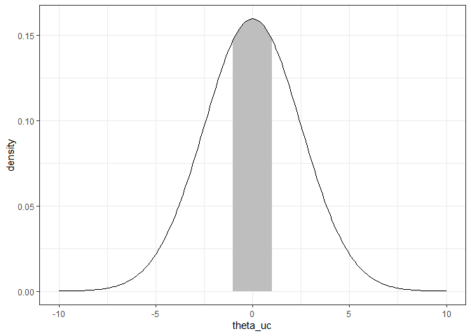

Ant data GLM - priors for Bayesian model
================
Brett Melbourne
31 Oct 2022

Here we look at the priors in the GLM.

``` r
library(ggplot2)
library(rstanarm)
options(mc.cores=parallel::detectCores())
theme_set(theme_bw())
```

Read in data and train the model with `rstanarm`

``` r
ant <- read.csv("data/ants.csv")
ant$habitat <- factor(ant$habitat)
bysfitHxL <- stan_glm(richness ~ habitat + latitude + habitat:latitude, 
                      family=poisson, data=ant)
```

To see what priors have been used

``` r
prior_summary(bysfitHxL)
```

    ## Priors for model 'bysfitHxL' 
    ## ------
    ## Intercept (after predictors centered)
    ##  ~ normal(location = 0, scale = 2.5)
    ## 
    ## Coefficients
    ##   Specified prior:
    ##     ~ normal(location = [0,0,0], scale = [2.5,2.5,2.5])
    ##   Adjusted prior:
    ##     ~ normal(location = [0,0,0], scale = [4.94,2.34,0.11])
    ## ------
    ## See help('prior_summary.stanreg') for more details

Before `rstanarm` trains the model it centers and scales the predictor
variables. This improves the behavior of the MCMC algorithm resulting in
faster and more reliable convergence. The default priors are specified
on this scale. For this model (GLM, Poisson with log link) we see that
the priors for the intercept and the three betas are all Normal(0,2.5):
`location` is the mean of the distribution and `scale` is the standard
deviation. There is a corresponding `Adjusted prior`, which is the
equivalent prior on the original scale.

What does a Normal(0,2.5) prior look like? To visualize, we can compute
it and compare to a “standard Normal”, which is Normal(0,1).

``` r
theta <- seq(-10, 10, 0.1)
standardN <- dnorm(theta, mean=0, sd=1)
prior2.5 <- dnorm(theta, mean=0, sd=2.5)
data.frame(theta, standardN, prior2.5) |> 
    ggplot() +
    geom_vline(xintercept=c(-1,1), col="gray", lty=2) +
    geom_line(mapping=aes(x=theta, y=standardN)) +
    geom_line(mapping=aes(x=theta, y=prior2.5), col="red") +
    ylab("density")
```

<!-- -->

This is a weakly informative prior. We are expressing a tendency for the
parameter to be near zero but most of the probability mass (area under
the curve) is beyond 1 standard deviation unit, allowing plausible
values out to about 6 or 7 standard deviation units. But magnitudes as
large as 10 standard deviation units are very implausible.
