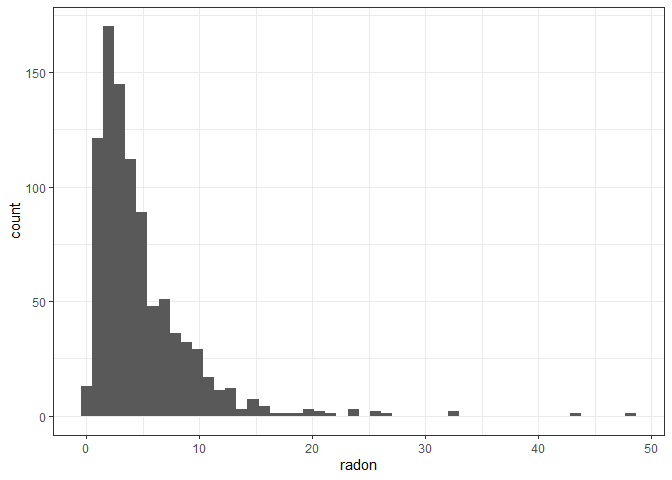
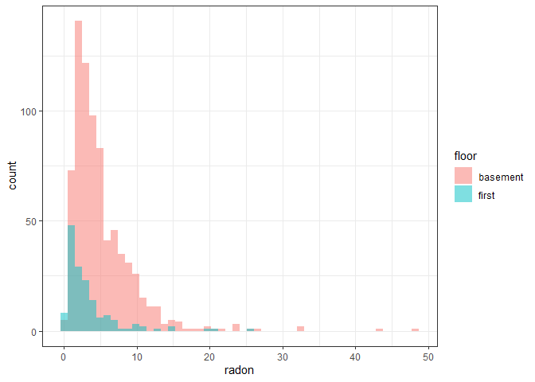
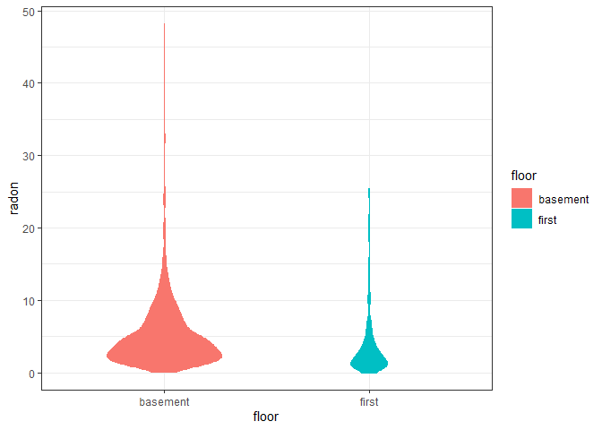
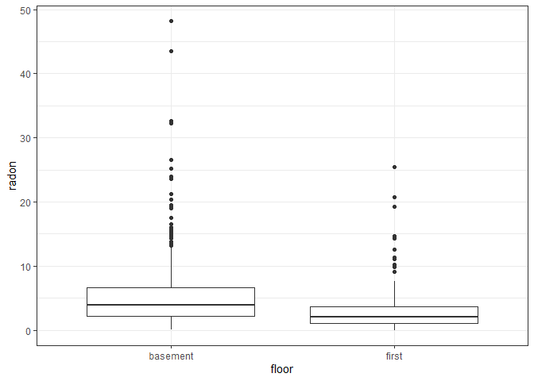
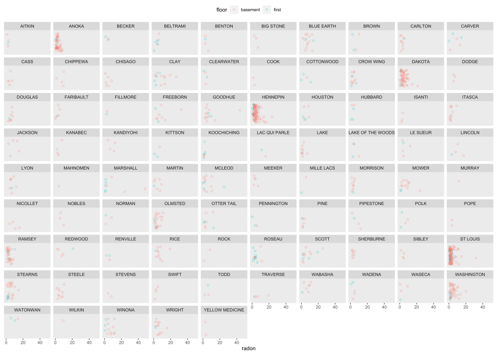
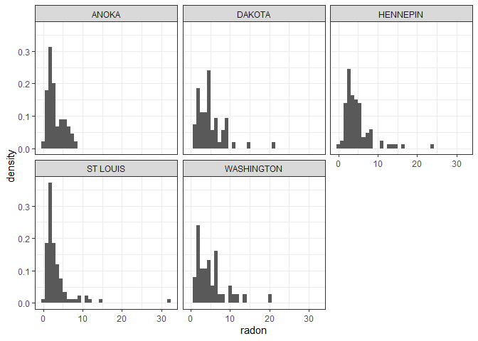
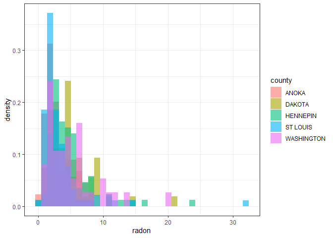
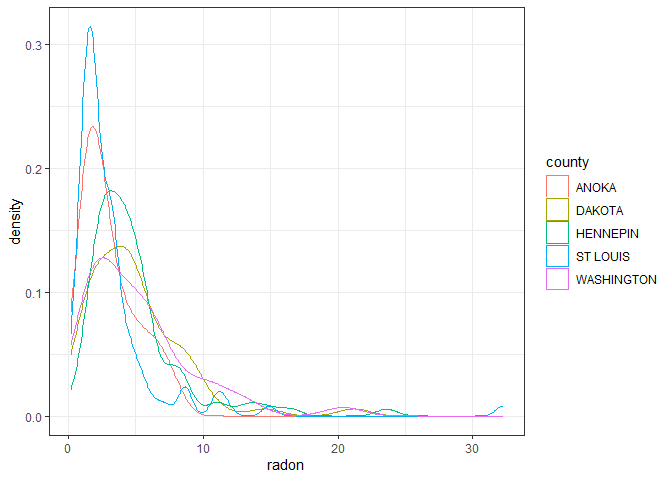
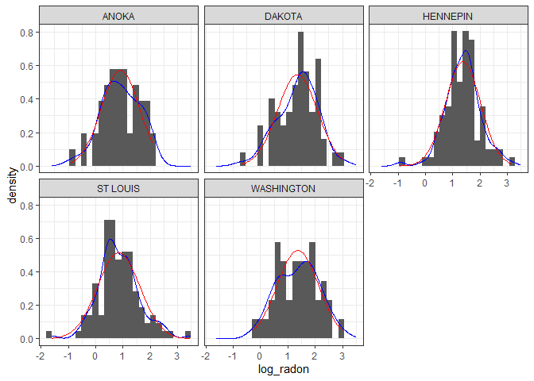
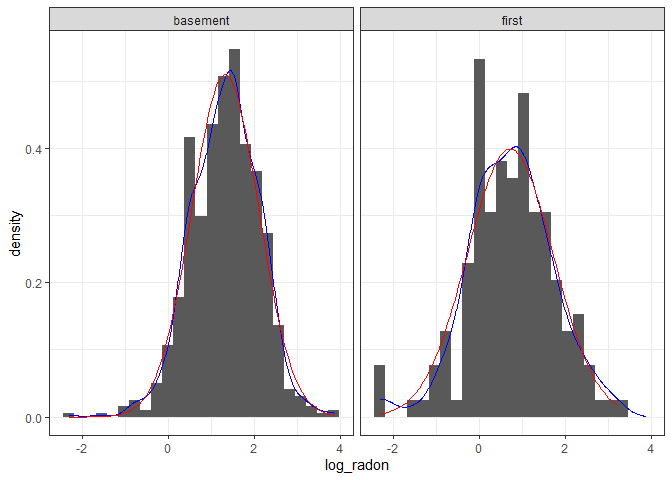

Multilevel model of radon levels I, EDA
================
Brett Melbourne
14 Oct 2018 (updated 31 Oct 2022)

Reading: Chapter 12 of Gelman & Hill

This is part I: Exploratory Data Analysis (EDA). Parts II-IV consider
models.

``` r
library(ggplot2)
library(dplyr)
theme_set(theme_bw())
```

Read in data. See `data/radon_MN_about.txt` for data source.

``` r
radon_dat <- read.csv("data/radon_MN.csv")
```

### Exploratory data analysis

Here we get to know the dataset, spot any problems or unusual features,
and do some informal graphical modeling by exploring how the data are
structured into groups and focusing on distributions. Thus,
distributional plots like histograms, boxplots, and density plots
feature prominently.

#### Inspect the data

e.g. in each column: what class? what unique values? what range?

``` r
head(radon_dat)
for ( c in 1:ncol(radon_dat) ) {
    print(paste("Column name:", names(radon_dat)[c]))
    print(class(radon_dat[,c]))
    print(unique(radon_dat[,c]))
    print(range(radon_dat[,c]))
}
```

There are 3 points with zero radon recorded. They are all on the first
floor:

``` r
sum(radon_dat$radon == 0)
```

    ## [1] 3

``` r
radon_dat %>%
    filter(radon==0)
```

    ##   floor radon     county
    ## 1 first     0     CARVER
    ## 2 first     0 COTTONWOOD
    ## 3 first     0     MCLEOD

#### Graphical views of the data

Histogram of radon levels

``` r
ggplot(data=radon_dat) +
    geom_histogram(mapping = aes(x=radon), bins=50)
```

<!-- -->

Equivalently using the pipe operator

``` r
radon_dat %>%
    ggplot() +
    geom_histogram(mapping = aes(x=radon), bins=50)
```

From the histogram we see that radon levels are positive, continuous,
and skewed with a long right tail, so perhaps a lognormal or gamma
distribution or similar will be appropriate for modeling these data.
With ggplot it is easy to group a histogram by floor. We see that there
are far fewer measurements taken on the first floor and that basements
have higher radon levels. Grouped histograms are stacked by default
(`position="stack"`). To compare the two groups, we don’t want to stack
them but overlay them, so we want `position="identity"` and we want some
`alpha` to give transparency.

``` r
radon_dat %>% 
    ggplot() +
    geom_histogram(mapping = aes(x=radon, fill=floor), position="identity",
                   bins=50, alpha=0.5)
```

<!-- -->

Violin plots are an alternative to histograms. The shape is a density
smoother (a smoothed histogram). We want to scale the area of the violin
to the number of observations to compare the two groups. Tufte might
complain of too much data ink (since the mirror image is a duplicate).

``` r
radon_dat %>% 
    ggplot +
    geom_violin(mapping = aes(y=radon, x=floor, fill=floor, col=floor), 
                scale="count")
```

<!-- -->

Another way to view this difference between floors is with a boxplot. We
see that radon is higher in basements.

``` r
radon_dat %>%     
    ggplot() +
    geom_boxplot(mapping = aes(y=radon, x=floor)) 
```

<!-- -->

Exploration of structured data is where `ggplot` shines. Let’s look at
radon levels by county and floor. We want to see all the data, so I have
designed a plot that will show every single point. To combat overlap, I
have jittered the points on the y-axis (the y-axis does not measure
anything) by appending (using `mutate()`) a new column called `yjit`,
and I’ve added some transparency (`alpha`). This plot was quite rapid to
put together and to try variations and modifications etc leading up to
it. Thus, we are able to get a sense of all of the features of this
dataset without much coding effort. You may need a large screen or
window that fills your laptop screen. This plot will take a moment to
compile. In the chunk options I have included `dev="svg"` so that the
knitted version will retain detail when it is enlarged or zoomed in.

``` r
radon_dat %>%
    mutate(yjit = jitter(0 * radon, amount=0.8)) %>%
    ggplot() +
    geom_point(mapping=aes(x=radon, col=floor, y=yjit), shape=1, alpha=0.5) +
    facet_wrap(facets=vars(county)) +
    scale_x_continuous(breaks=c(0,20,40)) +
    coord_cartesian(xlim=c(0,50), ylim=c(-1,1)) +
    theme_gray() +
    theme(axis.text.y=element_blank(),
          axis.ticks.y=element_blank(),
          axis.title.y=element_blank(),
          panel.grid=element_blank(),
          legend.position="top")
```

<!-- -->

From this plot we can easily see many data features. There aren’t any
points that seem especially like outliers or obvious errors. Thus, the
data have probably been well cleaned. Most measurements are in
basements. Some counties have a lot more data. Which counties have the
most data? Calculate sample size in each county and sort by decreasing:

``` r
radon_dat %>%
    group_by(county) %>%
    summarize(sample_size=n()) %>%
    arrange(-sample_size)
```

    ## # A tibble: 85 × 2
    ##    county     sample_size
    ##    <chr>            <int>
    ##  1 ST LOUIS           116
    ##  2 HENNEPIN           105
    ##  3 DAKOTA              63
    ##  4 ANOKA               52
    ##  5 WASHINGTON          46
    ##  6 RAMSEY              32
    ##  7 STEARNS             25
    ##  8 OLMSTED             23
    ##  9 BLUE EARTH          14
    ## 10 CLAY                14
    ## # … with 75 more rows

We see 5 counties with more than 40 houses sampled. Let’s extract these
using `filter()` to get a better sense of how radon distributions within
counties might vary between counties. We’ll also restrict to basement
data.

``` r
lrgst5cty <- radon_dat %>%
    group_by(county) %>%
    filter(n() > 40, floor == "basement")
```

Histograms for the five counties. Anoka and St Louis counties are more
concentrated around low radon levels whereas the other counties have
broader and higher radon levels. So, there appears to be variation among
counties.

``` r
lrgst5cty %>%
    ggplot() +
    geom_histogram(mapping=aes(x=radon, y=stat(density)), bins=36) +
    facet_wrap(facets=vars(county))
```

<!-- -->

Can we see this by comparing counties using overlapping histograms?

``` r
lrgst5cty %>%
    ggplot() +
    geom_histogram(mapping=aes(x=radon ,y=stat(density), fill=county),
                   position="identity", bins=36, alpha=0.6)
```

<!-- -->

No, that’s terrible! That plot was a dud because the choice of a
rectangle as the primitive geom did not allow for clear comparison of
distance on a common scale. The counties are all jumbled and hard to
distinguish. No worries, we can try a different view to show the data
more clearly. With some loss of information due to smoothing, a density
plot better discriminates among counties and confirms our impression
from above.

``` r
lrgst5cty %>%
    ggplot() +
    geom_density(mapping=aes(x=radon, col=county))
```

<!-- -->

#### Consider lognormal distribution

We are getting close to being ready for model fitting now. Next we’ll
try some informal graphical modeling to explore possible choices for a
distribution to use in the GLM. I suspect a lognormal distribution could
be useful to model variation because the radon data are positive and
have a longer right tail in the distributions we’ve looked at above. The
easiest way to model a lognormal distribution is to simply log transform
the data and use a normal distribution with the transformed data (but we
could certainly model a lognormal or gamma directly too). Gelman & Hill
log transform, so we’ll do that too. However, there are zeros in the
radon data and we can’t log those. To deal with this Gelman & Hill add
0.1 to the zeros only. This makes sense because that is the resolution
of the measurement devices (notice that the radon data are in increments
of 0.1).

``` r
radon_dat <- mutate(radon_dat, log_radon=log(ifelse(radon==0, 0.1, radon)))
```

Take a look at the transformed data in those five most-sampled counties.

First make a data frame with the estimated normal distribution for the
five counties.

Summary statistics for 5 counties

``` r
sm5cty <-
    radon_dat %>%
    group_by(county) %>%
    filter(n() > 40,floor=="basement") %>%
    summarize(mean=mean(log_radon), 
              sd=sd(log_radon), 
              min=min(log_radon), 
              max=max(log_radon))
sm5cty
```

    ## # A tibble: 5 × 5
    ##   county      mean    sd    min   max
    ##   <chr>      <dbl> <dbl>  <dbl> <dbl>
    ## 1 ANOKA      0.903 0.699 -0.916  2.09
    ## 2 DAKOTA     1.35  0.731 -0.693  3.05
    ## 3 HENNEPIN   1.37  0.641 -0.916  3.16
    ## 4 ST LOUIS   0.846 0.776 -1.61   3.47
    ## 5 WASHINGTON 1.37  0.757 -0.223  3.02

Normal fitted for 5 counties and collected into a dataframe.

``` r
norm_df <- NULL
for ( i in 1:5 ) {
    x <- seq(sm5cty$min[i], sm5cty$max[i], length.out = 100)
    y <- dnorm(x, sm5cty$mean[i], sm5cty$sd[i])
    norm_df <- rbind(norm_df, data.frame(x, y, county=sm5cty$county[i]))
}
rm(x, y) #clean up
head(norm_df)
```

    ##            x          y county
    ## 1 -0.9162907 0.01927473  ANOKA
    ## 2 -0.8859053 0.02156383  ANOKA
    ## 3 -0.8555199 0.02407924  ANOKA
    ## 4 -0.8251345 0.02683730  ANOKA
    ## 5 -0.7947491 0.02985480  ANOKA
    ## 6 -0.7643637 0.03314887  ANOKA

Now plot the transformed data with density smoother (blue) and fitted
normal (red). The log transformation seems very good:

``` r
radon_dat %>%
    group_by(county) %>%
    filter(n() > 40, floor == "basement") %>%
    ggplot() +
    geom_histogram(mapping=aes(x=log_radon, y=stat(density)), bins=25) +
    geom_density(mapping=aes(x=log_radon), col="blue") +
    geom_line(data=norm_df, mapping=aes(x=x, y=y), col="red") +
    facet_wrap(facets=vars(county))
```

<!-- -->

And now for the whole dataset (all counties combined) split by floor. It
is simple to modify the above code to group by floor instead.

``` r
sm_byfloor <-
    radon_dat %>%
    group_by(floor) %>%
    summarize(mean=mean(log_radon),
              sd=sd(log_radon),
              min=min(log_radon),
              max=max(log_radon))
```

Normal fitted for 2 floors

``` r
norm_df <- NULL
for ( i in 1:2 ) {
    x <- seq(sm_byfloor$min[i], sm_byfloor$max[i], length.out = 100)
    y <- dnorm(x, sm_byfloor$mean[i], sm_byfloor$sd[i])
    norm_df <- rbind(norm_df, data.frame(x, y, floor=sm_byfloor$floor[i]))
}
rm(x, y)
head(norm_df)
```

    ##           x            y    floor
    ## 1 -2.302585 1.092689e-05 basement
    ## 2 -2.240182 1.576411e-05 basement
    ## 3 -2.177778 2.259861e-05 basement
    ## 4 -2.115375 3.219092e-05 basement
    ## 5 -2.052971 4.556429e-05 basement
    ## 6 -1.990568 6.408482e-05 basement

Now plot the transformed data with density smoother (blue) and fitted
normal (red).

``` r
radon_dat %>%
    group_by(floor) %>%
    ggplot() +
    geom_histogram(mapping=aes(x=log_radon, y=stat(density)), bins=25) +
    geom_density(mapping=aes(x=log_radon), col="blue") +
    geom_line(data=norm_df, mapping=aes(x=x, y=y), col="red") +
    facet_wrap(facets=vars(floor))
```

<!-- -->

Thus, the log transformation seems excellent also for the entire dataset
grouped by floor. You can see a small artifact introduced by adding 0.1
to the zeros (this is the little leftmost spike in the first floor
histogram) but this should not be harmful. Do remember that the
important thing is not that the dependent variable *per se* is Normal,
it is that the **errors**, **or stochasticity**, are Normal. By grouping
the data in the various ways that they are structured by independent
variables, and then looking at the distributions, we are doing an
informal modeling, i.e. graphically “fitting” floor or county and then
examining the distribution after accounting for the expectation. Here,
we have in essence looked at a main effect of *county* and a main effect
of *floor*, which are the strongest signals to appear in the data from
our graphical exploration.

We now have some good information for moving on to proposing and
training models. In summary, the data look clean, there are some
predictor variables that give a strong signal, and a lognormal
distribution might be a good place to start.
