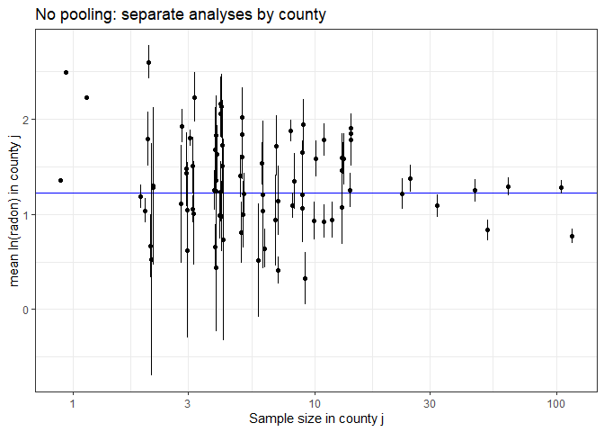
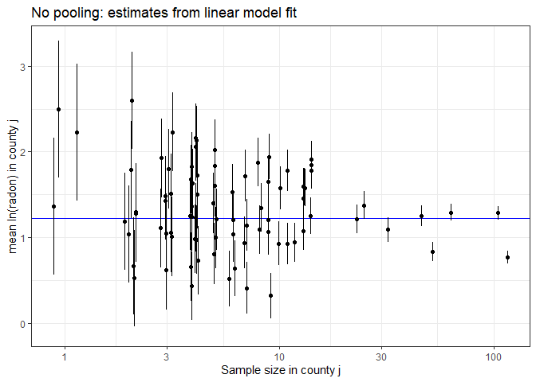

Multilevel model of radon levels II
================
Brett Melbourne
14 Oct 2018 (updated 1 Nov 2022)

Reading: Chapter 12 of Gelman & Hill

This is part II: variance components model (G&H 12.2). Here we fit a
simple variance components model of the average that accounts for
grouping structures (in other language, it is purely a random effects
model and does not have any fixed effects). In part III we will consider
a house-level (G&H 12.3-4) predictor of radon. In part IV, we will
consider a county-level predictor.

``` r
library(lme4)      #max lik multilevel: lmer(), glmer() etc
library(arm)       #for se.ranef()
library(ggplot2)
library(gridExtra) #arranging multiple plots
library(dplyr)
library(rstan)     #for extract()
library(rstanarm)  #Bayesian multilevel: stan_lmer(), stan_glmer() etc
options(mc.cores=parallel::detectCores())
theme_set(theme_bw()) #overrides rstanarm custom theme
```

Read in data, calculate log radon and convert county to a factor. See
`data/radon_MN_about.txt` for data source.

``` r
radon_dat <- read.csv("data/radon_MN.csv")
radon_dat$log_radon <- log(ifelse(radon_dat$radon==0, 0.1, radon_dat$radon))
radon_dat <- mutate(radon_dat, county=factor(county))
```

### G&H 12.2. Multilevel analysis with no predictors

Our aim here is to look at some models for the mean. We’ll look at three
models:

1.  Complete pooling - the simplest model for the overall mean
2.  No pooling - county means, considering counties as fixed effects
3.  Partial pooling - county means, considering counties as random
    effects

G&H prefer to not use the terms fixed and random but I use them here
because many of you will have learned it this way already. See G&H for
more discussion of this. We will broadly follow Gelman & Hill’s analysis
in Chapter 12 with some elaborations here and there, and we’ll use
`rstanarm` instead of BUGS.

#### Complete pooling model

In this case, complete pooling is just the overall mean. That is, we
omit any data structure or grouping variables.

``` r
poolmean <- mean(radon_dat$log_radon)
poolmean
```

    ## [1] 1.224623

``` r
cp_pred_df <- data.frame(poolmean) #df for use with ggplot
```

#### No pooling model

You can think of **no pooling** as separately calculating an estimate of
the mean for each county. For example, tabulate the means (and sd and
se) for each county:

``` r
lnrad_mean_var <- 
    radon_dat %>%
    group_by(county) %>%
    summarize(sample_size=n(), cty_mn=mean(log_radon), cty_sd=sd(log_radon)) %>%
    mutate(cty_se=cty_sd / sqrt(sample_size)) %>%
    mutate(sample_size_jit = jitter(sample_size)) #jitter added for plotting
```

Whenever I do a calculation or summary operation I like to look at the
whole result to check that everything makes sense and scan for problems.
So I would do this to print every row:

``` r
print(lnrad_mean_var, n=Inf) #n=Inf to print all rows
```

But here are the first 10 rows

``` r
print(lnrad_mean_var, n=10) #n=Inf to print all rows
```

    ## # A tibble: 85 × 6
    ##    county     sample_size cty_mn cty_sd cty_se sample_size_jit
    ##    <fct>            <int>  <dbl>  <dbl>  <dbl>           <dbl>
    ##  1 AITKIN               4  0.660  0.459  0.230            3.86
    ##  2 ANOKA               52  0.833  0.770  0.107           52.0 
    ##  3 BECKER               3  1.05   0.750  0.433            2.97
    ##  4 BELTRAMI             7  1.14   0.968  0.366            7.03
    ##  5 BENTON               4  1.25   0.424  0.212            3.85
    ##  6 BIG STONE            3  1.51   0.516  0.298            3.13
    ##  7 BLUE EARTH          14  1.91   0.553  0.148           14.1 
    ##  8 BROWN                4  1.63   0.608  0.304            3.95
    ##  9 CARLTON             10  0.931  0.615  0.194            9.93
    ## 10 CARVER               6  1.20   1.90   0.777            6.09
    ## # … with 75 more rows

In printing the whole data frame I saw that there are three counties
with only one sample, so we were not able to calculate a standard
deviation for those. We could fix this (by estimating from sample size
and sd of the other counties) but let’s not worry at this stage. Plot
what we’ve got:

``` r
lnrad_mean_var %>% 
    ggplot() +
    geom_hline(data=cp_pred_df, mapping=aes(yintercept=poolmean), col="blue") +
    geom_point(mapping=aes(x=sample_size_jit, y=cty_mn)) +
    geom_linerange(mapping=aes(x=sample_size_jit, 
                               ymin=cty_mn - cty_se, 
                               ymax=cty_mn + cty_se)) +
    scale_x_continuous(trans="log", breaks=c(1,3,10,30,100)) +
    labs(x="Sample size in county j",
         y="mean ln(radon) in county j",
         title="No pooling: separate analyses by county")
```

    ## Warning: Removed 3 rows containing missing values (geom_segment).

<!-- -->

This plot is very similar to G&H Fig. 12.1a but not the same. The blue
line is the completely pooled estimate (the overall mean). Some of the
standard errors are larger than G&H 12.1a because we have calculated
them independently for each county. The three points to the left without
an interval are the ones we couldn’t calculate a standard error for.

Now we’ll do as G&H did in Ch 12. This is also a **no pooling** analysis
for the county means. This analysis does not pool information about the
**means** but it does pool information about the uncertainty (the error
of each observation contributes to an estimate of the mean residual
error). This is sometimes called the **fixed effects model**, where here
`county` is the fixed effect. To fit this model in a frequentist
paradigm we can use `lm()`, which is implicitly a GLM with Normal
distribution and identity link. We fit `county` as a categorical
variable, which gives us estimated means for each county (the maximum
likelihood estimates are the means of the within-county samples). We use
the means parameterization (i.e without the intercept, thus “-1”):

``` r
npfit <- lm( log_radon ~ -1 + county, data=radon_dat )
```

Check the fitted model (diagnostic plots)

``` r
plot(npfit,1:5,ask=FALSE)
```

<!-- --><!-- --><!-- --><!-- --><!-- -->

The extended left tail, which has the 0 + 0.1 hack, is evident in the QQ
plot but otherwise the diagnostics look good. Let’s also look at a
residuals histogram compared to the Normal distribution:

``` r
r <- residuals(npfit)
x <- seq(min(r), max(r), length.out=100)
y <- dnorm(x, mean(r), sd(r))
res_df <- data.frame(residuals=r)
norm_df <- data.frame(x=x, y=y)
rm(r,x,y)
ggplot() +
    geom_histogram(data=res_df, mapping=aes(x=residuals, y=stat(density)), bins=60) +
    geom_line(data=norm_df, mapping=aes(x=x, y=y), col="red")
```

<!-- -->

So, Normal looks like a good approximation for the errors.

Plot the fitted model

``` r
np_pred_df <- data.frame(coef(summary(npfit))[,1:2], 
                         lnrad_mean_var$sample_size_jit)
names(np_pred_df) <- c("cty_mn","cty_se","sample_size_jit")

gh12.1a <- 
    np_pred_df %>% 
    ggplot() +
    geom_hline(data=cp_pred_df, mapping=aes(yintercept=poolmean), col="blue") +
    geom_point(mapping=aes(x=sample_size_jit, y=cty_mn)) +
    geom_linerange(mapping=aes(x=sample_size_jit, 
                               ymin=cty_mn-cty_se, 
                               ymax=cty_mn+cty_se)) +
    scale_x_continuous(trans="log", breaks=c(1,3,10,30,100)) +
    ylim(-0.1,3.3) +
    labs(x="Sample size in county j",y="mean ln(radon) in county j",
         title="No pooling: estimates from linear model fit")
gh12.1a
```

<!-- -->

Apart from some unimportant details, this is the same as G&H Fig. 12.1a.
The blue line is the complete pooling model (i.e. the overall mean).

#### Partial pooling & shrinkage in multilevel model

In the **complete pooling** model (i.e. the overall mean) we did not
include variation among counties, while in the **no pooling** model, we
estimated the county means separately, whether literally by separate
analyses or in the fixed effects model. In the **partial pooling** model
the estimates for the mean in each county are a balance between the
information in a county sample and information from other counties. To
achieve this, we formulate a **multilevel model**. In the multilevel
model we consider two levels for means: an overall mean and means for
counties. Each of the two levels of these means has an associated
stochastic process so that there are two **variance components**, a
between-county variance associated with the overall mean and a
within-county variance associated with the county means. To fit this
model in a frequentist paradigm we can use `lmer()` from the package
`lme4`. This model is implicitly a generalized linear mixed model (GLMM)
with Normal distribution, identity link, and two levels of
stochasticity:

``` r
ppfit <- lmer( log_radon ~ 1 + (1|county), REML=FALSE, data=radon_dat )
```

The `1` part of the above model specifies the overall mean (the
intercept term) while the `+ (1|county)` part specifies that the
intercepts for each county should be random variables (more specifically
the deviations, or “random effects”, of county means from the overall
mean will be modeled as a Normally distributed random variable).
`REML=FALSE` says to fit by ordinary maximum likelihood rather than the
default residual maximum likelihood.

By default, we get limited diagnostics for `lmer()`. Just residuals vs
fitted. The residual plot looks good though. We will later explore some
other diagnostic options for multilevel likelihood models.

``` r
plot(ppfit)
```

<!-- -->

In the summary we now see estimates for two components (or levels, or
strata) of variance, county (among counties) and residual (among houses
within counties):

``` r
summary(ppfit)
```

    ## Linear mixed model fit by maximum likelihood  ['lmerMod']
    ## Formula: log_radon ~ 1 + (1 | county)
    ##    Data: radon_dat
    ## 
    ##      AIC      BIC   logLik deviance df.resid 
    ##   2261.2   2275.7  -1127.6   2255.2      916 
    ## 
    ## Scaled residuals: 
    ##     Min      1Q  Median      3Q     Max 
    ## -4.4668 -0.5757  0.0432  0.6460  3.3508 
    ## 
    ## Random effects:
    ##  Groups   Name        Variance Std.Dev.
    ##  county   (Intercept) 0.0934   0.3056  
    ##  Residual             0.6366   0.7979  
    ## Number of obs: 919, groups:  county, 85
    ## 
    ## Fixed effects:
    ##             Estimate Std. Error t value
    ## (Intercept)  1.31226    0.04857   27.02

The random effects table shows that the variance at the houses-within
county level, the residual variance (0.6), is about 6 times greater than
the variance at the between-county level (0.09). In other words, most of
the variance in radon is at a small spatial scale, i.e. between houses.
Keep in mind that the house-level variance includes radon measurement
error in addition to natural variability among houses.

Save a plot of the fitted model

``` r
pp_pred_df <- data.frame(coef(ppfit)$county,
                         se.ranef(ppfit)$county[,1],
                         lnrad_mean_var$sample_size_jit)
names(pp_pred_df) <- c("cty_mn","cty_se","sample_size_jit")
pp_mean_df <- data.frame(ovrl_mn=summary(ppfit)$coefficients[1],
                         ovrl_se=summary(ppfit)$coefficients[2])

gh12.1b <- 
    pp_pred_df %>% 
    ggplot() +
    geom_hline(data=cp_pred_df, mapping=aes(yintercept=poolmean), col="blue") +
    geom_hline(data=pp_mean_df, mapping=aes(yintercept=ovrl_mn), 
               col="blue", lty=2) +
    geom_point(mapping=aes(x=sample_size_jit, y=cty_mn)) +
    geom_linerange(mapping=aes(x=sample_size_jit,
                               ymin=cty_mn-cty_se,
                               ymax=cty_mn+cty_se)) +
    scale_x_continuous(trans="log", breaks=c(1,3,10,30,100)) +
    ylim(-0.1, 3.3) +
    labs(x="Sample size in county j",y="mean ln(radon) in county j",
         title="Partial pooling: multilevel model, max likelihood")
```

Add a reference point to the saved no pooling and partial pooling plots
to illustrate shrinkage and plot them side by side:

``` r
gh12.1a_ref <- 
    gh12.1a + 
    geom_point(data=np_pred_df[36,],
               mapping=aes(x=sample_size_jit, y=cty_mn), 
               pch=1, cex=10, col="red")

gh12.1b_ref <- 
    gh12.1b + 
    geom_point(data=pp_pred_df[36,],
               mapping=aes(x=sample_size_jit, y=cty_mn),
               pch=1, cex=10, col="red")

grid.arrange(gh12.1a_ref, gh12.1b_ref, nrow = 1)
```

<!-- -->

The right panel is the fitted multilevel model compared to our previous
fit of the no pooling model in the left panel. In the multilevel model
the estimates for the mean in each county are a balance between the
sample mean and the overall mean, depending on the within-county sample
size. That is, the information in a particular county is pooled with the
information from other counties. You can see how this works by comparing
the multilevel (partial pooling) model in the right panel to the no
pooling model in the left panel. If there are more observations for a
given county, there is more information at the county level, so the
estimate of the county mean in the multilevel model remains close to the
sample mean for the county. If there are fewer observations, information
from the other counties will pull an estimate for a particular county
toward the overall mean, like county 36, which is circled in red. This
is called **shrinkage**. The estimate shrinks toward the overall mean.
The other thing to note is the dashed blue line. This is the estimated
overall mean from the multilevel model, which is also a balance of the
information at different levels. You can see that it is higher than the
simpler (but naive) overall mean of the data (solid blue line).

#### Partial pooling, Bayesian fit of multilevel model

Figure 12.1b in G&H was actually from a Bayesian version of the
multilevel model fitted using BUGS. Compared to the maximum likelihood
model we just fitted, this model had flat priors for the three model
parameters (overall mean and the two variances). The Bayesian version of
this model is accomplished easily with the `stan_lmer()` function of
`rstanarm`. We will use the weakly informative priors of `stan_lmer()`
by default rather than the flat priors in the BUGS fit of G&H. The
difference in analyses is neglible as the data overwhelm the priors in
this case.

``` r
ppfit_bayes <- stan_lmer(log_radon ~ 1 + (1|county), data=radon_dat)
print(summary(ppfit_bayes)[,c("mean","sd","n_eff","Rhat")], digits=3)
```

    ##                                              mean     sd n_eff  Rhat
    ## (Intercept)                              1.31e+00 0.0502  1316 0.999
    ## b[(Intercept) county:AITKIN]            -2.53e-01 0.2611  5666 0.999
    ## b[(Intercept) county:ANOKA]             -4.22e-01 0.1131  3708 0.999
    ## b[(Intercept) county:BECKER]            -8.76e-02 0.2548  5834 1.000
    ## b[(Intercept) county:BELTRAMI]          -9.04e-02 0.2189  5387 0.999
    ## b[(Intercept) county:BENTON]            -1.93e-02 0.2491  5918 0.999
    ## b[(Intercept) county:BIG_STONE]          5.68e-02 0.2654  6059 0.999
    ## b[(Intercept) county:BLUE_EARTH]         4.04e-01 0.1828  4793 0.999
    ## b[(Intercept) county:BROWN]              1.21e-01 0.2480  5777 0.999
    ## b[(Intercept) county:CARLTON]           -2.29e-01 0.1947  4922 1.000
    ## b[(Intercept) county:CARVER]            -5.19e-02 0.2262  5199 1.000
    ## b[(Intercept) county:CASS]               3.92e-02 0.2390  4578 1.000
    ## b[(Intercept) county:CHIPPEWA]           1.62e-01 0.2459  5466 1.000
    ## b[(Intercept) county:CHISAGO]           -1.36e-01 0.2327  5790 0.999
    ## b[(Intercept) county:CLAY]               3.14e-01 0.1830  5019 0.999
    ## b[(Intercept) county:CLEARWATER]        -1.26e-01 0.2446  5930 0.999
    ## b[(Intercept) county:COOK]              -1.54e-01 0.2750  5209 0.999
    ## b[(Intercept) county:COTTONWOOD]        -2.21e-01 0.2490  5117 1.001
    ## b[(Intercept) county:CROW_WING]         -2.41e-01 0.1910  5040 1.000
    ## b[(Intercept) county:DAKOTA]            -1.86e-02 0.1059  3047 0.999
    ## b[(Intercept) county:DODGE]              1.61e-01 0.2656  5333 0.999
    ## b[(Intercept) county:DOUGLAS]            2.01e-01 0.2029  5649 1.000
    ## b[(Intercept) county:FARIBAULT]         -3.76e-01 0.2375  4752 1.000
    ## b[(Intercept) county:FILLMORE]          -6.73e-02 0.2755  5911 1.000
    ## b[(Intercept) county:FREEBORN]           3.62e-01 0.2019  4408 1.001
    ## b[(Intercept) county:GOODHUE]            3.64e-01 0.1819  5671 1.000
    ## b[(Intercept) county:HENNEPIN]          -2.43e-02 0.0895  2806 0.999
    ## b[(Intercept) county:HOUSTON]            1.03e-01 0.2221  5682 1.000
    ## b[(Intercept) county:HUBBARD]           -2.21e-01 0.2427  6670 0.999
    ## b[(Intercept) county:ISANTI]            -7.64e-02 0.2594  5609 1.000
    ## b[(Intercept) county:ITASCA]            -2.42e-01 0.1963  5319 0.999
    ## b[(Intercept) county:JACKSON]            3.10e-01 0.2495  4983 0.999
    ## b[(Intercept) county:KANABEC]           -3.18e-02 0.2468  4861 0.999
    ## b[(Intercept) county:KANDIYOHI]          2.80e-01 0.2545  4401 1.000
    ## b[(Intercept) county:KITTSON]           -6.44e-02 0.2712  5279 1.000
    ## b[(Intercept) county:KOOCHICHING]       -4.65e-01 0.2331  5045 1.000
    ## b[(Intercept) county:LAC_QUI_PARLE]      3.04e-01 0.2890  4645 1.000
    ## b[(Intercept) county:LAKE]              -5.70e-01 0.2186  4241 1.000
    ## b[(Intercept) county:LAKE_OF_THE_WOODS]  7.67e-02 0.2483  6501 1.000
    ## b[(Intercept) county:LE_SUEUR]           1.23e-01 0.2310  5604 1.000
    ## b[(Intercept) county:LINCOLN]            3.15e-01 0.2537  4970 1.001
    ## b[(Intercept) county:LYON]               3.09e-01 0.2142  4526 0.999
    ## b[(Intercept) county:MAHNOMEN]           1.18e-02 0.2930  5587 0.999
    ## b[(Intercept) county:MARSHALL]          -6.11e-02 0.2003  5378 1.000
    ## b[(Intercept) county:MARTIN]            -1.92e-01 0.2288  5966 1.000
    ## b[(Intercept) county:MCLEOD]            -1.60e-01 0.1817  5502 1.000
    ## b[(Intercept) county:MEEKER]            -4.29e-02 0.2376  6730 0.999
    ## b[(Intercept) county:MILLE_LACS]        -1.85e-01 0.2701  4897 1.001
    ## b[(Intercept) county:MORRISON]          -1.46e-01 0.2061  5488 0.999
    ## b[(Intercept) county:MOWER]              1.84e-01 0.1823  4803 0.999
    ## b[(Intercept) county:MURRAY]             1.61e-01 0.2815  5652 1.000
    ## b[(Intercept) county:NICOLLET]           3.21e-01 0.2523  4732 1.000
    ## b[(Intercept) county:NOBLES]             1.90e-01 0.2552  5157 1.000
    ## b[(Intercept) county:NORMAN]            -9.18e-02 0.2573  5896 0.999
    ## b[(Intercept) county:OLMSTED]           -7.98e-02 0.1536  5034 0.999
    ## b[(Intercept) county:OTTER_TAIL]         2.00e-02 0.2056  5402 0.999
    ## b[(Intercept) county:PENNINGTON]        -2.16e-01 0.2674  6079 1.000
    ## b[(Intercept) county:PINE]              -3.23e-01 0.2320  5012 1.001
    ## b[(Intercept) county:PIPESTONE]          1.40e-01 0.2507  6050 1.000
    ## b[(Intercept) county:POLK]               1.37e-02 0.2420  6443 0.999
    ## b[(Intercept) county:POPE]              -7.38e-03 0.2712  6141 0.999
    ## b[(Intercept) county:RAMSEY]            -1.84e-01 0.1393  4633 1.000
    ## b[(Intercept) county:REDWOOD]            2.24e-01 0.2378  5854 1.001
    ## b[(Intercept) county:RENVILLE]           3.52e-02 0.2663  6928 1.000
    ## b[(Intercept) county:RICE]               2.92e-01 0.1926  4536 1.000
    ## b[(Intercept) county:ROCK]               1.76e-03 0.2735  5642 0.999
    ## b[(Intercept) county:ROSEAU]            -4.27e-02 0.1761  5780 0.999
    ## b[(Intercept) county:SCOTT]              1.77e-01 0.1886  4950 1.000
    ## b[(Intercept) county:SHERBURNE]         -1.22e-01 0.2066  6139 1.000
    ## b[(Intercept) county:SIBLEY]            -2.65e-02 0.2468  6044 1.000
    ## b[(Intercept) county:ST_LOUIS]          -5.13e-01 0.0871  3106 0.999
    ## b[(Intercept) county:STEARNS]            4.88e-02 0.1486  4817 0.999
    ## b[(Intercept) county:STEELE]             1.54e-01 0.1942  5026 1.000
    ## b[(Intercept) county:STEVENS]            1.06e-01 0.2785  5257 0.999
    ## b[(Intercept) county:SWIFT]             -1.25e-01 0.2511  5035 1.000
    ## b[(Intercept) county:TODD]               5.27e-02 0.2638  5767 1.000
    ## b[(Intercept) county:TRAVERSE]           1.95e-01 0.2454  6138 0.999
    ## b[(Intercept) county:WABASHA]            2.04e-01 0.2252  5368 1.000
    ## b[(Intercept) county:WADENA]            -1.39e-01 0.2396  5070 1.000
    ## b[(Intercept) county:WASECA]            -3.29e-01 0.2576  4136 0.999
    ## b[(Intercept) county:WASHINGTON]        -5.46e-02 0.1158  3668 0.999
    ## b[(Intercept) county:WATONWAN]           2.91e-01 0.2696  4152 1.001
    ## b[(Intercept) county:WILKIN]             1.27e-01 0.2969  5793 1.000
    ## b[(Intercept) county:WINONA]             9.42e-02 0.1817  4662 0.999
    ## b[(Intercept) county:WRIGHT]             1.82e-01 0.1813  4824 0.999
    ## b[(Intercept) county:YELLOW_MEDICINE]   -2.69e-02 0.2747  4879 1.000
    ## sigma                                    7.99e-01 0.0190  4904 1.000
    ## Sigma[county:(Intercept),(Intercept)]    1.01e-01 0.0315  1567 1.003
    ## mean_PPD                                 1.22e+00 0.0377  4182 1.000
    ## log-posterior                           -1.22e+03 8.9167  1033 1.004

Diagnostics: We have previously made trace plots and histograms manually
from samples. A handy tool is the shiny app included with `rstanarm`.
Focus on inspecting convergence in the trace plots and histograms for
the posteriors.

``` r
launch_shinystan(ppfit_bayes)
```

Extract posterior samples

``` r
samples <- extract(ppfit_bayes$stanfit)
names(samples)
```

    ## [1] "alpha"    "b"        "aux"      "theta_L"  "mean_PPD" "lp__"

``` r
str(samples$alpha) #Samples of overall mean. Matrix: samples by row, 1 col
```

    ##  num [1:4000, 1] 1.29 1.31 1.36 1.27 1.34 ...
    ##  - attr(*, "dimnames")=List of 2
    ##   ..$ iterations: NULL
    ##   ..$           : NULL

``` r
str(samples$b) #Samples of county deviations. Matrix: samples by row, 86 cols
```

    ##  num [1:4000, 1:86] -0.507 -0.3 -0.173 -0.35 -0.326 ...
    ##  - attr(*, "dimnames")=List of 2
    ##   ..$ iterations: NULL
    ##   ..$           : NULL

I’m not sure what the 86th b parameter is (we could look in the source
to figure it out) but the first 85 are the county samples.

Algorithm for posterior samples of the county means. This is an example
where we want to get the posterior distribution for a **derived
quantity**: the county means. We merely need to add the samples for the
overall mean (`alpha`) to the samples for the county deviations (`b`).

``` r
countysamples <- samples$b[,1:85] * NA
for ( i in 1:85 ) {
    countysamples[,i] <- samples$b[,i] + samples$alpha
}
# Now calculate mean and standard deviation of the posterior distributions for
# the county means.
countypostmns <- rep(NA, 85)
countypostses <- rep(NA, 85)
for ( i in 1:85 ) {
    countypostmns[i] <- mean(countysamples[,i])
    countypostses[i] <- sd(countysamples[,i])
}
```

Plot of posterior means and standard deviations

``` r
ppbayes_pred_df <- data.frame(countypostmns, countypostses, 
                              lnrad_mean_var$sample_size_jit)
names(ppbayes_pred_df) <- c("cty_mn","cty_se","sample_size_jit")
ppbayes_mean_df <- data.frame(ovrl_mn=mean(samples$alpha),
                              ovrl_se=sd(samples$alpha))
gh12.1b_bayes <- 
    ppbayes_pred_df %>% 
    ggplot() +
    geom_hline(data=cp_pred_df, mapping=aes(yintercept=poolmean), col="blue") +
    geom_hline(data=ppbayes_mean_df, 
               mapping=aes(yintercept=ovrl_mn), col="blue", lty=2) +
    geom_point(mapping=aes(x=sample_size_jit, y=cty_mn)) +
    geom_linerange(mapping=aes(x=sample_size_jit,
                               ymin=cty_mn-cty_se,
                               ymax=cty_mn+cty_se)) +
    scale_x_continuous(trans="log", breaks=c(1,3,10,30,100)) +
    ylim(-0.1, 3.3) +
    labs(x="Sample size in county j",y="mean ln(radon) in county j",
         title="Partial pooling: multilevel model, Bayesian")
grid.arrange(gh12.1b, gh12.1b_bayes, nrow = 1)
```

<!-- -->

The maximum likelihood (left) and Bayesian model (right) estimates are
practically identical. This is not surprising, since the priors in the
Bayesian model were weak and thus most of the information is in the
likelihood.
