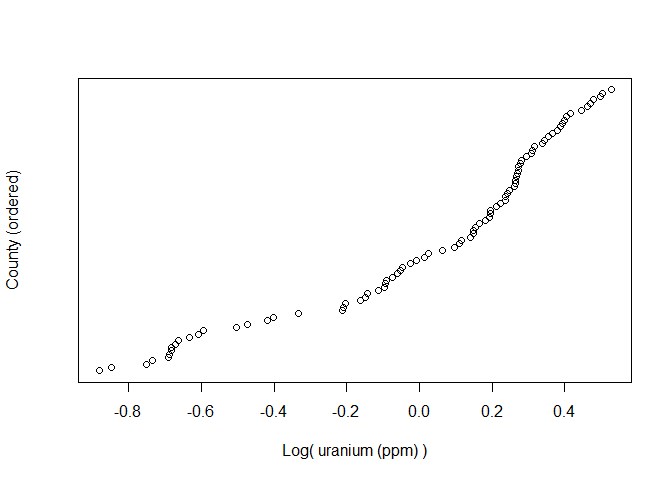
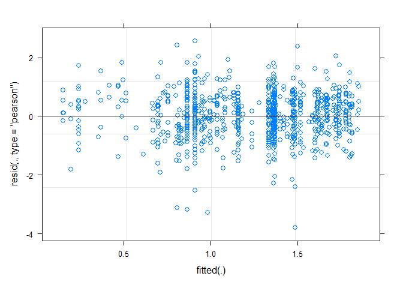
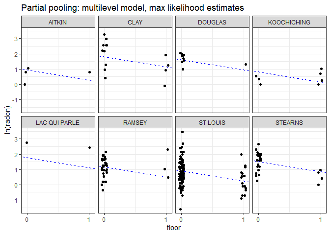
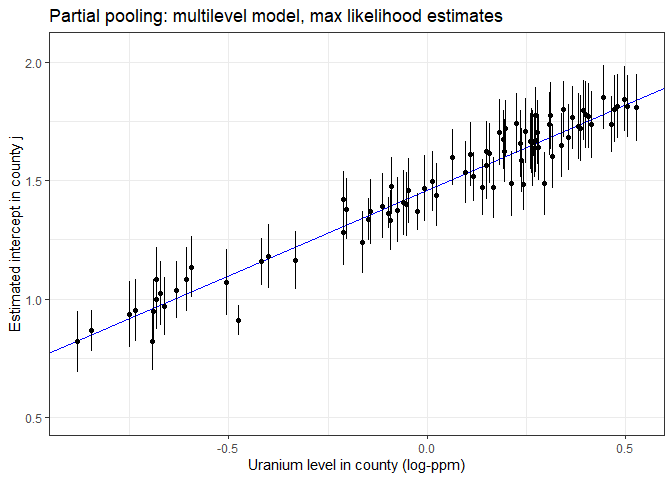
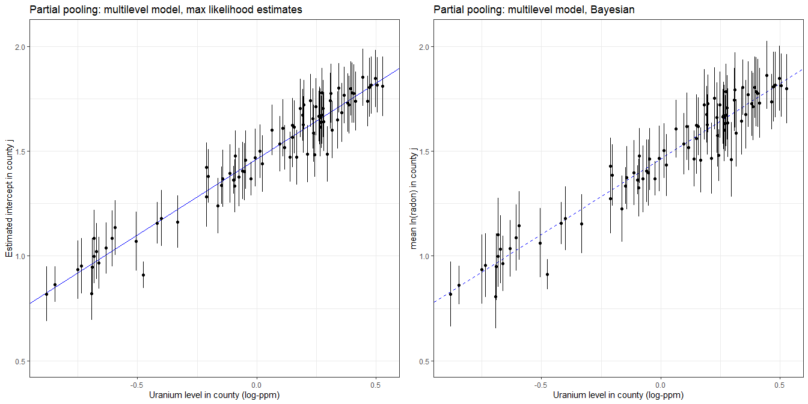

Multilevel model of radon levels IV
================
Brett Melbourne
1 Nov 2018 (updated 7 Nov 2022)

Chapter 12 of Gelman & Hill  
See `data/radon_MN_about.txt` and  
`data/radon_MN_U_about.txt` for data source  

This is part IV. Part I was EDA. Part II introduced partial pooling and
shrinkage (G&H 12.2). Part III considered a house-level predictor (G&H
12.3-4). Here, we add a county-level predictor (G&H 12.6).

``` r
library(lme4)      #max lik multilevel: lmer(), glmer() etc
library(arm)       #for se.ranef()
library(ggplot2)
library(gridExtra) #arranging multiple plots
library(dplyr)
library(rstan)     #for extract()
library(rstanarm)  #Bayesian multilevel: stan_lmer(), stan_glmer() etc
options(mc.cores=parallel::detectCores())
theme_set(theme_bw()) #overrides rstanarm custom theme
```

Read in data and manipulate as required for analysis (see Parts II &
III)

``` r
radon_dat <- read.csv("data/radon_MN.csv")
radon_dat$log_radon <- log(ifelse(radon_dat$radon==0, 0.1, radon_dat$radon))
radon_dat$county <- factor(radon_dat$county)
radon_dat$floor_x <- ifelse(radon_dat$floor=="basement", 0, 1)
head(radon_dat)
```

    ##      floor radon county log_radon floor_x
    ## 1    first   2.2 AITKIN 0.7884574       1
    ## 2 basement   2.2 AITKIN 0.7884574       0
    ## 3 basement   2.9 AITKIN 1.0647107       0
    ## 4 basement   1.0 AITKIN 0.0000000       0
    ## 5 basement   3.1  ANOKA 1.1314021       0
    ## 6 basement   2.5  ANOKA 0.9162907       0

### G&H 12.6. Analysis with a county level predictor (uranium)

The predictor at the county level is uranium. That is, measurement of
uranium was not done house by house. The dataset has just one value for
uranium per county.

``` r
uranium_dat <- read.csv("data/radon_MN_U.csv")
head(uranium_dat)
```

    ##      county     uppm
    ## 1    AITKIN 0.502054
    ## 2     ANOKA 0.428565
    ## 3    BECKER 0.892741
    ## 4  BELTRAMI 0.552472
    ## 5    BENTON 0.866849
    ## 6 BIG STONE 1.472640

Log uranium

``` r
uranium_dat$logu <- log(uranium_dat$uppm)
```

Plot the uranium data. This is a predictor variable, so we are not
necessarily interested in its distribution (thus, I do not choose a
histogram here).

``` r
plot(x=sort(uranium_dat$logu), y=1:85, yaxt="n",
     ylab="County (ordered)", xlab="Log( uranium (ppm) )")
```

<!-- -->

I don’t see anything untoward in this plot.

Perhaps counterintuitively, we now add these county-scale uranium data
to the dataframe that contains all our other data. The data will then be
in a tidy data format. Each row contains an observation for the level of
radon in a house but we add a column for the county-scale uranium
associated with each house. This means that the county-scale uranium
values are repeated multiple times in the dataset. This might feel like
cheating: aren’t we pretending there are more uranium data than we
actually have? No, we are not. There is no problem here because uranium
will be a predictor variable. Furthermore, in the multilevel model, we
will be estimating the effect of uranium (*logu*) at the appropriate
scale by including *county* as a grouping variable.

``` r
radon_dat <- merge(radon_dat, uranium_dat, by="county", all.x=TRUE)
radon_dat[sample(1:nrow(radon_dat), 50),] #print a sample of 50 rows to check
```

    ##              county    floor radon  log_radon floor_x     uppm         logu
    ## 149       CROW WING    first   1.0  0.0000000       1 0.530789 -0.633390700
    ## 689        ST LOUIS    first   2.1  0.7419373       1 0.622088 -0.474673717
    ## 331        HENNEPIN basement   4.6  1.5260563       0 0.907991 -0.096520812
    ## 350        HENNEPIN basement   6.0  1.7917595       0 0.907991 -0.096520812
    ## 730        ST LOUIS basement   3.3  1.1939225       0 0.622088 -0.474673717
    ## 83       BLUE EARTH    first  14.3  2.6602595       1 1.312080  0.271613664
    ## 536         OLMSTED basement   3.8  1.3350011       0 1.275260  0.243150079
    ## 705        ST LOUIS basement   3.3  1.1939225       0 0.622088 -0.474673717
    ## 78       BLUE EARTH basement  12.8  2.5494452       0 1.312080  0.271613664
    ## 562       PIPESTONE basement  12.1  2.4932055       0 1.613820  0.478604039
    ## 776        ST LOUIS basement   2.2  0.7884574       0 0.622088 -0.474673717
    ## 828         WABASHA basement   8.4  2.1282317       0 1.161930  0.150082416
    ## 410         KITTSON    first   0.9 -0.1053605       1 0.992227 -0.007803367
    ## 63         BELTRAMI    first   2.2  0.7884574       1 0.552472 -0.593352526
    ## 895          WINONA basement   7.2  1.9740810       0 1.589170  0.463211867
    ## 647           SCOTT basement   2.2  0.7884574       0 1.065150  0.063115634
    ## 601          RAMSEY basement   1.0  0.0000000       0 0.658327 -0.418053511
    ## 561       PIPESTONE basement   1.7  0.5306283       0 1.613820  0.478604039
    ## 778         STEARNS basement   7.5  2.0149030       0 1.123440  0.116395407
    ## 752        ST LOUIS    first   0.7 -0.3566749       1 0.622088 -0.474673717
    ## 77       BLUE EARTH basement   6.8  1.9169226       0 1.312080  0.271613664
    ## 318        HENNEPIN basement   8.4  2.1282317       0 0.907991 -0.096520812
    ## 31            ANOKA basement   4.5  1.5040774       0 0.428565 -0.847312860
    ## 648           SCOTT basement   5.4  1.6863990       0 1.065150  0.063115634
    ## 113        CHIPPEWA basement   7.7  2.0412203       0 1.314800  0.273684563
    ## 189          DAKOTA basement   6.5  1.8718022       0 0.976144 -0.024145162
    ## 571          RAMSEY basement   3.6  1.2809338       0 0.658327 -0.418053511
    ## 326        HENNEPIN basement   4.7  1.5475625       0 0.907991 -0.096520812
    ## 695        ST LOUIS    first   0.8 -0.2231436       1 0.622088 -0.474673717
    ## 196          DAKOTA basement   0.9 -0.1053605       0 0.976144 -0.024145162
    ## 411     KOOCHICHING basement   1.7  0.5306283       0 0.414025 -0.881828921
    ## 339        HENNEPIN basement   4.6  1.5260563       0 0.907991 -0.096520812
    ## 694        ST LOUIS basement   1.7  0.5306283       0 0.622088 -0.474673717
    ## 341        HENNEPIN basement  10.9  2.3887628       0 0.907991 -0.096520812
    ## 633          ROSEAU basement   4.0  1.3862944       0 0.808928 -0.212045365
    ## 192          DAKOTA basement   3.3  1.1939225       0 0.976144 -0.024145162
    ## 521         OLMSTED basement   4.4  1.4816045       0 1.275260  0.243150079
    ## 20            ANOKA basement   3.3  1.1939225       0 0.428565 -0.847312860
    ## 439         LINCOLN basement  10.6  2.3608540       0 1.560340  0.444903746
    ## 710        ST LOUIS basement  32.2  3.4719665       0 0.622088 -0.474673717
    ## 918 YELLOW MEDICINE basement   3.7  1.3083328       0 1.426590  0.355286981
    ## 851      WASHINGTON basement   1.9  0.6418539       0 0.862876 -0.147484283
    ## 908          WRIGHT basement   2.1  0.7419373       0 0.913909 -0.090024275
    ## 902          WINONA basement   7.6  2.0281482       0 1.589170  0.463211867
    ## 304        HENNEPIN basement   2.8  1.0296194       0 0.907991 -0.096520812
    ## 579          RAMSEY basement   4.2  1.4350845       0 0.658327 -0.418053511
    ## 691        ST LOUIS basement   1.8  0.5877867       0 0.622088 -0.474673717
    ## 786         STEARNS basement   7.0  1.9459101       0 1.123440  0.116395407
    ## 363        HENNEPIN basement   4.7  1.5475625       0 0.907991 -0.096520812
    ## 259         GOODHUE basement   3.5  1.2527630       0 1.217270  0.196610646

Alternatively, we could have used the function `left_join` from `dplyr`

``` r
left_join(radon_dat, uranium_dat, by="county")
```

or, more explicitly row by row using a for loop

``` r
for ( i in 1:nrow(radon_dat) ) {
    radon_dat$logu[i] <- uranium_dat$logu[uranium_dat$county==radon_dat$county[i]]
}
```

#### Partial pooling: multilevel model

In the multilevel model, we model the variation among counties in the
intercept but now we allow the intercept to be a function of the uranium
level in the county.

``` r
ppfit <- lmer(log_radon ~ floor_x + logu + (1|county), REML=FALSE, data=radon_dat)
```

The deviations of the county intercepts from the county-scale mean
intercept will be modeled as a Normally distributed random variable.

Residual plot looks fine.

``` r
plot(ppfit)
```

<!-- -->

As in the model without a predictor, in the summary we have estimates
for two levels (or scales) of variance, county (among counties) and
residual (among houses within counties):

``` r
summary(ppfit)
```

    ## Linear mixed model fit by maximum likelihood  ['lmerMod']
    ## Formula: log_radon ~ floor_x + logu + (1 | county)
    ##    Data: radon_dat
    ## 
    ##      AIC      BIC   logLik deviance df.resid 
    ##   2132.8   2156.9  -1061.4   2122.8      914 
    ## 
    ## Scaled residuals: 
    ##     Min      1Q  Median      3Q     Max 
    ## -4.9976 -0.6163  0.0307  0.6561  3.3794 
    ## 
    ## Random effects:
    ##  Groups   Name        Variance Std.Dev.
    ##  county   (Intercept) 0.02127  0.1458  
    ##  Residual             0.57499  0.7583  
    ## Number of obs: 919, groups:  county, 85
    ## 
    ## Fixed effects:
    ##             Estimate Std. Error t value
    ## (Intercept)  1.46427    0.03714  39.421
    ## floor_x     -0.66644    0.06865  -9.708
    ## logu         0.72320    0.08965   8.067
    ## 
    ## Correlation of Fixed Effects:
    ##         (Intr) flor_x
    ## floor_x -0.361       
    ## logu     0.154 -0.011

Compared to our previous analysis without uranium (*logu*) as a
county-level predictor, the county-level variance is now markedly
reduced. The county-level variance (0.02) is now about five times less
than without uranium as a predictor (0.1) because *logu* is accounting
for most of the county-level variance.

The following will extract the fixed effects (the estimates of
$\beta_0$, $\beta_1$, $\beta_2$):

``` r
fixef(ppfit)
```

    ## (Intercept)     floor_x        logu 
    ##   1.4642651  -0.6664446   0.7232005

The following will extract the random effects (or county errors,
i.e. the deviations of each county from $\beta_0$, the county-scale
mean):

``` r
ranef(ppfit)$county
```

    ##                     (Intercept)
    ## AITKIN            -0.0179049553
    ## ANOKA              0.0132967914
    ## BECKER             0.0110287558
    ## BELTRAMI           0.1000862363
    ## BENTON             0.0074905000
    ## BIG STONE         -0.0230891610
    ## BLUE EARTH         0.1172682332
    ## BROWN              0.0383440827
    ## CARLTON           -0.0611033042
    ## CARVER             0.0005928621
    ## CASS               0.0587970219
    ## CHIPPEWA           0.0087706144
    ## CHISAGO            0.0192948986
    ## CLAY               0.0887146888
    ## CLEARWATER        -0.0141831962
    ## COOK              -0.0299061999
    ## COTTONWOOD        -0.0612961327
    ## CROW WING          0.0313021006
    ## DAKOTA            -0.0783189236
    ## DODGE              0.0145052057
    ## DOUGLAS            0.0377374237
    ## FARIBAULT         -0.1906697471
    ## FILLMORE          -0.0269580812
    ## FREEBORN           0.1156793235
    ## GOODHUE            0.1148136002
    ## HENNEPIN          -0.0314492806
    ## HOUSTON           -0.0132743951
    ## HUBBARD            0.0053968655
    ## ISANTI             0.0135324582
    ## ITASCA            -0.0169968356
    ## JACKSON            0.0519434864
    ## KANABEC           -0.0244053538
    ## KANDIYOHI          0.0667917505
    ## KITTSON            0.0095636906
    ## KOOCHICHING       -0.0078641968
    ## LAC QUI PARLE      0.0855960132
    ## LAKE              -0.1418611800
    ## LAKE OF THE WOODS  0.1120497108
    ## LE SUEUR           0.0206570459
    ## LINCOLN            0.0665354713
    ## LYON               0.0480987057
    ## MAHNOMEN          -0.0075429376
    ## MARSHALL           0.0244664122
    ## MARTIN            -0.1133097791
    ## MCLEOD            -0.0932052603
    ## MEEKER            -0.0416670319
    ## MILLE LACS        -0.0313718174
    ## MORRISON          -0.0636185948
    ## MOWER              0.0132526872
    ## MURRAY             0.0264114516
    ## NICOLLET           0.0671959196
    ## NOBLES             0.0169994943
    ## NORMAN            -0.0422783415
    ## OLMSTED           -0.1564744846
    ## OTTER TAIL         0.0642764988
    ## PENNINGTON        -0.0345269336
    ## PINE              -0.1076987708
    ## PIPESTONE          0.0047696890
    ## POLK               0.0048996570
    ## POPE              -0.0267387480
    ## RAMSEY            -0.0044843852
    ## REDWOOD            0.0379256899
    ## RENVILLE          -0.0086726566
    ## RICE               0.0691085347
    ## ROCK              -0.0376774205
    ## ROSEAU             0.1105065369
    ## SCOTT              0.0898010353
    ## SHERBURNE          0.0274040943
    ## SIBLEY            -0.0506964759
    ## ST LOUIS          -0.2115118076
    ## STEARNS           -0.0313500327
    ## STEELE            -0.0214618586
    ## STEVENS           -0.0008935427
    ## SWIFT             -0.0909600970
    ## TODD               0.0274960635
    ## TRAVERSE           0.0220112930
    ## WABASHA            0.0495946579
    ## WADENA             0.0446046828
    ## WASECA            -0.1310090098
    ## WASHINGTON        -0.0213916011
    ## WATONWAN           0.1075369683
    ## WILKIN             0.0212238364
    ## WINONA            -0.0613104471
    ## WRIGHT             0.0785885116
    ## YELLOW MEDICINE   -0.0368282736

The function `coef()` will return the county coefficients. Here are the
first six:

``` r
head(coef(ppfit)$county)
```

    ##           (Intercept)    floor_x      logu
    ## AITKIN       1.446360 -0.6664446 0.7232005
    ## ANOKA        1.477562 -0.6664446 0.7232005
    ## BECKER       1.475294 -0.6664446 0.7232005
    ## BELTRAMI     1.564351 -0.6664446 0.7232005
    ## BENTON       1.471756 -0.6664446 0.7232005
    ## BIG STONE    1.441176 -0.6664446 0.7232005

The first coefficient column here (`(Intercept)`) is the sum of the
overall intercept $\beta_0$ and the county random effects. That is:

``` r
head(fixef(ppfit)[1] + ranef(ppfit)$county)
```

    ##           (Intercept)
    ## AITKIN       1.446360
    ## ANOKA        1.477562
    ## BECKER       1.475294
    ## BELTRAMI     1.564351
    ## BENTON       1.471756
    ## BIG STONE    1.441176

We will use `coef()` next to form a dataframe for plotting.

Plot the fitted model (G&H Fig. 12.5) for 8 selected counties:

``` r
pp_pred_df <- data.frame(coef(ppfit)$county,
                         se.ranef(ppfit)$county[,1],
                         unique(radon_dat$county))
names(pp_pred_df) <- c("cty_b0","b1","b2","cty_b0_se","county")

# Calculate the intercepts for each county (this will be the log(radon) level in
# a basement):
pp_pred_df$cty_b0 <- pp_pred_df$cty_b0 + pp_pred_df$b2 * uranium_dat$logu

# Add uranium data to the county-scale results dataframe
pp_pred_df <- cbind(pp_pred_df, uranium_dat[,-1])

display8 <- c("LAC QUI PARLE","AITKIN","KOOCHICHING","DOUGLAS","CLAY","STEARNS",
              "RAMSEY","ST LOUIS")
radon_dat %>%
    filter(county %in% display8) %>%
    ggplot() +
    geom_abline(data=filter(pp_pred_df, county %in% display8),
                mapping=aes(slope=b1, intercept=cty_b0), col="blue", lty=2) +
    geom_point(mapping=aes(x=jitter(floor_x, 0.2), y=log_radon)) +
    scale_x_continuous(breaks=c(0,1)) +
    facet_wrap(facets=vars(county), ncol=4) +
    labs(x="floor", y="ln(radon)",
         title="Partial pooling: multilevel model, max likelihood estimates")
```

<!-- -->

These estimates are not very different from the analysis that did not
include uranium as a predictor (see Part III). The difference is that
the intercepts in each panel are now partly predicted by the uranium
level in a county.

Plot the estimated intercepts (G&H Fig. 12.6):

``` r
gh12.6 <- 
    pp_pred_df %>%
    ggplot() +
    geom_abline(intercept=fixef(ppfit)[1], slope=fixef(ppfit)[3], col="blue") +
    geom_point(mapping=aes(x=logu, y=cty_b0)) +
    geom_linerange(mapping=aes(x=logu,
                               ymin=cty_b0 - cty_b0_se,
                               ymax=cty_b0 + cty_b0_se)) +
    ylim(0.5, 2.05) +
    labs(x="Uranium level in county (log-ppm)",
         y="Estimated intercept in county j",
         title="Partial pooling: multilevel model, max likelihood estimates")
gh12.6
```

<!-- -->

This plot is the same as in Fig. 12.6 of G&H, except that their plot
appears to be for the radon level on the first floor rather than the
basement (thus their plot is not strictly for the intercepts as labelled
on their y-axis).

#### Bayesian fit of multilevel model

The Bayesian fit is straightforward but may take a minute or two.

``` r
ppfit_bayes <- stan_lmer(log_radon ~ floor_x + logu + (1|county), data=radon_dat)
```

Print a selection of columns from the summary

``` r
print(summary(ppfit_bayes)[,c("mean","sd","n_eff","Rhat")], digits=3)
```

    ##                                              mean     sd n_eff  Rhat
    ## (Intercept)                              1.46e+00 0.0394  2889 1.001
    ## floor_x                                 -6.66e-01 0.0700  5399 1.001
    ## logu                                     7.20e-01 0.0924  3069 1.000
    ## b[(Intercept) county:AITKIN]            -1.92e-02 0.1487  5488 1.000
    ## b[(Intercept) county:ANOKA]              7.84e-03 0.1029  3415 1.000
    ## b[(Intercept) county:BECKER]             1.50e-02 0.1491  6289 1.000
    ## b[(Intercept) county:BELTRAMI]           1.08e-01 0.1499  4145 0.999
    ## b[(Intercept) county:BENTON]             1.20e-02 0.1448  5317 0.999
    ## b[(Intercept) county:BIG_STONE]         -2.90e-02 0.1531  4133 1.001
    ## b[(Intercept) county:BLUE_EARTH]         1.23e-01 0.1294  3383 1.000
    ## b[(Intercept) county:BROWN]              4.38e-02 0.1471  5283 1.000
    ## b[(Intercept) county:CARLTON]           -6.99e-02 0.1394  4159 1.000
    ## b[(Intercept) county:CARVER]             8.21e-04 0.1424  6130 1.000
    ## b[(Intercept) county:CASS]               6.12e-02 0.1423  4673 0.999
    ## b[(Intercept) county:CHIPPEWA]           1.11e-02 0.1432  6277 1.000
    ## b[(Intercept) county:CHISAGO]            2.12e-02 0.1400  5853 1.000
    ## b[(Intercept) county:CLAY]               9.27e-02 0.1288  4922 0.999
    ## b[(Intercept) county:CLEARWATER]        -1.39e-02 0.1452  6590 1.000
    ## b[(Intercept) county:COOK]              -3.81e-02 0.1576  5602 1.001
    ## b[(Intercept) county:COTTONWOOD]        -6.59e-02 0.1511  4137 0.999
    ## b[(Intercept) county:CROW_WING]          2.89e-02 0.1269  6844 1.000
    ## b[(Intercept) county:DAKOTA]            -7.71e-02 0.0862  3849 1.000
    ## b[(Intercept) county:DODGE]              1.62e-02 0.1540  6756 0.999
    ## b[(Intercept) county:DOUGLAS]            4.10e-02 0.1337  5655 0.999
    ## b[(Intercept) county:FARIBAULT]         -2.15e-01 0.1757  1755 1.000
    ## b[(Intercept) county:FILLMORE]          -3.29e-02 0.1562  5552 0.999
    ## b[(Intercept) county:FREEBORN]           1.27e-01 0.1424  3442 1.001
    ## b[(Intercept) county:GOODHUE]            1.22e-01 0.1323  3354 1.001
    ## b[(Intercept) county:HENNEPIN]          -3.17e-02 0.0729  4382 1.000
    ## b[(Intercept) county:HOUSTON]           -1.22e-02 0.1426  7027 0.999
    ## b[(Intercept) county:HUBBARD]            4.04e-03 0.1452  6231 0.999
    ## b[(Intercept) county:ISANTI]             1.39e-02 0.1519  5830 0.999
    ## b[(Intercept) county:ITASCA]            -2.23e-02 0.1296  5783 1.000
    ## b[(Intercept) county:JACKSON]            5.83e-02 0.1454  4938 1.000
    ## b[(Intercept) county:KANABEC]           -2.73e-02 0.1550  5692 1.000
    ## b[(Intercept) county:KANDIYOHI]          7.56e-02 0.1557  5023 1.001
    ## b[(Intercept) county:KITTSON]            6.43e-03 0.1521  6652 0.999
    ## b[(Intercept) county:KOOCHICHING]       -1.14e-02 0.1405  5338 1.000
    ## b[(Intercept) county:LAC_QUI_PARLE]      1.04e-01 0.1724  3714 0.999
    ## b[(Intercept) county:LAKE]              -1.58e-01 0.1532  2063 1.002
    ## b[(Intercept) county:LAKE_OF_THE_WOODS]  1.30e-01 0.1581  3148 0.999
    ## b[(Intercept) county:LE_SUEUR]           2.27e-02 0.1383  6204 0.999
    ## b[(Intercept) county:LINCOLN]            7.82e-02 0.1536  4934 1.000
    ## b[(Intercept) county:LYON]               5.56e-02 0.1380  6071 0.999
    ## b[(Intercept) county:MAHNOMEN]          -1.22e-02 0.1623  6379 0.999
    ## b[(Intercept) county:MARSHALL]           2.80e-02 0.1289  6165 1.000
    ## b[(Intercept) county:MARTIN]            -1.25e-01 0.1520  3610 1.000
    ## b[(Intercept) county:MCLEOD]            -1.01e-01 0.1314  4362 1.000
    ## b[(Intercept) county:MEEKER]            -4.75e-02 0.1457  5984 1.000
    ## b[(Intercept) county:MILLE_LACS]        -3.94e-02 0.1616  5508 1.000
    ## b[(Intercept) county:MORRISON]          -7.15e-02 0.1366  4258 1.000
    ## b[(Intercept) county:MOWER]              1.23e-02 0.1249  6386 1.000
    ## b[(Intercept) county:MURRAY]             3.29e-02 0.1570  5881 1.000
    ## b[(Intercept) county:NICOLLET]           7.93e-02 0.1521  3944 0.999
    ## b[(Intercept) county:NOBLES]             2.12e-02 0.1542  6348 1.000
    ## b[(Intercept) county:NORMAN]            -5.31e-02 0.1448  4927 1.000
    ## b[(Intercept) county:OLMSTED]           -1.59e-01 0.1238  2588 1.001
    ## b[(Intercept) county:OTTER_TAIL]         6.88e-02 0.1403  5020 1.000
    ## b[(Intercept) county:PENNINGTON]        -4.28e-02 0.1563  6031 1.000
    ## b[(Intercept) county:PINE]              -1.20e-01 0.1575  3359 1.000
    ## b[(Intercept) county:PIPESTONE]          8.48e-03 0.1492  5725 0.999
    ## b[(Intercept) county:POLK]               7.49e-03 0.1468  6531 1.000
    ## b[(Intercept) county:POPE]              -3.09e-02 0.1558  5275 1.000
    ## b[(Intercept) county:RAMSEY]            -7.58e-03 0.1017  5030 0.999
    ## b[(Intercept) county:REDWOOD]            4.31e-02 0.1484  6037 1.000
    ## b[(Intercept) county:RENVILLE]          -1.13e-02 0.1475  5343 1.000
    ## b[(Intercept) county:RICE]               7.29e-02 0.1293  5355 1.000
    ## b[(Intercept) county:ROCK]              -4.64e-02 0.1526  5520 0.999
    ## b[(Intercept) county:ROSEAU]             1.17e-01 0.1274  4042 1.000
    ## b[(Intercept) county:SCOTT]              9.77e-02 0.1322  3934 1.000
    ## b[(Intercept) county:SHERBURNE]          2.73e-02 0.1351  6199 1.000
    ## b[(Intercept) county:SIBLEY]            -5.92e-02 0.1473  5275 0.999
    ## b[(Intercept) county:ST_LOUIS]          -2.10e-01 0.0884  1627 1.002
    ## b[(Intercept) county:STEARNS]           -3.13e-02 0.1062  5426 0.999
    ## b[(Intercept) county:STEELE]            -2.46e-02 0.1319  5622 1.000
    ## b[(Intercept) county:STEVENS]            3.17e-03 0.1553  6600 1.000
    ## b[(Intercept) county:SWIFT]             -1.05e-01 0.1549  3762 1.000
    ## b[(Intercept) county:TODD]               3.15e-02 0.1421  5680 1.000
    ## b[(Intercept) county:TRAVERSE]           2.47e-02 0.1451  6386 0.999
    ## b[(Intercept) county:WABASHA]            5.28e-02 0.1400  5287 0.999
    ## b[(Intercept) county:WADENA]             5.15e-02 0.1482  5410 0.999
    ## b[(Intercept) county:WASECA]            -1.51e-01 0.1662  2867 1.000
    ## b[(Intercept) county:WASHINGTON]        -2.29e-02 0.0914  4691 1.000
    ## b[(Intercept) county:WATONWAN]           1.26e-01 0.1629  3188 1.000
    ## b[(Intercept) county:WILKIN]             2.65e-02 0.1634  5990 0.999
    ## b[(Intercept) county:WINONA]            -6.21e-02 0.1261  5209 0.999
    ## b[(Intercept) county:WRIGHT]             7.89e-02 0.1260  5145 1.000
    ## b[(Intercept) county:YELLOW_MEDICINE]   -4.40e-02 0.1545  5201 0.999
    ## sigma                                    7.59e-01 0.0180  4130 1.000
    ## Sigma[county:(Intercept),(Intercept)]    2.67e-02 0.0168  1120 1.001
    ## mean_PPD                                 1.22e+00 0.0355  4993 1.000
    ## log-posterior                           -1.18e+03 9.4386   872 1.002

We see that the `Rhat`s are all close to 1, suggesting the chains have
converged, and the effective number of replicates `n_eff` is high or
maximal. The parameter estimates are very similar to the maximum
likelihood fit. The parameterization is important though: `sigma` with a
small “s” is the standard deviation at the lowest scale, whereas `Sigma`
with a big “S” is the variance at the county scale. You need to square
`sigma` to obtain the variance and compare with the residual variance in
the frequentist analysis, whereas `Sigma` is directly comparable with
the county variance in the frequentist analysis.

Diagnostics: inspect convergence, histograms for posteriors etc

``` r
launch_shinystan(ppfit_bayes)
```

The diagnostics look good. Trace plots show convergence. Histograms of
parameters are all fairly smooth and symmetric. The one exception is the
county `Sigma`, which has a longer right-tailed distribution. That’s
because `Sigma` is a variance, which typically have such a distribution.

Extract posterior samples:

``` r
samples <- extract(ppfit_bayes$stanfit)
names(samples)
```

    ## [1] "alpha"    "beta"     "b"        "aux"      "theta_L"  "mean_PPD" "lp__"

``` r
str(samples$alpha) #Samples of overall mean. Matrix: samples by row, 1 col
```

    ##  num [1:4000, 1] 1.5 1.42 1.49 1.55 1.48 ...
    ##  - attr(*, "dimnames")=List of 2
    ##   ..$ iterations: NULL
    ##   ..$           : NULL

``` r
str(samples$b) #Samples of county deviations. Matrix: samples by row, 86 cols
```

    ##  num [1:4000, 1:86] 0.1823 0.0189 -0.0325 0.0892 0.1263 ...
    ##  - attr(*, "dimnames")=List of 2
    ##   ..$ iterations: NULL
    ##   ..$           : NULL

I’m still not sure what the 86th b parameter is but the first 85 are the
county samples.

``` r
str(samples$beta) #Samples of $\beta$s. Matrix: samples by row, 2 cols.
```

    ##  num [1:4000, 1:2] -0.702 -0.517 -0.758 -0.786 -0.819 ...
    ##  - attr(*, "dimnames")=List of 2
    ##   ..$ iterations: NULL
    ##   ..$           : NULL

County means in basements are alpha + b + $\beta_2$ \* logu, so we’ll
first derive posterior samples for the county mean and then calculate
summaries of their posterior distributions:

``` r
# Derive posterior samples for county means
countysamples <- samples$b[,1:85] * NA
for ( i in 1:85 ) {
    countysamples[,i] <- samples$alpha + samples$b[,i] + samples$beta[,2] * uranium_dat$logu[i]
}
# Now calculate mean and standard deviation of the posterior distributions for
# the county means.
countypostmns <- rep(NA,85)
countypostses <- rep(NA,85)
for ( i in 1:85 ) {
    countypostmns[i] <- mean(countysamples[,i])
    countypostses[i] <- sd(countysamples[,i])
}
```

Plot of posterior means and standard deviations (and compare to the
maximum likelihood fit):

``` r
ppbayes_pred_df <- data.frame(cty_mn=countypostmns,cty_se=countypostses)
ppbayes_pred_df <- cbind(ppbayes_pred_df,uranium_dat) #Add U to the dataframe

gh12.6_bayes <-
    ppbayes_pred_df %>%
    ggplot() +
    geom_abline(intercept=mean(samples$alpha), slope=mean(samples$beta[,2]),
                col="blue", lty=2) +
    geom_point(mapping=aes(x=logu, y=cty_mn)) +
    geom_linerange(mapping=aes(x=logu,
                               ymin=cty_mn-cty_se,
                               ymax=cty_mn+cty_se)) +
    ylim(0.5, 2.05) +
    labs(x="Uranium level in county (log-ppm)",
         y="mean ln(radon) in county j",
         title="Partial pooling: multilevel model, Bayesian")
grid.arrange(gh12.6, gh12.6_bayes, nrow = 1)
```

<!-- -->

Once again, the maximum likelihood and Bayesian model estimates are very
similar. However, the Bayesian model suggests slightly higher
uncertainty (larger standard errors) in the estimate of radon level in
each county (this is because the uncertainty in the variance parameters
is propagated to the posterior distribution for the county means,
whereas the variance parameters in the frequentist analysis, once
estimated, are assumed fixed).
