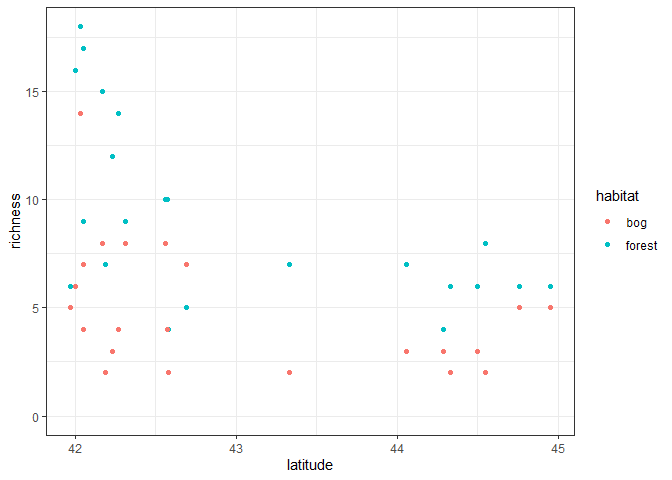
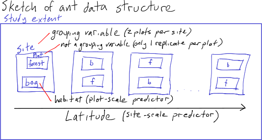
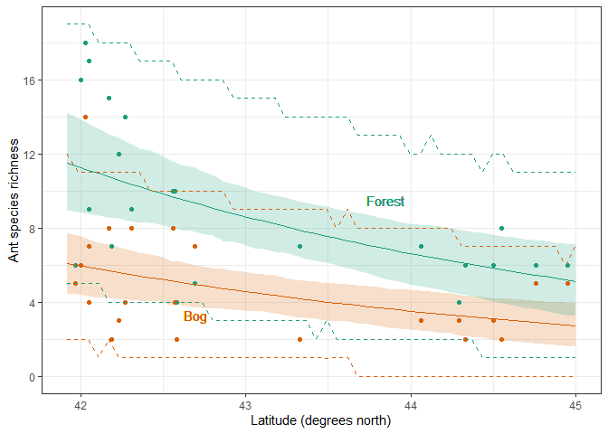
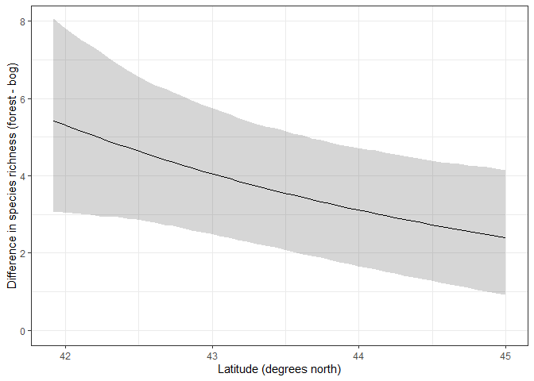

Ant data Generalized Linear Mixed Model
================
Brett Melbourne
11 Nov 2020 (minor updates 14 Nov 2022)

Third in a series of scripts to analyze the ant data described in
Ellison (2004). This script fits multilevel models to fully account for
the design structure. I will demonstrate both frequentist and Bayesian
approaches.

Set up for Bayesian analysis (order is important):

``` r
library(lme4)
library(ggplot2)
library(rstanarm)
options(mc.cores=parallel::detectCores())
theme_set(theme_bw())
source("source/hpdi.R") #For calculating credible intervals
```

Read in and plot the data:

``` r
ant <- read.csv("data/ants.csv")
ant$habitat <- factor(ant$habitat)
ant |>
    ggplot(mapping=aes(x=latitude, y=richness, col=habitat)) +
    geom_point() +
    ylim(0,18)
```

<!-- -->

## GLMM

Recall that our first analysis was a GLM with Poisson distribution and
log link. The multilevel model will do the same. In the design, at each
site there are a pair of plots, one plot is a bog while the other is a
forest.



Thus, *site* is a grouping variable, while *plot* is the data scale.
*Habitat type* is a predictor at the plot scale. *Latitude* is a
predictor at the site scale.

``` r
ant$site <- factor(ant$site)
```

We’ll first try a maximum likelihood fit using `glmer` but we’ll see
that the algorithm fails to converge (although the failed fit is pretty
close):

``` r
glmerHxL <- glmer(richness ~ habitat + latitude + habitat:latitude + (1|site),
                 family=poisson, data=ant)
```

    ## Warning in checkConv(attr(opt, "derivs"), opt$par, ctrl = control$checkConv, :
    ## Model failed to converge with max|grad| = 0.0139547 (tol = 0.002, component 1)

    ## Warning in checkConv(attr(opt, "derivs"), opt$par, ctrl = control$checkConv, : Model is nearly unidentifiable: very large eigenvalue
    ##  - Rescale variables?;Model is nearly unidentifiable: large eigenvalue ratio
    ##  - Rescale variables?

We get a warning suggesting to rescale variables. If we look at the
correlation matrix (`Correlation of Fixed Effects`), we see a very high
correlation (-1.000) between the `intercept` and `latitude` parameters,
and the `habitat` and `habitat:latitude` parameters:

``` r
summary(glmerHxL)
```

    ## Generalized linear mixed model fit by maximum likelihood (Laplace
    ##   Approximation) [glmerMod]
    ##  Family: poisson  ( log )
    ## Formula: richness ~ habitat + latitude + habitat:latitude + (1 | site)
    ##    Data: ant
    ## 
    ##      AIC      BIC   logLik deviance df.resid 
    ##    216.4    225.3   -103.2    206.4       39 
    ## 
    ## Scaled residuals: 
    ##      Min       1Q   Median       3Q      Max 
    ## -1.28068 -0.61850 -0.02911  0.54244  1.94715 
    ## 
    ## Random effects:
    ##  Groups Name        Variance Std.Dev.
    ##  site   (Intercept) 0.04704  0.2169  
    ## Number of obs: 44, groups:  site, 22
    ## 
    ## Fixed effects:
    ##                        Estimate Std. Error z value Pr(>|z|)   
    ## (Intercept)             12.2065     4.7297   2.581  0.00986 **
    ## habitatforest            1.7596     5.3706   0.328  0.74319   
    ## latitude                -0.2483     0.1105  -2.248  0.02457 * 
    ## habitatforest:latitude  -0.0263     0.1256  -0.209  0.83416   
    ## ---
    ## Signif. codes:  0 '***' 0.001 '**' 0.01 '*' 0.05 '.' 0.1 ' ' 1
    ## 
    ## Correlation of Fixed Effects:
    ##             (Intr) hbttfr latitd
    ## habitatfrst -0.734              
    ## latitude    -1.000  0.735       
    ## hbttfrst:lt  0.734 -1.000 -0.735
    ## optimizer (Nelder_Mead) convergence code: 0 (OK)
    ## Model failed to converge with max|grad| = 0.0139547 (tol = 0.002, component 1)
    ## Model is nearly unidentifiable: very large eigenvalue
    ##  - Rescale variables?
    ## Model is nearly unidentifiable: large eigenvalue ratio
    ##  - Rescale variables?

So, indeed this correlation might be the problem. Scaling and centering
latitude fixes convergence.

``` r
ant$latitude_s <- scale(ant$latitude)
glmerHxL <- glmer(richness ~ habitat + latitude_s + habitat:latitude_s + (1|site),
                 family=poisson, data=ant)
```

In the summary, we see we have a random effect term: the variance at the
site scale, which is quite small.

``` r
summary(glmerHxL)
```

    ## Generalized linear mixed model fit by maximum likelihood (Laplace
    ##   Approximation) [glmerMod]
    ##  Family: poisson  ( log )
    ## Formula: richness ~ habitat + latitude_s + habitat:latitude_s + (1 | site)
    ##    Data: ant
    ## 
    ##      AIC      BIC   logLik deviance df.resid 
    ##    216.4    225.3   -103.2    206.4       39 
    ## 
    ## Scaled residuals: 
    ##      Min       1Q   Median       3Q      Max 
    ## -1.28067 -0.61790 -0.02882  0.54285  1.94512 
    ## 
    ## Random effects:
    ##  Groups Name        Variance Std.Dev.
    ##  site   (Intercept) 0.04703  0.2169  
    ## Number of obs: 44, groups:  site, 22
    ## 
    ## Fixed effects:
    ##                          Estimate Std. Error z value Pr(>|z|)    
    ## (Intercept)                1.5239     0.1111  13.713   <2e-16 ***
    ## habitatforest              0.6285     0.1240   5.069    4e-07 ***
    ## latitude_s                -0.2666     0.1182  -2.255   0.0241 *  
    ## habitatforest:latitude_s  -0.0271     0.1343  -0.202   0.8401    
    ## ---
    ## Signif. codes:  0 '***' 0.001 '**' 0.01 '*' 0.05 '.' 0.1 ' ' 1
    ## 
    ## Correlation of Fixed Effects:
    ##             (Intr) hbttfr lttd_s
    ## habitatfrst -0.726              
    ## latitude_s   0.210 -0.195       
    ## hbttfrst:l_ -0.192  0.274 -0.735

Let’s compare to the fit without the site grouping structure. We see
that parameter estimates are almost the same.

``` r
summary(glm(richness ~ habitat + latitude_s + habitat:latitude_s,
    family=poisson, data=ant))
```

    ## 
    ## Call:
    ## glm(formula = richness ~ habitat + latitude_s + habitat:latitude_s, 
    ##     family = poisson, data = ant)
    ## 
    ## Deviance Residuals: 
    ##     Min       1Q   Median       3Q      Max  
    ## -2.1562  -0.7929  -0.0332   0.8516   2.7420  
    ## 
    ## Coefficients:
    ##                          Estimate Std. Error z value Pr(>|z|)    
    ## (Intercept)               1.54619    0.10038  15.404  < 2e-16 ***
    ## habitatforest             0.62826    0.12449   5.047 4.49e-07 ***
    ## latitude_s               -0.27937    0.11024  -2.534   0.0113 *  
    ## habitatforest:latitude_s -0.02807    0.13706  -0.205   0.8377    
    ## ---
    ## Signif. codes:  0 '***' 0.001 '**' 0.01 '*' 0.05 '.' 0.1 ' ' 1
    ## 
    ## (Dispersion parameter for poisson family taken to be 1)
    ## 
    ##     Null deviance: 102.763  on 43  degrees of freedom
    ## Residual deviance:  50.242  on 40  degrees of freedom
    ## AIC: 218.6
    ## 
    ## Number of Fisher Scoring iterations: 4

So, why should we include the grouping term? First, because it is part
of the sample design. Thus, we know it is a contributing factor. This is
already a fact of the design and we can’t explain it away, for example,
with a non-significant hypothesis test for an effect of site. Second, we
see that the autocorrelation due to site has an effect on the
uncertainty of the latitude parameter. The mixed-effects model estimates
more uncertainty in the latitude parameter, and a larger p-value for its
null hypothesis test. This is because there is effectively less
replication of latitude because latitude occurs at the site scale and
plots within sites are pseudoreplicates with respect to latitude.

Now turning to the Bayesian model. We have the same likelihood but we
now have weakly informative priors as well (using here the sensible
default priors). If we did this analysis with the scaled latitude
variable we would see that the Bayesian analysis is substantially
similar to the frequentist one. However, recall that in `rstanarm`, the
predictor variables are rescaled automatically, so we’ll use the
unscaled latitude variable for convenience as it will return results on
the original scale, saving us from carrying out the back-conversions.

``` r
bayesHxL <- stan_glmer(richness ~ habitat + latitude + habitat:latitude + (1|site), 
                       family=poisson, data=ant)
print(summary(bayesHxL)[,c("mean","sd","n_eff","Rhat")], digits=3)
```

    ##                                          mean     sd n_eff  Rhat
    ## (Intercept)                          1.30e+01 4.0967  2195 1.000
    ## habitatforest                        6.79e-01 2.9806  2240 1.001
    ## latitude                            -2.67e-01 0.0956  2187 1.000
    ## habitatforest:latitude              -9.79e-04 0.0697  2238 1.001
    ## b[(Intercept) site:ARC]              2.37e-02 0.1732  4516 1.000
    ## b[(Intercept) site:BH]               8.57e-02 0.1790  3911 1.000
    ## b[(Intercept) site:CAR]              1.11e-01 0.2138  3354 0.999
    ## b[(Intercept) site:CB]              -1.14e-01 0.1817  3885 1.000
    ## b[(Intercept) site:CHI]             -4.96e-02 0.2017  3894 1.001
    ## b[(Intercept) site:CKB]              3.60e-01 0.2048  1837 0.999
    ## b[(Intercept) site:COL]              4.24e-02 0.2003  4265 1.000
    ## b[(Intercept) site:HAW]             -2.85e-01 0.2297  2640 1.000
    ## b[(Intercept) site:HBC]              1.21e-01 0.1843  3479 1.001
    ## b[(Intercept) site:MOL]              7.65e-04 0.2054  3188 1.000
    ## b[(Intercept) site:MOO]              9.27e-02 0.2074  3325 1.001
    ## b[(Intercept) site:OB]              -3.95e-02 0.1809  4038 0.999
    ## b[(Intercept) site:PEA]             -9.52e-02 0.2081  3331 1.002
    ## b[(Intercept) site:PK]              -2.28e-01 0.2072  3511 1.000
    ## b[(Intercept) site:QP]              -2.74e-02 0.1775  4098 1.000
    ## b[(Intercept) site:RP]               1.68e-01 0.1788  3193 0.999
    ## b[(Intercept) site:SKP]              1.79e-01 0.1819  2604 1.000
    ## b[(Intercept) site:SNA]             -1.05e-02 0.2029  4407 1.000
    ## b[(Intercept) site:SPR]             -1.12e-01 0.1963  3681 1.001
    ## b[(Intercept) site:SWR]              5.45e-02 0.1739  3527 1.001
    ## b[(Intercept) site:TPB]             -1.90e-01 0.1954  3174 1.000
    ## b[(Intercept) site:WIN]             -7.46e-02 0.1855  4188 1.000
    ## Sigma[site:(Intercept),(Intercept)]  6.70e-02 0.0502  1489 1.001
    ## mean_PPD                             7.01e+00 0.5718  4261 0.999
    ## log-posterior                       -1.39e+02 5.0158  1031 1.001

Inspect diagnostics of the fit

``` r
launch_shinystan(bayesHxL)
```

In particular, the posterior distributions for the linear coefficients
$\beta_i$ are all nicely symmetric, as expected for this type of model.

We could next form credible intervals and prediction intervals but we’ll
defer that to the overdispersed model below.

## Overdispersed model

In the Poisson model, the variance is by definition equal to the mean.
What if there is more variance than this? This situation is called
overdispersion. We can include any extra variance by using a plot level
error term, which effectively makes the likelihood a Poisson-lognormal
model.

First define a plot-level indicator. Plot is the lowest level in this
dataset, so this is effectively the row number of the dataset.

``` r
ant$plot <- factor(1:nrow(ant))
#ant$plot <- 1:nrow(ant) #works just as well not as factor
```

Fit the mixed effects model now including the plot random effect. The
overdispersed GLMM using `glmer` with the unstandardized latitude again
fails to converge.

``` r
glmer_odHxL <- glmer(richness ~ habitat + latitude + habitat:latitude + (1|site) + (1|plot),
                        family=poisson, data=ant)
```

    ## Warning in checkConv(attr(opt, "derivs"), opt$par, ctrl = control$checkConv, :
    ## Model failed to converge with max|grad| = 0.00686656 (tol = 0.002, component 1)

    ## Warning in checkConv(attr(opt, "derivs"), opt$par, ctrl = control$checkConv, : Model is nearly unidentifiable: very large eigenvalue
    ##  - Rescale variables?;Model is nearly unidentifiable: large eigenvalue ratio
    ##  - Rescale variables?

Unfortunately, the overdispersed GLMM using `glmer` with scaled latitude
also fails to end in a successful fit, now for a different reason.

``` r
ant$latitude_s <- scale(ant$latitude)
glmer_odHxL_s <- glmer(richness ~ habitat + latitude_s + habitat:latitude_s + (1|site) + (1|plot),
      family=poisson, data=ant)
```

    ## boundary (singular) fit: see help('isSingular')

Failure to fit often happens with `glmer`. In this case, it’s because
the overdispersion variance is close to zero (i.e. near the boundary of
parameter space) and the training algorithm is not coping with that. The
best we can do for a maximum likelihood fit is to assume the
overdispersion term is close enough to zero to not matter and thus leave
it out of the model.

We don’t have any such problems with the Bayesian model, which takes the
overdispersion term in stride (the prior regularizes the estimate).

``` r
bayes_odHxL <- stan_glmer(richness ~ habitat + latitude + habitat:latitude + (1|site) + (1|plot),
                        family=poisson, data=ant)
print(summary(bayes_odHxL)[,c("mean","sd","n_eff","Rhat")], digits=3)
```

    ##                                          mean     sd n_eff  Rhat
    ## (Intercept)                          1.30e+01 3.9191  2742 1.001
    ## habitatforest                        6.30e-01 2.9209  2684 1.001
    ## latitude                            -2.67e-01 0.0914  2741 1.001
    ## habitatforest:latitude               2.01e-04 0.0683  2679 1.001
    ## b[(Intercept) plot:1]               -6.03e-02 0.1378  2616 1.001
    ## b[(Intercept) plot:2]                4.78e-02 0.1333  3009 1.000
    ## b[(Intercept) plot:3]                4.73e-02 0.1381  2060 1.001
    ## b[(Intercept) plot:4]                5.47e-02 0.1346  2731 1.000
    ## b[(Intercept) plot:5]               -2.03e-02 0.1273  4986 0.999
    ## b[(Intercept) plot:6]                3.85e-02 0.1291  3770 1.000
    ## b[(Intercept) plot:7]               -3.61e-02 0.1332  3570 1.001
    ## b[(Intercept) plot:8]                2.39e-02 0.1259  4594 0.999
    ## b[(Intercept) plot:9]                4.32e-02 0.1283  4224 1.000
    ## b[(Intercept) plot:10]              -2.37e-02 0.1283  4843 0.999
    ## b[(Intercept) plot:11]              -4.19e-03 0.1236  5410 0.999
    ## b[(Intercept) plot:12]               8.56e-03 0.1237  5473 0.999
    ## b[(Intercept) plot:13]              -6.38e-02 0.1536  2484 1.003
    ## b[(Intercept) plot:14]              -6.00e-02 0.1381  3460 1.000
    ## b[(Intercept) plot:15]              -9.26e-03 0.1327  4695 0.999
    ## b[(Intercept) plot:16]               7.16e-03 0.1275  4956 1.000
    ## b[(Intercept) plot:17]              -3.26e-02 0.1334  3920 1.000
    ## b[(Intercept) plot:18]              -4.64e-04 0.1302  5128 1.000
    ## b[(Intercept) plot:19]              -1.47e-04 0.1293  6589 1.000
    ## b[(Intercept) plot:20]               3.24e-02 0.1308  4074 1.000
    ## b[(Intercept) plot:21]               5.98e-04 0.1274  5139 0.999
    ## b[(Intercept) plot:22]               6.65e-03 0.1343  4553 0.999
    ## b[(Intercept) plot:23]              -1.01e-02 0.1321  4505 1.000
    ## b[(Intercept) plot:24]              -6.36e-03 0.1291  4616 1.001
    ## b[(Intercept) plot:25]               9.73e-02 0.1675  1788 1.001
    ## b[(Intercept) plot:26]               4.43e-03 0.1310  5125 1.000
    ## b[(Intercept) plot:27]              -2.37e-02 0.1372  4827 1.001
    ## b[(Intercept) plot:28]               2.58e-02 0.1335  5008 1.000
    ## b[(Intercept) plot:29]              -5.01e-02 0.1449  3130 1.001
    ## b[(Intercept) plot:30]              -4.04e-02 0.1370  4229 1.001
    ## b[(Intercept) plot:31]              -3.13e-02 0.1385  4485 1.000
    ## b[(Intercept) plot:32]               3.88e-02 0.1333  4191 1.000
    ## b[(Intercept) plot:33]               4.05e-02 0.1406  3612 1.001
    ## b[(Intercept) plot:34]              -1.87e-02 0.1339  4643 1.000
    ## b[(Intercept) plot:35]              -3.97e-02 0.1408  3594 1.001
    ## b[(Intercept) plot:36]               3.58e-02 0.1365  4741 1.000
    ## b[(Intercept) plot:37]              -3.63e-02 0.1417  3978 1.001
    ## b[(Intercept) plot:38]              -8.16e-03 0.1380  4697 1.000
    ## b[(Intercept) plot:39]              -1.73e-03 0.1353  5530 1.000
    ## b[(Intercept) plot:40]              -2.19e-02 0.1381  4176 1.001
    ## b[(Intercept) plot:41]              -3.80e-03 0.1347  5610 0.999
    ## b[(Intercept) plot:42]              -2.14e-02 0.1313  5109 1.001
    ## b[(Intercept) plot:43]               3.38e-02 0.1444  3853 1.001
    ## b[(Intercept) plot:44]               3.64e-02 0.1447  3925 1.000
    ## b[(Intercept) site:ARC]              2.39e-02 0.1724  5130 1.000
    ## b[(Intercept) site:BH]               7.47e-02 0.1716  4263 1.000
    ## b[(Intercept) site:CAR]              9.15e-02 0.2045  3094 0.999
    ## b[(Intercept) site:CB]              -9.58e-02 0.1751  4840 0.999
    ## b[(Intercept) site:CHI]             -4.69e-02 0.1998  5485 1.000
    ## b[(Intercept) site:CKB]              2.96e-01 0.2193  1549 1.003
    ## b[(Intercept) site:COL]              3.26e-02 0.1890  5744 0.999
    ## b[(Intercept) site:HAW]             -2.37e-01 0.2265  1952 1.001
    ## b[(Intercept) site:HBC]              9.69e-02 0.1730  3110 1.000
    ## b[(Intercept) site:MOL]             -3.14e-03 0.1931  5150 1.000
    ## b[(Intercept) site:MOO]              8.07e-02 0.1936  4333 1.000
    ## b[(Intercept) site:OB]              -3.64e-02 0.1694  5939 0.999
    ## b[(Intercept) site:PEA]             -8.05e-02 0.1926  4080 1.001
    ## b[(Intercept) site:PK]              -1.90e-01 0.2059  2344 1.001
    ## b[(Intercept) site:QP]              -2.84e-02 0.1730  6022 0.999
    ## b[(Intercept) site:RP]               1.39e-01 0.1751  2780 1.001
    ## b[(Intercept) site:SKP]              1.45e-01 0.1810  2624 1.001
    ## b[(Intercept) site:SNA]             -4.69e-03 0.1848  5243 1.000
    ## b[(Intercept) site:SPR]             -9.00e-02 0.1895  4306 1.001
    ## b[(Intercept) site:SWR]              3.75e-02 0.1693  4599 1.000
    ## b[(Intercept) site:TPB]             -1.52e-01 0.1924  2965 1.000
    ## b[(Intercept) site:WIN]             -6.12e-02 0.1767  4867 1.000
    ## Sigma[plot:(Intercept),(Intercept)]  2.11e-02 0.0279  1372 1.003
    ## Sigma[site:(Intercept),(Intercept)]  5.64e-02 0.0490  1300 1.005
    ## mean_PPD                             7.01e+00 0.5538  4676 0.999
    ## log-posterior                       -2.04e+02 7.1059  1103 1.011

Inspecting the posterior distribution for the parameters reveals nice
symmetric distributions, except for the Sigma parameters (variances of
the random effects), which is expected. Sigma_plot in particular has a
high probability mass near zero.

``` r
launch_shinystan(bayes_odHxL)
```

## Intervals

The code for the GLMM is substantially the same as the GLM. First form a
new dataset for prediction.

``` r
newd <- data.frame(latitude=rep(seq(from=41.92, to=45, length.out=50), 2),
                   habitat=factor(rep(c("bog","forest"), each=50)))
```

Then derive samples for the posterior distribution of the inverse link
function, i.e. Dist($\mu$), which we’ll call `pmu`. In the GLMM we can
choose whether we want predictions to include the specific grouping
terms or not (in other words, do we want to predict for a specific
site?). Here, we want to predict for generic new sites, so we don’t
include the specific sites. To do that, we use the argument
`re.form=NA`, which means “don’t form the random effects”).

``` r
pmu <- posterior_linpred(bayes_odHxL, transform=TRUE, re.form=NA, newdata=newd)
```

This is a matrix with samples in rows and the variable combinations in
columns. The estimated means are then:

``` r
mnmu <- colMeans(pmu)
```

and the 95% credible intervals for the mean are:

``` r
n <- ncol(pmu) #or nrow(newd)
regression_intervals <- data.frame(mulo95=rep(NA,n), muhi95=rep(NA,n))
for ( i in 1:n ) {
    regression_intervals[i,] <- hpdi(pmu[,i], prob=0.95)
}
```

For predictions, first derive samples for the posterior predictive
distribution, which we’ll call ppd:

``` r
ppd <- posterior_predict(bayes_odHxL, re.form=NA, newdata=newd)
```

and the prediction intervals (here CPI) are then:

``` r
n <- ncol(ppd) #or nrow(newd)
prediction_intervals <- data.frame(ppdlo95=rep(NA,n), ppdhi95=rep(NA,n))
for ( i in 1:n ) {
    prediction_intervals[i,] <- quantile(ppd[,i], prob=c(0.025,0.975))
}
```

The plot shows that the credible intervals for the means are a little
wider than the fit that did not include the site-level grouping term or
the overdispersion term (compare to `10_8_ants_bayesian_GLM.md`).

``` r
preds <- cbind(newd, mnmu, regression_intervals, prediction_intervals)
bfc <- c("#d95f02", "#1b9e77") #bog & forest colors
preds |>
    ggplot() +
    geom_ribbon(mapping=aes(x=latitude, ymin=mulo95, ymax=muhi95, fill=habitat), alpha=0.2) +
    geom_point(data=ant, mapping=aes(x=latitude, y=richness, col=habitat)) +
    geom_line(mapping=aes(x=latitude, y=mnmu, col=habitat)) +
    geom_line(mapping=aes(x=latitude, y=ppdlo95, col=habitat), lty=2) +
    geom_line(mapping=aes(x=latitude, y=ppdhi95, col=habitat), lty=2) +
    geom_text(aes(x=42.7, y=3.3, label="Bog"), col=bfc[1]) +
    geom_text(aes(x=43.85, y=9.5, label="Forest"), col=bfc[2]) +
    scale_fill_manual(values=bfc) +
    scale_color_manual(values=bfc) +
    scale_y_continuous(breaks=seq(0, 20, 4), minor_breaks=seq(0, 20, 2)) +
    xlab("Latitude (degrees north)") +
    ylab("Ant species richness") +
    theme(legend.position="none")
```

<!-- -->

To derive the differences between forest and bog across latitude using
the output from the `posterior_linpred` convenience function we have to
consider how we set up the `newd` dataframe. We asked for 50 increments
of bog across latitude followed by 50 increments of forest. So to obtain
derived samples of the difference between forest and bog we’ll subtract
the first 50 columns from the second 50 columns of the `pmu` matrix.

``` r
diff <- pmu[,51:100] - pmu[,1:50]
diff_mn <- colMeans(diff)
n <- ncol(diff)
diff_cpi <- data.frame(difflo95=rep(NA,n), diffhi95=rep(NA,n))
for ( i in 1:n ) {
    diff_cpi[i,] <- quantile(diff[,i], prob=c(0.025,0.975))
}
diff_df <- data.frame(cbind(diff_mn, diff_cpi, latitude=newd$latitude[1:50]))
```

The plot shows similar estimates compared to the fit that did not
include the site-level grouping term or the overdispersion term (compare
to `10_8_ants_bayesian_GLM.md`). However, the decline with latitude is a
little less steep and the credible interval is a little wider after
accounting for the spatial structure and overdispersion.

``` r
diff_df |> 
    ggplot() +
    geom_ribbon(mapping=aes(x=latitude, ymin=difflo95, ymax=diffhi95), alpha=0.2) +
    geom_line(mapping=aes(x=latitude, y=diff_mn)) +
    coord_cartesian(ylim=c(0,8)) +
    xlab("Latitude (degrees north)") +
    ylab("Difference in species richness (forest - bog)")
```

<!-- -->
