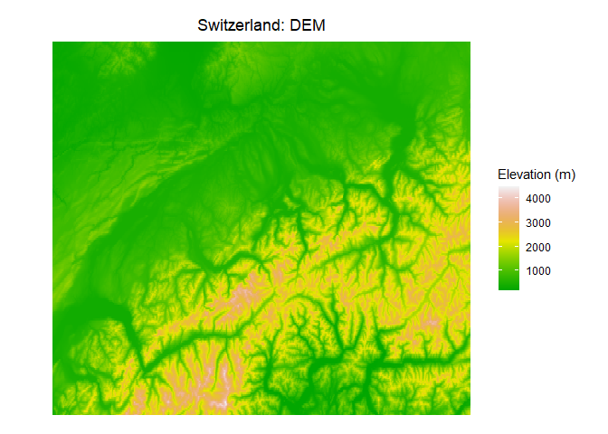
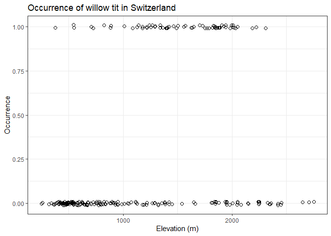
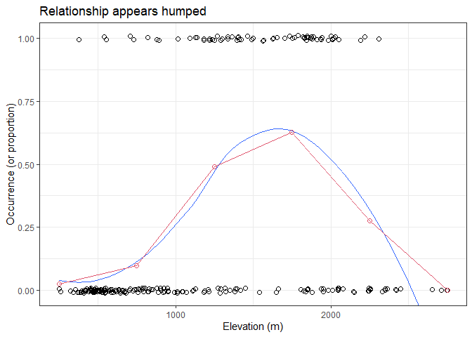
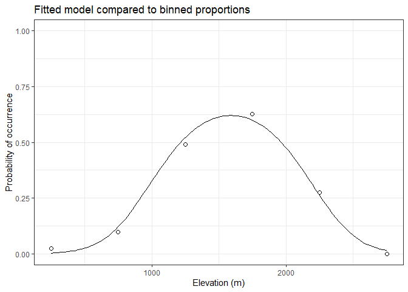
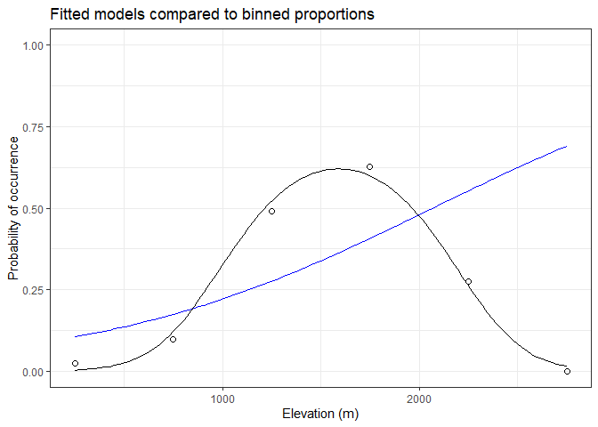
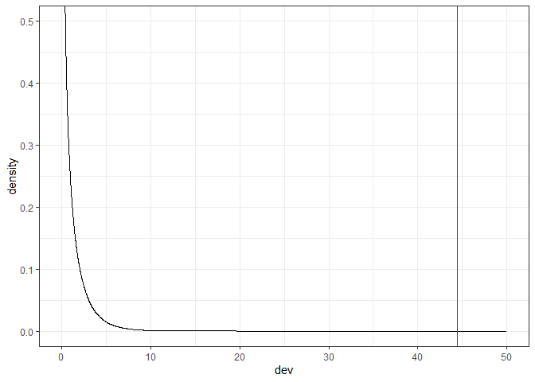
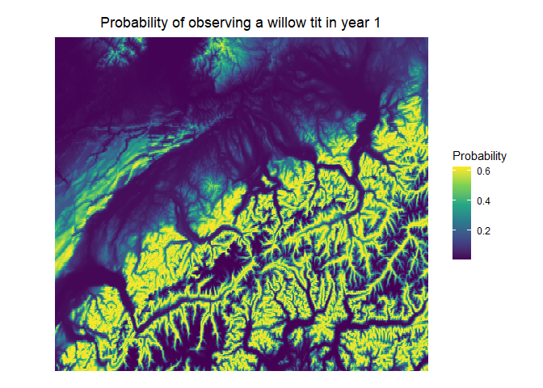
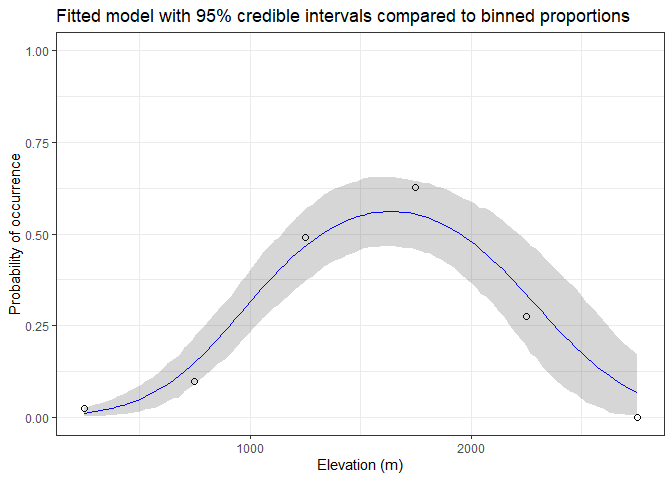

Binomial GLM. Swiss breeding bird survey example
================
Brett Melbourne
16 Nov 2020 (updated 15 Nov 2022)

Willow tit distribution with altitude. This is an example of a nonlinear
biological model with a binomial distribution. The model is logit-linear
and together with the binomial distribution, this combination is the
special case of logistic regression. The data are occurrence
(presence-absence) of the willow tit. This example is from Royle JA &
Dorazio RM (2008) Hierarchical Modeling and Inference in Ecology, p 87.
Altitude data are from eros.usgs.gov. To exactly replicate the analysis
on p 87, first rescale the elevation data: `elev <- scale(elev)`. I
don’t do that here in order to show another strategy for fixing an
algorithm, i.e. rescaling parameters.

``` r
library(ggplot2)
library(dplyr)
theme_set(theme_bw())
```

Read in and plot elevation data (digital elevation model) for
Switzerland.

``` r
swissdem <- read.csv("data/switzerland_tidy.csv")

swissdem %>% 
    ggplot() +
    geom_raster(mapping=aes(x=x, y=y, fill=Elev_m)) +
    scale_fill_gradientn(colors=terrain.colors(22), name="Elevation (m)") + 
    coord_quickmap() +
    labs(title="Switzerland: DEM") +
    theme_void() +
    theme(plot.title=element_text(hjust=0.5, vjust=-2))
```

<!-- -->

Read in the bird data. The dataset is from Royle & Dorazio. We will
focus for now on the occurrence data from year 1 in the column `y.1`.

``` r
willowtit <- read.csv("data/wtmatrix.csv") 
```

Here are the first 30 rows of data

``` r
willowtit %>% 
    select(y.1, elev) %>% 
    head(n=30)
```

    ##    y.1 elev
    ## 1    0  420
    ## 2    0  450
    ## 3    0 1050
    ## 4    0 1110
    ## 5    0  510
    ## 6    0  630
    ## 7    0  590
    ## 8    0  530
    ## 9    1 1140
    ## 10   0  770
    ## 11   0 1220
    ## 12   0  460
    ## 13   0 1010
    ## 14   0  760
    ## 15   1 1300
    ## 16   1 1270
    ## 17   0  380
    ## 18   1  550
    ## 19   0  390
    ## 20   0 1380
    ## 21   0  530
    ## 22   0 1190
    ## 23   1 1490
    ## 24   0  920
    ## 25   0  620
    ## 26   0  540
    ## 27   1  820
    ## 28   1 1220
    ## 29   1 1180
    ## 30   0  730

Plot the data

``` r
willowtit %>% 
    ggplot() +
    geom_jitter(mapping=aes(x=elev, y=y.1), shape=1, size=2, height=0.01) +
    labs(x="Elevation (m)", y="Occurrence", 
         title="Occurrence of willow tit in Switzerland")
```

<!-- -->

… also summarized by binning into 500 m increments. We set up bins, then
calculate the proportion present in each bin, then the midpoint of the
bin. The mean of a binary variable (0,1) is the proportion.

``` r
freq_table <-
    willowtit %>% 
    group_by(bin=cut(elev, breaks=seq(0, 3000, by=500))) %>% 
    summarize(p=mean(y.1)) %>% 
    mutate(mid=seq(250, 3000, by=500)) 
freq_table
```

    ## # A tibble: 6 × 3
    ##   bin                  p   mid
    ##   <fct>            <dbl> <dbl>
    ## 1 (0,500]         0.0244   250
    ## 2 (500,1e+03]     0.0972   750
    ## 3 (1e+03,1.5e+03] 0.490   1250
    ## 4 (1.5e+03,2e+03] 0.628   1750
    ## 5 (2e+03,2.5e+03] 0.276   2250
    ## 6 (2.5e+03,3e+03] 0       2750

Plot including the binned proportion and a smoother on the occurrence
data (i.e. the zeros and ones) for comparison. Both of these approaches
(binning, smoothing) are useful for visualization of binary data in
exploratory data analysis (EDA).

``` r
willowtit %>% 
    ggplot() +
    geom_jitter(mapping=aes(x=elev, y=y.1), shape=1, size=2, height=0.01) +
    geom_smooth(mapping=aes(x=elev, y=y.1), size=0.5, se=FALSE) +
    geom_line(data=freq_table, 
              mapping=aes(x=mid, y=p), col=2) +
    geom_point(data=freq_table, 
               mapping=aes(x=mid, y=p), shape=1, size=2, col=2) +
    coord_cartesian(ylim=c(-0.01,1.01)) +
    labs(x="Elevation (m)", y="Occurrence (or proportion)", 
         title="Relationship appears humped")
```

    ## `geom_smooth()` using method = 'loess' and formula 'y ~ x'

<!-- -->

The most striking feature we see is that the relationship appears to be
hump shaped.

## Binomial GLM the hard way

We’ll first do this the hard way by coding the likelihood and optimizing
directly. I’m doing this to show once again the breakdown of a data
science problem into model, training and inference algorithms. The model
algorithm is a logit-linear model (aka logit link function), the
training algorithm is maximizing the likelihood (minimizing the negative
log likelihood) and the inference algorithm illustrated here is a
frequentist null hypothesis significance test based on a sampling
distribution of the likelihood-ratio statistic. You can apply this
general approach to any model with a binomial distribution (or indeed
any other kind of distribution), not merely one with a logit link
function, such as a process-based or mechanistic ecological model. You
won’t usually do this the hard way for ordinary binomial GLMs like this
example because you can use `glm()` that does the same thing and
`stan_glm()` for the Bayesian version with sensible priors. We’ll look
at these approaches at the end of this script.

### Model algorithm

The linear predictor: here we’ll allow for the distribution of willow
tits with elevation to be hump shaped since we clearly saw that in the
EDA above. There is an optimal elevation for willow tits. One simple
model for a hump relates the logit of the probability of occurrence, p,
to elevation by a quadratic function:

$$
ln( p/(1-p) ) = \beta_0 + \beta_1 elev + \beta_2 elev^2
$$

The probability of occurrence of the willow tit for a sample location is
then obtained from the inverse function of the linear predictor, in this
case the antilogit. Notice that the logit link function ranges from -INF
to +INF on the scale of the linear predictor but is bounded 0-1 on the
probability scale. This function encodes the model algorithm; it
calculates the predicted probability.

``` r
p_pred_quadratic  <- function(b0, b1, b2, elev) {
    lp <- b0 + b1 * elev + b2 * elev^2   #logit p
    prob <- exp(lp) / (1 + exp(lp))      #antilogit
    return(prob)
}
```

### Training algorithm

Here we’ll use maximum likelihood to train the model. We need a negative
log likelihood function for the logit-quadratic model with binomial
distribution. A log scale direct search showed that $\beta_2$ is several
orders of magnitude smaller than the other parameters. Optimization is
better behaved if all parameters are on similar scales. We use a simple
trick here, which is to pass `quadratic_nll` a parameter with a similar
magnitude to the other parameters but then rescale the parameter in the
`quadratic_nll` function back to its original magnitude.

``` r
quadratic_nll <- function(p, occ, elev) {
    b2 <- p[3] * 1e-06  #Rescale
    ppred <- p_pred_quadratic(b0=p[1], b1=p[2], b2, elev)
    nll <- -sum(dbinom(occ, size=1, prob=ppred, log=TRUE))
    return(nll)
}
```

I first did a bit of a grid search to get some idea of the likelihood
surface and that suggested these starting values for `optim()`.

``` r
par <- c(-8,0.02,-3)
```

Now find the maximum likelihood estimates (MLE) of the parameters using
`optim()` with the Nelder-Mead algorithm

``` r
fit_quadratic <- optim(par, quadratic_nll, occ=willowtit$y.1, elev=willowtit$elev)
```

Here are the results of the fit. $\beta_2$ is `par[3]*1e-06`.
Convergence was confirmed.

``` r
fit_quadratic
```

    ## $par
    ## [1] -8.37878883  0.01115711 -3.50844525
    ## 
    ## $value
    ## [1] 105.6839
    ## 
    ## $counts
    ## function gradient 
    ##      246       NA 
    ## 
    ## $convergence
    ## [1] 0
    ## 
    ## $message
    ## NULL

Form predictions from the fitted model (using the model algorithm)

``` r
elevxx <- seq(min(willowtit$elev), max(willowtit$elev), length.out=100) #grid for the x axis
predp <- p_pred_quadratic(fit_quadratic$par[1], fit_quadratic$par[2],
                          fit_quadratic$par[3]*1e-06, elevxx)
preds_quad <- data.frame(elev=elevxx, p=predp)
```

Plot the fitted model with the (summarized) data

``` r
preds_quad %>% 
    ggplot() +
    geom_point(data=freq_table, 
               mapping=aes(x=mid, y=p), shape=1, size=2) +
    geom_line(mapping=aes(x=elev, y=p)) +
    coord_cartesian(ylim=c(0,1)) +
    labs(x="Elevation (m)", y="Probability of occurrence",
         title="Fitted model compared to binned proportions")
```

<!-- -->

### Inference algorithm

Here we’ll illustrate a frequentist hypothesis test. Sometimes we might
be interested in testing a biological hypothesis. For example,
ecological theory suggests that the distribution of a species in
relation to an environmental variable should be structured such that
there is an optimum environment. In other words, we should expect a
hump-shaped relationship of abundance along the gradient. To test the
hypothesis that a species’ distribution is humped one could construct a
null hypothesis significance test (NHST). An alternative (null) model is
that there is no hump, only a monotonically increasing or decreasing
probability with elevation. In that case, a suitable null model is
$logit(p)$ related to elevation by a linear function:

$$ln( p/(1-p) ) = \beta_0 + \beta_1 elev$$

Note that the backtransformed function

$$p = f(b0,b1,elev)$$

is still a nonlinear function (sigmoid).

Here is code for the model and training algorithms of the null model

``` r
p_pred_linear  <- function(b0, b1, elev) {
    lp <- b0 + b1 * elev             #logit probability
    prob <- exp(lp) / (1 + exp(lp))  #antilogit
    return(prob)
}

linear_nll <- function(p, occ, elev) {
    ppred <- p_pred_linear(b0=p[1], b1=p[2], elev)
    nll <- -sum(dbinom(occ, size=1, prob=ppred, log=TRUE))
    return(nll)
}

par <- c(-3,0.001) #Starting parameters from direct search
fit_linear <- optim(par, linear_nll, occ=willowtit$y.1, elev=willowtit$elev)
fit_linear #Convergence is good.
```

    ## $par
    ## [1] -2.442180671  0.001180472
    ## 
    ## $value
    ## [1] 127.8825
    ## 
    ## $counts
    ## function gradient 
    ##       77       NA 
    ## 
    ## $convergence
    ## [1] 0
    ## 
    ## $message
    ## NULL

Form predictions from the null model

``` r
elevxx <- seq(min(willowtit$elev), max(willowtit$elev), length.out=100) #grid for the x axis
predp <- p_pred_linear(fit_linear$par[1], fit_linear$par[2], elevxx)
preds_lin <- data.frame(elev=elevxx, p=predp)
```

Plot the fitted null model (blue) with the data. It’s clear that the
hump model (black) is a much better description of the data than the
monotonic (null) model.

``` r
preds_lin %>% 
    ggplot() +
    geom_line(mapping=aes(x=elev, y=p), col="blue") +
    geom_point(data=freq_table, 
               mapping=aes(x=mid, y=p), shape=1, size=2) +
    geom_line(data=preds_quad, 
              mapping=aes(x=elev, y=p)) +
    coord_cartesian(ylim=c(0,1)) +
    labs(x="Elevation (m)", y="Probability of occurrence",
         title="Fitted models compared to binned proportions")
```

<!-- -->

Inference algorithm: here we’ll use a frequentist **likelihood ratio
test**. We first propose a test statistic called the deviance, which is
a scaled likelihood ratio:

$$
deviance = 2 \textup{ ln} \left ( \frac{L_1}{L_0} \right )
$$

where in this case $L_1$ is the likelihood of the humped model and $L_0$
is the likelihood of the monotonic (null) model. We first calculate this
deviance for our data and models (the difference in the negative log
likelihoods corresponds to the equation above):

``` r
nll_H0 <- fit_linear$value
nll_H1 <- fit_quadratic$value
deviance <- 2 * (nll_H0 - nll_H1)
deviance
```

    ## [1] 44.39716

Statistical theory shows that the deviance for data generated from the
null model has (asymptotically, i.e. for large datasets) a chi-squared
sampling distribution (with degrees of freedom equal to the difference
in the number of parameters between the models). Here is a visualization
of the observed deviance (red vertical line) in relation to this
theoretical sampling distribution, i.e. $\chi^2$ distribution:

``` r
data.frame(dev=seq(0,50,0.01)) %>% 
    mutate(density=dchisq(dev, df=1)) %>% 
    ggplot() +
    geom_line(mapping=aes(dev, density)) +
    geom_vline(xintercept=deviance, col="red") +
    coord_cartesian(ylim=c(0,0.5))
```

<!-- -->

We can see that the observed deviance is way, way out in the low
probability tail of this sampling distribution. To obtain a p-value we
can compute it from the $\chi^2$ distribution. The p-value is the
probability of a deviance as large or larger than the one observed,
which is 1 minus the probability of a deviance smaller than the one
observed (or the cumulative probability):

``` r
1 - pchisq(deviance, df=1)  #This is the P-value. Significant at alpha < 0.05.
```

    ## [1] 2.680756e-11

The low p-value says that if the null hypothesis were true, a likelihood
ratio of hump:null as large (or larger) than the one we observed has low
probability. Or in typical shorthand, the test suggests the model with
the hump is significantly better. We could alternatively implement an
inference algorithm that generates data (and then the test statistic)
from the null model explicitly to form the sampling distribution of the
test statistic. This would be the parametric bootstrapped p-value
algorithm that we looked at in week 5. This is a good idea for small
datasets where the asymptotic assumption of the $\chi^2$ distribution
might not apply.

### Plot predictions as a map

… for the best-fitting (quadratic) model. We input the elevations from
the map of Switzerland to the model algorithm, forming a raster data
structure in tidy format (which incidentally is a very inefficient way
to store a raster in memory but is necessary for `ggplot()`). The
viridis color scale has excellent properties for visualizing a
continuous scale. The locations where we’re most likely to observe this
species pop out in yellow.

``` r
predp <- p_pred_quadratic(fit_quadratic$par[1], fit_quadratic$par[2],
                          fit_quadratic$par[3]*1e-06, swissdem$Elev_m)
willowtit_ras <- cbind(swissdem[,1:2], p=predp)

willowtit_ras %>% 
    ggplot() +
    geom_raster(mapping=aes(x=x, y=y, fill=p)) +
    scale_fill_viridis_c(name="Probability") + 
    coord_quickmap() +
    labs(title="Probability of observing a willow tit in year 1") +
    theme_void() +
    theme(plot.title=element_text(hjust=0.5, vjust=-2))
```

<!-- -->

### Built-in tools for GLMs

Here is the equivalent model algorithm and maximum likelihood training
algorithm using `glm()`.

``` r
glm_quadratic <- glm(y.1 ~ elev + I(elev^2), family=binomial, data=willowtit) 
glm_linear <- glm(y.1 ~ elev, family=binomial, data=willowtit)
```

Here is the equivalent frequentist inference algorithm (likelihood ratio
test) using the `anova()` function. Notice that the deviance and p value
are the same as the hand-coded analysis above. The residual deviance is
2X the nll (e.g. compare 2X nll_H1 from above). We could also use these
likelihoods in pure likelihood inference algorithms, or information
theoretic inference algorithms.

``` r
anova(glm_linear, glm_quadratic, test="Chisq")    
```

    ## Analysis of Deviance Table
    ## 
    ## Model 1: y.1 ~ elev
    ## Model 2: y.1 ~ elev + I(elev^2)
    ##   Resid. Df Resid. Dev Df Deviance Pr(>Chi)    
    ## 1       235     255.76                         
    ## 2       234     211.37  1   44.397 2.68e-11 ***
    ## ---
    ## Signif. codes:  0 '***' 0.001 '**' 0.01 '*' 0.05 '.' 0.1 ' ' 1

``` r
cbind(logLik(glm_linear),logLik(glm_quadratic)) #Log likelihoods, compare to nll_H0 and nll_H1
```

    ##           [,1]      [,2]
    ## [1,] -127.8825 -105.6838

``` r
glm_quadratic  #See residual deviance
```

    ## 
    ## Call:  glm(formula = y.1 ~ elev + I(elev^2), family = binomial, data = willowtit)
    ## 
    ## Coefficients:
    ## (Intercept)         elev    I(elev^2)  
    ##  -8.397e+00    1.118e-02   -3.517e-06  
    ## 
    ## Degrees of Freedom: 236 Total (i.e. Null);  234 Residual
    ## Null Deviance:       282.3 
    ## Residual Deviance: 211.4     AIC: 217.4

The Bayesian version is

``` r
library(rstanarm)
source("source/hpdi.R")
options(mc.cores=parallel::detectCores())
stanfit <- stan_glm(y.1 ~ elev + I(elev^2), family=binomial, data=willowtit)
print(summary(stanfit)[,c("mean","sd","n_eff","Rhat")], digits=3)
```

    ##                    mean       sd n_eff Rhat
    ## (Intercept)   -6.60e+00 9.58e-01   949    1
    ## elev           8.36e-03 1.41e-03   926    1
    ## I(elev^2)     -2.55e-06 4.85e-07   914    1
    ## mean_PPD       2.84e-01 3.59e-02  2782    1
    ## log-posterior -1.16e+02 1.20e+00  1358    1

Credible intervals

``` r
newd <- data.frame(elev=seq(min(willowtit$elev),max(willowtit$elev),length.out=100))
#pmu <- posterior_linpred(stanfit, transform=TRUE, newdata=newd)
pmu <- posterior_epred(stanfit, newdata=newd)
mnmu <- colMeans(pmu)
regression_intervals <- t(apply(pmu, 2, hpdi, prob=0.95)) #CPI was no good
colnames(regression_intervals) <- c("mulo95","muhi95")
mcpreds_df <- cbind(newd,mnmu,regression_intervals)

mcpreds_df %>% 
    ggplot() +
    geom_point(data=freq_table, 
               mapping=aes(x=mid, y=p), shape=1, size=2) +
    geom_ribbon(mapping=aes(x=elev, ymin=mulo95, ymax=muhi95),
        alpha=0.2) +
    geom_line(mapping=aes(x=elev, y=mnmu), col="blue") +
    coord_cartesian(ylim=c(0,1)) +
    labs(x="Elevation (m)", y="Probability of occurrence",
         title="Fitted model with 95% credible intervals compared to binned proportions")
```

<!-- -->

The Bayesian model has a more gentle estimate for the quadratic
parameter.
