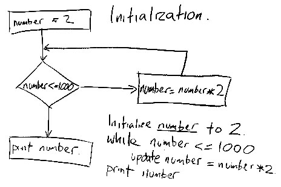
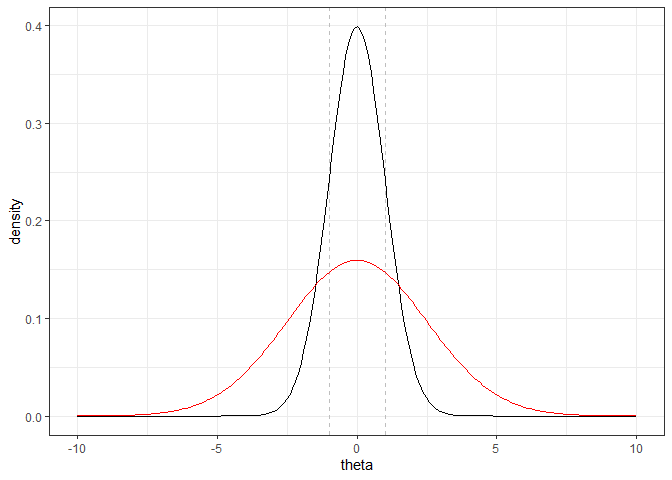

# Images in a markdown document
To insert a graphic in a markdown document:

```

```

Take care with the path: the image path needs to **start** in the same directory as your `.R` or `.Rmd` file. I suggest putting the image file in a directory called `images` or in the same directory as the graphics output from the analysis.

After you push to GitHub, check that your image displays in the `.md` document on the GitHub website. Then you know you got the path right.

See https://www.earthdatascience.org/courses/earth-analytics/document-your-science/add-images-to-rmarkdown-report/.


For example, here I insert a diagram of an algorithm hand drawn on the board in the early weeks of the class. Note that since we are in the `skills_tutorials` subfolder and the `images` folder is not contained in that folder, we need to first go up out of the `skills_tutorials` folder its parent folder to find the `images` folder. To do that we use `../`, which says "go up one level". To go up two levels you would use `../../` etc.

```

```


**Fig. 2.** Flowchart for an algorithm to calculate the largest $2^x$ that is less than or equal to 1000.


Here is another example where I insert a figure from week 10, the prior distribution of the $\beta s$ for the Bayesian ants model. The file for this figure is found in one of the folders from week 10. 

```

```


**Fig. 1.** Prior distribution for $\beta$ (here labelled `theta_uc`) in the ants example. This is a normal distribution with $\sigma=2.5$. The shaded area is +/- 1 standard deviation.


